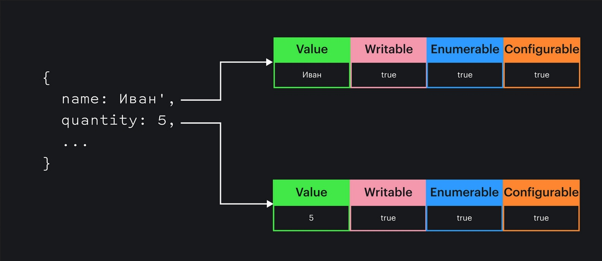

# Шпаргалка по JavaScript

<details>

<summary></summary>

* [MDN - Повторное введение в JavaScript](https://developer.mozilla.org/ru/docs/Web/JavaScript/A\_re-introduction\_to\_JavaScript)
* [tproger.ru - Шпаргалка по современному JavaScript](https://tproger.ru/translations/javascript-cheatsheet/)
* [Habr - Подводные камни JavaScript](https://habr.com/ru/post/159313)
* [learn.javascript.ru](https://learn.javascript.ru)
* [MDN](https://developer.mozilla.org/ru/docs/Web/JavaScript)
* [doka.guide](https://doka.guide/js)
* [O'Reilly - Вы не знаете JS (серия из 6 книг, открытый доступ)](https://github.com/azat-io/you-dont-know-js-ru)
* [metanit.com](https://metanit.com/web/javascript/)
* [Schoolsw3](https://www.schoolsw3.com/js)
* [ITchief](https://itchief.ru/javascript/)
* [code.mu - Учебник JS: основной](https://code.mu/ru/javascript/book/prime/)
* [code.mu - Учебник JS: высший](https://code.mu/ru/javascript/book/supreme/)
* [code.mu - Учебник JS: ООП](https://code.mu/ru/javascript/book/oop/)
* [code.mu - Справочник JavaScript](https://code.mu/ru/javascript/manual/)
* [code.mu - Практика JS](https://code.mu/ru/javascript/book/practice/)
* [webref.ru - Знакомство с JavaScript (2015-2019)](https://webref.ru/dev/learn-javascript)
* [professorweb.ru - Учебник JavaScript](https://professorweb.ru/my/javascript/js\_theory/level1/javascript\_index.php)

**Видео**

* [IT-Kamasutra - JS в деталях (48 видео)](https://www.youtube.com/playlist?list=PLcvhF2Wqh7DN2nTU8Q10SvAn4k8NpMJvh)
* [IT-Kamasutra - Уроки JavaScript с нуля (ну ваще с нуля) (429 видео)](https://www.youtube.com/playlist?list=PLcvhF2Wqh7DPD5sRK3lw4bjBsKdgY2bPi)
* [WebDev - JavaScript (15 видео)](https://www.youtube.com/playlist?list=PLNkWIWHIRwMHKLotIS\_d-wyj00pg0AnUg)
* [WebDev - ES6 (19 видео)](https://www.youtube.com/playlist?list=PLNkWIWHIRwMGLJXugVvdK7i8UagGQNaXD)
* [code.mu - Видео-уроки JS](https://code.mu/ru/javascript/video/lesson)

**Есть отдельные статьи**

* [Habr.com](https://habr.com/ru/search/?q=javascript)
* [medium.com](https://medium.com/)
* [proglib.io](https://proglib.io/search?q=Javascript)
* [webformyself.com](https://webformyself.com/category/javascriptajax-2/javascriptajax/)

**Прочее**

* [Hexlet - Бесплатный курс JS](https://ru.hexlet.io/courses/js-basics)
* [Официальная спецификация - актуальная (en)](https://www.ecma-international.org/publications/standards/Ecma-262.htm)
* [Официальная спецификация - черновик и предложения (en)](https://tc39.github.io/ecma262)

\


</details>

<details>

<summary></summary>

\


</details>

***

<details>

<summary><strong>Работа движка JS. Окружение</strong></summary>

***

В паре слов:

* есть `движок` и `окружение`
* в разных окружениях может использоваться один движок: `V8` работает и в браузере `Chrome/Chromium` и в платформе `node.js`
* в движке конвейер:
  * `парсер` -> `абст. синтакс. дерево` -> `интерпретатор` -> `компилятор` -> `машинный код`
* код попадает в `очередь`. Упомянуть `микро/макро задачи`, `web workers`
* задачи из очереди по одной уходят в `стэк`
  * стр-ра данных в движке. Стопка тарелок, LIFO
* стек работает синхронно, окружение асинхронно.
* асинхронные операции выполняются в окружении.
  * ждёт нужный момент и ставит задачу в очередь стэка. Дальше всё как обычно.
* всё работает в бесконечном «событийном цикле» `event loop`:
  * `макрозадача 1` -> все `микрозадачи` -> `отрисовка страницы` (рендер) -> `макрозадача 2`

\*\*\*\
`Инструкции` — синтаксические конструкции и команды, которые выполняют действия. «Строки программы». Отделяются точкой с запятой.

**Ссылки**

* [Medium - Движки JavaScript. Часть 1: парсинг](https://medium.com/nuances-of-programming/%D0%B4%D0%B2%D0%B8%D0%B6%D0%BA%D0%B8-javascript-%D1%87%D0%B0%D1%81%D1%82%D1%8C-1-%D0%BF%D0%B0%D1%80%D1%81%D0%B8%D0%BD%D0%B3-754a8d60df23)
* [Medium - Движки JavaScript. Часть 2: генерация кода и базовые оптимизации](https://medium.com/nuances-of-programming/%D0%B4%D0%B2%D0%B8%D0%B6%D0%BA%D0%B8-javascript-%D1%87%D0%B0%D1%81%D1%82%D1%8C-2-%D0%B3%D0%B5%D0%BD%D0%B5%D1%80%D0%B0%D1%86%D0%B8%D1%8F-%D0%BA%D0%BE%D0%B4%D0%B0-%D0%B8-%D0%B1%D0%B0%D0%B7%D0%BE%D0%B2%D1%8B%D0%B5-%D0%BE%D0%BF%D1%82%D0%B8%D0%BC%D0%B8%D0%B7%D0%B0%D1%86%D0%B8%D0%B8-fb66fd238769)
* [learn.javascript.ru - Событийный цикл (event-loop)](https://learn.javascript.ru/event-loop)
* [learn.javascript.ru - Микрозадачи](https://learn.javascript.ru/microtask-queue)
* [learn.javascript.ru - Браузерное окружение, спецификации](https://learn.javascript.ru/browser-environment)
* [Habr - Как работает JS (19 статей)](https://habr.com/ru/company/ruvds/blog/337042/)
* [Habr - Знакомство с WebAssembly](https://habr.com/ru/post/342180/)
* [Habr - Асинхронность в JavaScript: Пособие для тех, кто хочет разобраться](https://habr.com/ru/company/wrike/blog/302896/)
* [MDN - EventLoop](https://developer.mozilla.org/ru/docs/Web/JavaScript/EventLoop)
* [Habr - Устройство движка JavaScript](https://habr.com/ru/sandbox/135800/)
* [YouTube - Филипп Робертс: Что за чертовщина такая event loop?](https://youtu.be/8aGhZQkoFbQ) - Очень просто и понятно. Рекомендую
* [Habr - Знай свой инструмент: Event Loop](https://habr.com/ru/post/336498/)
* [tproger.ru - Как эмулировать многопоточность в JavaScript](https://tproger.ru/translations/js-engine-macrotasks-microtasks/)
* [JavaScript event loop в картинках . Часть 1](https://medium.com/@pavelbely/javascript-event-loop-%D0%B2-%D0%BA%D0%B0%D1%80%D1%82%D0%B8%D0%BD%D0%BA%D0%B0%D1%85-%D1%87%D0%B0%D1%81%D1%82%D1%8C-1-a19e4d99f242)
* [JavaScript event loop в картинках . Часть 2](https://medium.com/@pavelbely/javascript-event-loop-%D0%B2-%D0%BA%D0%B0%D1%80%D1%82%D0%B8%D0%BD%D0%BA%D0%B0%D1%85-%D1%87%D0%B0%D1%81%D1%82%D1%8C-2-f98693f6a1d8)
* [Hexlet - Event loop](https://ru.hexlet.io/courses/js\_async/lessons/event\_loop/theory\_unit)
* [alishoff - Как работает JS](https://alishoff.com/blog/184)
* [Habr - Разбираемся с асинхронностью в JavaScript \[Перевод статьи Sukhjinder Arora\]](https://habr.com/ru/post/439620/)
* [MDN - Введение в асинхронный JavaScript](https://developer.mozilla.org/ru/docs/Learn/JavaScript/Asynchronous/Introducing)
* [Doka - Асинхронность в JS](https://doka.guide/js/async-in-js/)
* [dev-gang.ru - Как работает JavaScript: под капотом движка V8](https://dev-gang.ru/article/kak-rabotaet-javascript-pod-kapotom-dvizhka-v-5ew7muxdnq/)

\


</details>

<details>

<summary><strong>Асинхронность в JS*</strong></summary>

***

**Ссылки**

* [Legmo notes — Задачки для собеседования frontend. Console.log](../Pages/JS/InterviewTasks.md#task-1)
* [YouTube - Как на самом деле работает EventLoop (26 мин)](https://youtu.be/8cV4ZvHXQL4) - Очень просто и понятно.
* [YouTube - Филипп Робертс: Что за чертовщина такая event loop? (26 мин) Он же?](https://youtu.be/8aGhZQkoFbQ) - Очень просто и понятно. Рекомендую
* [learn.javascript.ru - Событийный цикл (event-loop)](https://learn.javascript.ru/event-loop)
* [Medium - Движки JavaScript. Часть 1: парсинг](https://medium.com/nuances-of-programming/%D0%B4%D0%B2%D0%B8%D0%B6%D0%BA%D0%B8-javascript-%D1%87%D0%B0%D1%81%D1%82%D1%8C-1-%D0%BF%D0%B0%D1%80%D1%81%D0%B8%D0%BD%D0%B3-754a8d60df23)
* [Medium - Движки JavaScript. Часть 2: генерация кода и базовые оптимизации](https://medium.com/nuances-of-programming/%D0%B4%D0%B2%D0%B8%D0%B6%D0%BA%D0%B8-javascript-%D1%87%D0%B0%D1%81%D1%82%D1%8C-2-%D0%B3%D0%B5%D0%BD%D0%B5%D1%80%D0%B0%D1%86%D0%B8%D1%8F-%D0%BA%D0%BE%D0%B4%D0%B0-%D0%B8-%D0%B1%D0%B0%D0%B7%D0%BE%D0%B2%D1%8B%D0%B5-%D0%BE%D0%BF%D1%82%D0%B8%D0%BC%D0%B8%D0%B7%D0%B0%D1%86%D0%B8%D0%B8-fb66fd238769)
* [Habr - Конструкция async/await в JavaScript](https://habr.com/ru/company/ruvds/blog/414373/)
* [Habr - Async/Await в javascript. Взгляд со стороны](https://habr.com/ru/post/282477/)
* [Habr - Знай свой инструмент: Event Loop](https://habr.com/ru/post/336498/)
* [learnjavascript - Управление памятью в JavaScript](https://learn.javascript.ru/memory-management)
* [learn.javascript.ru (en)](https://javascript.info/async-await)
* [JavaScript event loop в картинках . Часть 1](https://medium.com/@pavelbely/javascript-event-loop-%D0%B2-%D0%BA%D0%B0%D1%80%D1%82%D0%B8%D0%BD%D0%BA%D0%B0%D1%85-%D1%87%D0%B0%D1%81%D1%82%D1%8C-1-a19e4d99f242)
* [JavaScript event loop в картинках . Часть 2](https://medium.com/@pavelbely/javascript-event-loop-%D0%B2-%D0%BA%D0%B0%D1%80%D1%82%D0%B8%D0%BD%D0%BA%D0%B0%D1%85-%D1%87%D0%B0%D1%81%D1%82%D1%8C-2-f98693f6a1d8)
* [Стеки и очереди в JavaScript](http://shuvalov.info/2013/03/21/stack-and-queue/)
* [Полное понимание синхронного и асинхронного JavaScript с Async/Await](https://medium.com/@stasonmars/%D0%BF%D0%BE%D0%BB%D0%BD%D0%BE%D0%B5-%D0%BF%D0%BE%D0%BD%D0%B8%D0%BC%D0%B0%D0%BD%D0%B8%D0%B5-%D1%81%D0%B8%D0%BD%D1%85%D1%80%D0%BE%D0%BD%D0%BD%D0%BE%D0%B3%D0%BE-%D0%B8-%D0%B0%D1%81%D0%B8%D0%BD%D1%85%D1%80%D0%BE%D0%BD%D0%BD%D0%BE%D0%B3%D0%BE-javascript-%D1%81-async-await-ba5f47f4436)
* [MDN](https://developer.mozilla.org/ru/docs/Web/JavaScript/EventLoop)
* [Hexlet](https://ru.hexlet.io/courses/js-asynchronous-programming/lessons/event-loop/theory\_unit)
* [Habr - Асинхронность в JavaScript: Пособие для тех, кто хочет разобраться](https://habr.com/ru/company/wrike/blog/302896/)
* [Habr - Как работает JS: цикл событий, асинхронность и пять способов улучшения кода с помощью async / await](https://habr.com/ru/company/ruvds/blog/340508/)
* [Как эмулировать многопоточность в JavaScript](https://tproger.ru/translations/js-engine-macrotasks-microtasks/)
* [pythontutor - как работает JS код](http://pythontutor.com/javascript.html#mode=display)
* [learnjavascript - Про события и асинхронность](https://learn.javascript.ru/events-and-timing-depth)
* [Замыкания в JavaScript](https://htmlacademy.ru/blog/useful/javascript/lets-learn-javascript-closures)
* [Ад обратных вызовов](http://callbackhell.ru/)
* [Асинхронное программирование: концепция, реализация, примеры](https://proglib.io/p/asynchrony/)
* https://doka.guide/js/async-in-js/

\


</details>

<details>

<summary><strong>Use strict</strong></summary>

ES5 (2009)\
Добавлен для обратной совместимости - чтоб старые программы работали корректно.\
Его надо включать вручную, прописать `"use strict"` в начале скрипта или функции.\
Выше `"use strict"` можно писать только комментарии.

В строгом режиме:

* Нельзя `использовать необъявленные переменные`. И объекты.
  * Раньше неправильный ввод имени переменной создавал новую глобальную переменную. Теперь это вызовет ошибку.
* Нельзя `удалять переменные, объекты или функции`.
* Нельзя `удалять свойства`, которое невозможно удалить.
* Нельзя `дублировать имя параметра`
* Нельзя `присваивать значения св-вам read-only` (недоступным для записи).
  * Запись в свойства "read-only" / "get-only", несуществующие св-ва, объекты или переменные — вызовет ошибку
* Запрет `восьмеричной системы счисления` — восьмеричные числовые литералы и escape-символы не допускаются:
* Нельзя называть переменные словами `eval`, `arguments`,`with` ,
* Зарезервированы слова: `implements`, `interface`, `let`, `package`, `private`, `protected`, `public`, `static` и `yield`.
  * Нельзя задействовать эти слова для именования или обращения к переменным или аргументам.
* `eval()` запрещенно создавать переменные в области, из которой он был вызван (по соображениям безопасности)
* Ключевое слово `this` в функции ведет себя иначе.
  * Относится к объекту, который вызвал функцию. Если объект не указан, функции в строгом режиме вернут, undefined, а функции в нормальном режиме вернут глобальный объект (окно):

В «классах» и «модулях» строгий режим включён автоматически.\
Поэтому в них нет нужды добавлять директиву "use strict".

Объединение скрипта в строгом режиме со скриптом в обычном выглядит как скрипт в строгом режиме!\
Справедливо и обратное: объединение обычного скрипта со строгим выглядит как нестрогий скрипт.

**Ссылки**

* [learn.javascript.ru - Строгий режим](https://learn.javascript.ru/strict-mode)
* [MDN - Строгий режим](https://developer.mozilla.org/ru/docs/Web/JavaScript/Reference/Strict\_mode)
* [Schoolsw3 - JavaScript - Строгий режим](https://www.schoolsw3.com/js/js\_strict.php)
* [learn.javascript.ru - Eval](https://learn.javascript.ru/eval)
* [learn.javascript.ru - Модули](https://learn.javascript.ru/modules-intro)

\


</details>

<details>

<summary><strong>Типы данных</strong></summary>

* Примитивы
  * Boolean
  * String
  * Number
  * BigInt - целые числа произвольной длины
  * Symbol - уникальные идентификаторы(ES6)
* Тривиальные типы
  * Null - преднамеренное отсутствующее значение. 'typeof' === Object. Ошибка языка
  * Undefined - неинициализированное значение (не было изначально)
* Object
  * Массивы
  * Функции - 'typeof' выдаст function. но это объект
  * Даты
  * RegExp - регулярные выражения
  * Ошибки - несколько встроенных типов (конструктор Error создаёт объект ошибки)
  * все структуры которые создаются с ключевым словом `new`: Map, Set, WeakMap, WeakSet, Error...
* сложные типы
  * Объект, Массив
* специальный тип Функция

**TypeOf**

* typeof `null` — `object` (хотя реальный тип 'null')
* typeof `function` — `function` (хотя реальный тип 'object')

**Преобразование логическое**

* `false` = пустая строка, 0, null, NaN, undefined
* `true` = все остальное

**Undefined, null, NaN**

* undefined — значение переменной, которая не была инициализирована. Единственное значение типа Undefined. Глобальная переменная.
* null — умышленно созданный «пустой» объект. Единственное значение типа Null. Зарезервированное слово
* NaN — спец. значение типа Number, для выражения «не чисел», «неопределенности». Переменная глобального контекста ( объекта window).
  * например - результат деления 0 на 0, parseInt('неприводимая к числу строка'), Math.sqrt(-1)...
  * деление других чисел на 0 — это бесконечность, для которой в JS есть значения Infinity.
* Странности
  * С чем бы мы ни сравнивали `NaN`, результатом сравнения всегда будет `false`.
  * Оператор `typeof` говорит что тип необъявленной переменной — `undefined`, но при обращении к ней происходит ошибка.
    * Т.к. необъявленная (Undeclarated) переменная ещё не существует.
    * Если переменная объявлена, но не инициализирована (её не присвоено значение) — такой ошибки не будте
  * Можно читать и записывать значение `undefined` => кто-то может перезаписать его и сравнение с undefined будет некорректным.
    * Т.к. undefined — это не только значение undefined типа Undefined, но и глобальная переменная. Её можно переопределить.
  * `null` мы перезаписать не можем. Язык даёт перезаписать `undefined`, но не даёт перезаписать `null`.
    * Это не глобальная переменная, а зарезервированное слово, его перезаписать нельзя
  * При переопределении undefined всё прошло успешно, при переопределении null возникла ошибка, а при переопределении NaN операция не вызвала ошибки, но свойство не было переопределено.
* Советы
  * Не использовать булевы операторы с NaN. Для проверки нужно использовать функцию `isNaN`.
  * Перед обращением к переменной проверять что она объявлена. При обращении к необъявленной (Undeclared) переменной — ошибка.
  * Не сравнивать переменные с `undefined` — кто-то мог перезаписать глобальную переменную undefined и сравнение будет некорректным. Лучшее решение: сравнивать не значение переменной, а её тип (`typeof a === 'undefined'`).

**Операции с дробными числами**

```js
//Проблема
console.log( 0.1 + 0.2 == 0.3 ); // false
console.log( 0.1 + 0.2); // 0.30000000000000004

//Решение
let sum = 0.1 + 0.2;
alert( sum.toFixed(2) ); // 0.30
//PS: метод «toFixed» возвращает строку!
```

При сложении некоторых дробных чисел, выдаётся арифметически неверный результат.\
Такие результаты получаются из-за особенностей работы c числами с плавающей точкой. Это не является особенностью JavaScript, другие языки работают также (я проверил в PHP, Python и Ruby).\


Вы, как программист, обязаны знать об особенностях работы компьютера с числами с плавающей точкой.\
Число хранится в памяти в бинарной форме, как последовательность бит – единиц и нулей. Но дроби, такие как 0.1, 0.2, которые выглядят довольно просто в десятичной системе счисления, на самом деле являются бесконечной дробью в двоичной форме.

В большинстве случаев достаточно просто округлять результаты.\


Если необходимо выдавать точный результат — можно просто умножать все аргументы на 10 и результат делить обратно на 10\
Подробнее: [learn.javascript.ru — Числа. Неточные вычисления](https://learn.javascript.ru/number#netochnye-vychisleniya)

**Ссылки**

* [Habr - Подводные камни JavaScript](https://habr.com/ru/post/159313)
* [doka - Типы](https://doka.guide/js/typecasting)
* [doka - Типы. Преобразование типов](https://doka.guide/js/typecasting/#preobrazovanie-tipov)

\


</details>

<details>

<summary><strong>Значения и ссылки</strong></summary>

Примитивы при присваивании переменных копируются целиком - `по значению`. Boolean, string, numbers, bigInt, symbol, null, undefined

```js
  var message = "Привет!";
var phrase = message;
// Две независимые переменные, каждая хранит значение "Привет!"
// Изменение `message` никак не влияет на `phrase`
```

Объекты (в том числе массивы и функции) копируются `по ссылке`.\
В переменной, которой присвоен объект, хранится не сам объект, а «ссылка» на него (адрес его места в памяти).

Если есть две переменные с одной и той же функцией - в них не лежат копии этой функции!\
Обе эти переменные ссылаются на одну и ту же функцию:

```js
function func() {
  alert('!');
};

var test = func; //И `test` и `func` указывают на одну и ту же функцию. Изменим одну - изменится и вторая
```

**Способы копировать объект**

* СМ ниже
* Подробнее: [Medium - Копирование объектов в JavaScript (2019)](https://medium.com/@stasonmars/%D0%BA%D0%BE%D0%BF%D0%B8%D1%80%D0%BE%D0%B2%D0%B0%D0%BD%D0%B8%D0%B5-%D0%BE%D0%B1%D1%8A%D0%B5%D0%BA%D1%82%D0%BE%D0%B2-%D0%B2-javascript-d25c261a7aff)

**Ссылки**

* [learn.javascript.ru - Копирование объектов и ссылки](https://learn.javascript.ru/object-reference)
* [TOП-12 JavaScript-концепций: от ссылок до асинхронных операций](https://proglib.io/p/js-concepts/)
* [Передача параметров по значению и по ссылке](https://metanit.com/web/javascript/3.7.php)
* [Habr - Функции в Javascript: ссылки и вызовы](https://habr.com/ru/sandbox/18362/)

\


</details>

<details>

<summary><strong>Приведение типов*</strong></summary>

```
true + false
12 / "6"
"number" + 15 + 3
15 + 3 + "number"
[1] > null
"foo" + + "bar"
'true' == true
false == 'false'
null == ''
!!"false" == !!"true"
[‘x’] == ‘x’
[] + null + 1
[1,2,3] == [1,2,3]
{}+[]+{}+[1]
!+[]+[]+![]
new Date(0) - 0
new Date(0) + 0
```

Ответ

```
true + false             // 1
12 / "6"                 // 2
"number" + 15 + 3        // 'number153'
15 + 3 + "number"        // '18number'
[1] > null               // true
"foo" + + "bar"          // 'fooNaN'
'true' == true           // false
false == 'false'         // false
null == ''               // false
!!"false" == !!"true"    // true
['x'] == 'x'             // true 
[] + null + 1            // 'null1'
[1,2,3] == [1,2,3]       // false
{}+[]+{}+[1]             // '0[object Object]1'
!+[]+[]+![]              // 'truefalse'
new Date(0) - 0          // 0
new Date(0) + 0          // 'Thu Jan 01 1970 02:00:00(EET)0'
```

**Ссылки**

* [Doka - Преобразование типов](https://doka.guide/js/typecasting/#preobrazovanie-tipov)
* [learn.javascript.ru - Преобразование типов](https://learn.javascript.ru/type-conversions)
* [Medium - Преобразование типов в JavaScript](https://medium.com/@sergeybulavyk/%D0%BF%D1%80%D0%B5%D0%BE%D0%B1%D1%80%D0%B0%D0%B7%D0%BE%D0%B2%D0%B0%D0%BD%D0%B8%D0%B5-%D1%82%D0%B8%D0%BF%D0%BE%D0%B2-%D0%B2-javascript-35a15ddfc333)
* [proglib.io - 5+5=? Преобразование значений в строку или число в JavaScript](https://proglib.io/p/5-5-preobrazovanie-znacheniy-v-stroku-ili-chislo-v-javascript-2022-05-15)
* [Habr - Неявное преобразование типов в JavaScript](https://habr.com/ru/company/ruvds/blog/347866/)

\


</details>

<details>

<summary><strong>Что является объектом в JS?</strong></summary>

**Объекты**

* собственно объекты (логично)
* массивы
* функции
* RegExp
* все структуры которые создаются с ключевым словом `new`: Map, Set, WeakMap, WeakSet...

**Не совсем объекты**

* у String, Number, Boolean можно вызывать некоторые методы объектов, например `str.length` — в памяти временно создаётся объект

**Не объекты**

* Null — значение не определено. 'typeof' выдаст Object. Ошибка языка
* undefined — неинициализированное значение (не было изначально)
*
* BigInt — какие-то методы есть, может и такой же вариант как у String, Number, Boolean
* Symbol — какие-то методы есть, может и такой же вариант как у String, Number, Boolean

\


</details>

<details>

<summary><strong>Замыкания</strong></summary>

***

**Определения**

* Функция, которая содержит ссылки на переменные из родительской области видимости.
* Способность функции запоминать контекст (LexicalEnvironment), в которой она была создана.
* Приём, позволяет вызывать n экземпляров функции, и в каждом запомнить своё значение внутренних переменных.
* .
* Функция, которая запоминает свои внешние переменные и может получить к ним доступ.
* Функция вместе со всеми внешними переменными, которые ей доступны.
* Комбинация функции и лексического окружения, в котором она была объявлена.

«Брать из замыкания» — из внутренней функции получаем/меняем переменные родительской функции.

Это замыкание если:

* родительская функция возвращает дочернюю функцию (через return). Именно функцию, а не результат её работы!
* дочерняя использует переменные из родительской\
  \


**Ссылки**

* [learn.javascript.ru - Замыкания](https://learn.javascript.ru/closures)
* [MDN - Замыкания](https://developer.mozilla.org/ru/docs/Web/JavaScript/Closures)
* [Habr - Замыкания в JavaScript](https://habr.com/ru/post/38642/)
* [htmlacademy - Замыкания в JavaScript](https://htmlacademy.ru/blog/useful/javascript/lets-learn-javascript-closures)
* [Wikipedia](https://ru.wikipedia.org/wiki/%D0%97%D0%B0%D0%BC%D1%8B%D0%BA%D0%B0%D0%BD%D0%B8%D0%B5\_\(%D0%BF%D1%80%D0%BE%D0%B3%D1%80%D0%B0%D0%BC%D0%BC%D0%B8%D1%80%D0%BE%D0%B2%D0%B0%D0%BD%D0%B8%D0%B5\))
* [pikabu - Замыкание в JS по-человечески](https://pikabu.ru/story/zamyikanie\_v\_js\_pochelovecheski\_9330642)
* [Hexlet - Возврат функций из функций](https://ru.hexlet.io/courses/js-functions/lessons/return-function/theory\_unit)
* [code.mu - Продвинутая работа с функциями](http://code.mu/books/javascript/advanced/prodvinutaya-rabota-s-funkciyami-javascript.html)
* [proglib - Пора понять замыкания в JavaScript! Часть 1. Готовим фундамент](https://proglib.io/p/js-closures-1/)
* [proglib - Пора понять замыкания в JavaScript! Часть 2. Переходим к делу](https://proglib.io/p/js-closures-2/)
* [learn.javascript.ru - Объект функции, NFE](https://learn.javascript.ru/function-object#polzovatelskie-svoystva)

\


</details>

<details>

<summary><strong>Прототипы*</strong></summary>

***

В JS объекты имеют скрытое «свойство» `[[Prototype]]` (внутренний слот объекта).\
Оно либо равно `null`, либо ссылается на другой объект. Этот объект называется «прототип».

Хочу прочитать свойство в object, а оно отсутствует — JS ищет его в прототипе.\
Такой механизм — «прототипное наследование». Это одна из основных особенностей языка JS.\
Такие свойства — «прототипно унаследованные».

Каждый объект имеет внутреннюю ссылку на другой объект, называемый его прототипом.\
У объекта-прототипа также есть свой собственный прототип и так далее до тех пор, пока цепочка не завершится объектом, у которого свойство `prototype` равно `null`.\
По определению, `null` не имеет прототипа и является завершающим звеном в цепочке прототипов.

Прототипную модель наследования иногда относят к недостаткам JS, но она мощнее классической.\
Поверх неё можно предельно просто реализовать классическое наследование.\
А вот попытки совершить обратное вынудят вас попотеть.\
\


* РЕЗЮМЕ
  * Любой объект «под капотом» создаётся с помощью класса (функции-конструктора, `new X()`).
  * У любого объекта есть свойство `__proto__`
  * Чтобы знать значение `__proto__` объекта — надо знать с помощью какой функции-конструктора он создан (`new Object()`, `new Boolean()`...)
  * `__proto__` объекта ссылается на `prototype` класса (функции-конструктора, `new X()`), которым этот объект был создан
  * `prototype` — обычное свойство, содержит объект со своим набором свойств и методов
  * свойство `prototype` (X.prototype) - есть у класса и функций (но не стрелочных)
  * зачем классу нужен `prototype` — чтобы созданные от него объекты могли наследовать методы и свойства
  * `[[Prototype]]` содержит ссылку на свойство `prototype` (т.е. на объект X.prototype)
  * ИТОГО
    * у всех функций (в том числе у всех классов) есть свойство `prototype`. Его нет только у стрелочных функций (у них нет this).
    * это свойство = объект. Или, другими словами, ссылается на объект. У каждой конкретной функции этот объект свой.
    * когда мы в JS создаем объект — мы всегда создаём его при помощи какого-то класса (функции-конструктора, `new X()`)
    * у созданного объекта всегда есть свойство `__proto__`
    * свойства `__proto__` которое под капотом работает с внутренним слотом `[[Prototype]]`
    * `__proto__`/`[[Prototype]]` ссылается на класс при помощи которого мы объект создали. Точнее — на объект содержащийся в его свойстве `prototype` (X.prototype).\
      \


**Ссылки**

* [IT-Kamasutra - prototype и **proto** (YouTube)](https://youtu.be/b55hiUlhAzI)
* [IT-Kamasutra - прототип prototype (YouTube)](https://youtu.be/QSy5LGMjMgg)
* [Javascript-джедай #20 - Прототипы и наследование (YouTube)](https://youtu.be/4oudziatkLI)
* [learn.javascript.ru - Прототипы](https://learn.javascript.ru/prototypes)
* [Habr - Прототипы в JS и малоизвестные факты](https://habr.com/ru/post/518360/)
* [learn.javascript.ru - F.prototype](https://learn.javascript.ru/function-prototype)
* [learn.javascript.ru - Свойство F.prototype и создание объектов через new](https://learn.javascript.ru/new-prototype)
* [Мальцев А - Создание объектов с помощью конструктора в JavaScript](https://itchief.ru/javascript/constructors)
* [JS Advanced 1. Конструкторы и прототипы](https://gist.github.com/ncer/ea537927470b3c0b6bbd7a741e50d9fe)
* [Спецификация ECMAScript - 6.1.7.2. Object Internal Methods and Internal Slots](https://262.ecma-international.org/6.0/#sec-object-internal-methods-and-internal-slots)
* [MDN - Object.prototype.**proto**](https://developer.mozilla.org/ru/docs/Web/JavaScript/Reference/Global\_Objects/Object/proto)
* [MDN - Наследование и цепочка прототипов](https://developer.mozilla.org/ru/docs/Web/JavaScript/Inheritance\_and\_the\_prototype\_chain)

\


</details>

<details>

<summary><strong>Конструктор</strong></summary>

`Конструктор` — специальная функция, задача которой заполнить пустой объект свойствами и методами.\
Функция, которая конфигурирует объект для дальнейшего использования.\
Это эквивалент типов данных (классов) в ООП языках программирования (C++, C#, Java).

Обычный синтаксис {...} позволяет создать только один объект.\
Если надо создать N однотипных объектов — можно сделать при помощи функции-конструктора и оператора "new".\
Основная цель конструкторов – удобный способ многократного создания однотипных объектов.

В других языках программирования можно создавать свои типы данных (классы)\
В JS такой возможности нет, можно оперировать лишь теми типами данных, которые заложены в язык:

* примитивами,
* тривиальными типами null и undefined,
* сложными типами (Объект, Массив)
* специальным типом Функция.

Функции-конструкторы технически являются обычными функциями. Есть два соглашения:

* Имя функции-конструктора должно начинаться с большой буквы.
* Функция-конструктор должна выполняться только с помощью оператора "new".\
  \


`new` - ключевое слово, которое создает новый пустой объект

`Object()` - функция, в которую передается новый пустой объект

* конфигурирует объект и добавляет в него стандартные свойства и методы
* настроенный готовый объект возвращается в переменную, которой он присвоен

В JS мы можем создать строковое значение двумя способами:

* используя литерал
  * `let simpleStr = 'My String'` — переменная со строковым значением (литерал)
* используя конструктор
  * `var objectStr = new String('some String object');` — объект типа String (конструктор)

Добавлять новые свойства и методы можно только к объектам, созданным через оператор new.\
Добавить свойство к переменной невозможно.\
Каждый раз, когда мы обращаемся к примитиву через переменную, под капотом JS временно превращает его значение в объект для того, чтобы можно было взаимодействовать с определенными нативными методами, характерными для этого примитива (например, toString() для строк). Но этот объект не сохраняется в памяти, поэтому и невозможно обратиться ни к одному его кастомному свойству/методу, если такое было добавлено.

Ключевое слово this - это то, что отличает конструктор от обычной функции. Конструктор использует в своем теле ключевое слово this, чтобы в объект добавить какие-то свойства. Ключевое слово this в момент запуска функции всегда ссылается на пустой объект, который был создан с помощью оператора new.

Как мы отличаем, что объекты относятся к какому-то типу данных (классу)? Если 2 объекта имеют одинаковый набор свойств и методов, значит эти объекты относятся к одному типу (классу).

В конструкторе можно создавать не только свойства, но и методы

Свойство функции-конструктора = аналог статического свойства в других языках\
Метод функции-конструктора = аналог статического метода в других языках\
\


* `new function() { … }` — можно обернуть в коде создание одного большого объекта с большим кодом. Конструктор создаётся и тут же вызывается. Не может быть использован дважды. Инкапсуляция кода создания большого объекта\


\


**new.target** Используя специальное свойство new.target внутри функции, мы можем проверить, вызвана ли функция при помощи оператора `new` или без него.

* В случае, если функция вызвана при помощи new , то в new.target будет сама функция,в противном случае undefined
* Можно использовать, чтобы отличить обычный вызов от вызова «в режиме конструктора» => можно обработать этот случай, написать для него свою логику => чтобы функцию можно было вызывать как с, так и без new. Иногда используется в библиотеках. Плохая практика.\


\


**Return из конструктора**

Обычно конструкторы ничего не возвращают явно. Их задача – записать все необходимое в this , который в итоге станет результатом. Если return всё же есть:

* При вызове return с объектом, будет возвращён объект, а не this .
* При вызове return с примитивным значением, примитивное значение будет отброшено. Return с объектом возвращает объект, в любом другом случае конструктор вернёт this

**Конструктор Function()**

Позволяет динамически создавать и компилировать анонимные функции. Он принимает неограниченное кол-во параметров, последний параметр всегда является телом создаваемой функции. Параметры, которые передаются в начале списка аргументов Function(), являются входными параметрами для генерируемой функции.

```js
var func = new Function('x', 'y', 'return x + y');
console.log( func(10, 20) ); // 30
```

Использовать этот конструктор для создания функций не рекомендуется, т.к. он снижает производительность, а также, являясь экивалентом функции eval(), он открывает потенциальную брешь в безопасности: код, который попадет в тело функции, обязательно выполнится и если этот код функция получает извне от пользователя, то передав вредоносный код, можно получить нежелательные последствия.

**Ссылки**

* [learn.javascript.ru - Конструктор, оператор "new"](https://learn.javascript.ru/constructor-new)
* [JS Advanced 1. Конструкторы и прототипы](https://gist.github.com/ncer/ea537927470b3c0b6bbd7a741e50d9fe)

\


</details>

<details>

<summary><strong>Промисы - Promises</strong></summary>

***

Способ организации асинхронного кода.\
Объект, который содержит своё состояние — ожидание, выполнен успешно, ошибка.\
Позволяет вызывать разные коллбеки в зависимости от результата — одни для успеха, другие для ошибок.

Промисы можно объединять в цепочки — замена «пирамиды вложенных колбэков».\
Выполняем асинхронную операцию, с результатами её работы выполняем другую асинхронную операцию и т.д.\
\


**Ссылки**

* [learn.javascript.ru - Промисы](https://learn.javascript.ru/promise-basics)
* [MDN - Промисы](https://developer.mozilla.org/ru/docs/Web/JavaScript/Reference/Global\_Objects/Promise)
* [MDN - Использование промисов](https://developer.mozilla.org/ru/docs/Web/JavaScript/Guide/Using\_promises)
* [Habr - У нас проблемы с промисами](https://habr.com/ru/company/mailru/blog/269465/)
* [Habr - Асинхронность в JavaScript: Пособие для тех, кто хочет разобраться](https://habr.com/ru/company/wrike/blog/302896/)
* [Habr - Как работает JS: цикл событий, асинхронность и пять способов улучшения кода с помощью async / await](https://m.habr.com/ru/company/ruvds/blog/340508/)
* [Hexlet - new Promise (JS: Асинхронное программирование)](https://ru.hexlet.io/courses/js-asynchronous-programming/lessons/new-promise/theory\_unit)
* [Habr - Промисы в ES6: паттерны и анти-паттерны](https://m.habr.com/ru/company/ruvds/blog/339414/)
* [Habr - Познаем промисы на основе Ecmascript спецификации. Знакомство](https://habr.com/ru/post/478938/)
* [Medium - Полное понимание синхронного и асинхронного JavaScript с Async/Await](https://medium.com/@stasonmars/%D0%BF%D0%BE%D0%BB%D0%BD%D0%BE%D0%B5-%D0%BF%D0%BE%D0%BD%D0%B8%D0%BC%D0%B0%D0%BD%D0%B8%D0%B5-%D1%81%D0%B8%D0%BD%D1%85%D1%80%D0%BE%D0%BD%D0%BD%D0%BE%D0%B3%D0%BE-%D0%B8-%D0%B0%D1%81%D0%B8%D0%BD%D1%85%D1%80%D0%BE%D0%BD%D0%BD%D0%BE%D0%B3%D0%BE-javascript-%D1%81-async-await-ba5f47f4436)
* [Ад обратных вызовов](http://callbackhell.ru/)
* [WebDev - ES6 #13 Промисы (YouTube)](https://youtu.be/XD1MKx7eIuQ)

\


</details>

<details>

<summary><strong>Промисы - Async/Await</strong></summary>

***

Специальный синтаксис для работы с промисами.\
Замена `.then` — позволяет оформлять асинхронный код более привычным способом, как синхронный. Синтаксический сахар

Ключевое слово `async` сообщает JS-интерпретатору что эту функцию, нужно обрабатывать по-особому:

* такая функция всегда возвращает промис. Если вернёт что-то другое — это значение автоматически обернется в успешно завершившийся промис.
* когда система достигнет в этой функции ключевого слова `await` — она приостановится.\
  Она считает, что выражение после `await` возвращает промис — ожидает разрешения или отклонения этого промиса перед продолжением.

Ключевое слово `await` перед промисом заставит JS дождаться его выполнения, после чего:

* Если промис завершается с ошибкой, будет сгенерировано исключение, как если бы на этом месте находилось `throw`.
* Иначе вернётся результат промиса — то, что возвращает асинхронная функция справа от слова await.
* Ключевое слово await говорит движку JS приостановить код в этой строке, не блокируя остальной код скрипта за пределами асинхронной функции.\
  \


**Ссылки**

* [learn.javascript.ru - Async/await](https://learn.javascript.ru/async-await)
* [MDN - Async/await](https://developer.mozilla.org/ru/docs/Learn/JavaScript/Asynchronous/Promises)
* [Habr - Конструкция async/await в JavaScript](https://habr.com/ru/company/ruvds/blog/414373/)
* [Habr - Async/Await в javascript. Взгляд со стороны](https://habr.com/ru/post/282477/)
* [Habr - Асинхронность в JavaScript: Пособие для тех, кто хочет разобраться](https://habr.com/ru/company/wrike/blog/302896/)
* [Habr - Как работает JS: цикл событий, асинхронность и пять способов улучшения кода с помощью async / await](https://m.habr.com/ru/company/ruvds/blog/340508/)
* [Habr - Поймут даже дети: простое объяснение async/await и промисов в JavaScript](https://habr.com/ru/post/474726/?ysclid=l8aawlijry104453440)
* [Habr - Разница между асинхронной функцией и функцией, возвращающей промис](https://habr.com/ru/post/475260/)
* [Дока - Асинхронность в JS ](https://doka.guide/js/async-in-js/?ysclid=l8abi9sfsv463636739)[Полное понимание синхронного и асинхронного JavaScript с Async/Await](https://stasonmars.ru/javascript/polnoe-ponimanie-syncronnogo-i-asyncronnogo-javascript-s-async-await/)
* [Ад обратных вызовов](http://callbackhell.ru/)
* [WebDev - ES6 #14 Async/Await (YouTube)](https://youtu.be/b17RVAqp5QA)
* [learn.javascript.ru - Асинхронные итераторы и генераторы](https://learn.javascript.ru/async-iterators-generators)
* [Mentanit - Асинхронные итераторы](https://metanit.com/web/javascript/17.7.php)
* [Habr - Как работать с async/await в циклах JavaScript](https://habr.com/ru/post/435084/)

\


</details>

<details>

<summary><strong>Атрибуты async и defer тега script</strong></summary>

Аттрибуты тэга `<script>`. Влияют на то, когда будет загружаться и выполняться этот скрипт. Будет ли заблокирован парсинг HTML на время загрузки/выполнения или нет.

`Async` — указает браузеру, что скрипт может быть выполнен асинхронно.\
Скрипт скачивается асинхронно (параллельно с формированием документа). Как только скрипт загружен - он запускается, парсер на это время будет приостановлен. Атрибут доступен только для файлов, подключающихся внешне.

`Defer` (анг откладывать) - указывает браузеру, что скрипт должен быть выполнен после того, как HTML-документ будет полностью разобран.\
Скрипт скачивается асинхронно (параллельно с формированием документа). И после получения - скрипт не запускается сразу, а ждёт, пока документ будет полностью сформирован.\
\


**Где расположен элемент `<script>` ?**

Асинхронное и отложенное выполнения наиболее важны, когда элемент `<script>` не находится в самом конце документа.\
HTML-документы парсятся по порядку, с открытия `<html>` до его закрытия.\
Если внешний JS-файл размещается непосредственно перед закрывающим тегом `</body>`, то использование `async` и `defer` становится менее уместным — парсер к тому времени уже разберёт большую часть документа, и JS-файлы уже не будут оказывать воздействие на него.\
\


**Async - скрипт самодостаточен**

Для файлов, которые не зависят от других файлов и/или не имеют никаких зависимостей, атрибут async будет наиболее полезен. Поскольку нам не важно, когда файл будет исполнен, асинхронная загрузка — наиболее подходящий вариант.\
\


**Defer - скрипт полагается на полностью разобранный DOM**

Во многих случаях файл скрипта содержит функции, взаимодействующие с DOM. Или, возможно, существует зависимость от другого файла на странице. В таких случаях DOM должен быть полностью разобран, прежде чем скрипт будет выполнен. Как правило, такой файл помещается в низ страницы, чтобы убедиться, что для его работы всё было разобрано. Однако, в ситуации, когда по каким-либо причинам файл должен быть размещён в другом месте — атрибут defer может быть полезен.\
\


**Синхронный inline - скрипт небольшой и зависим**

Если скрипт является относительно небольшим и/или зависит от других файлов, то, возможно, стоит определить его инлайново. Несмотря на то, что встроенный код блокирует разбор HTML-документа, он не должен сильно помешать, если его размер небольшой. Кроме того, если он зависит от других файлов, может понадобиться незначительная блокировка.\
\


**Ссылки**

* [learn.javascript.ru - Внешние скрипты, порядок исполнения](https://learn.javascript.ru/external-script)
* [Асинхронный JavaScript против отложенного](https://habr.com/ru/post/323790/)
* [Разница между async и defer у тега script](https://wp-kama.ru/id\_12151/raznitsa-async-defer.html)
* [Атрибут defer](http://htmlbook.ru/html/script/defer)

\


</details>

<details>

<summary><strong>Стрелочные функции</strong></summary>

Специальный синтаксис создания функций. Появились в ES6.

**Особенности**

* Не имеют своего `this`. Внутри стрелочных функций тот же `this`, что и снаружи. Удобно в обработчиках событий и коллбэках.
* Не имеют своего `arguments`. Используются аргументы внешней «обычной» функции.

**Отличия от bind**

* `.bind(this)` создаёт «связанную версию» функции.
* Стрелка => ничего не привязывает. У функции просто нет this. При получении значения this – оно, как обычная переменная, берётся из внешнего лексического окружения.

**Можно ли сделать `.bind` стрелочной функции?**

* нет. У стрелочных функций нет `this`, он всегда будет определяться как контекст, в котором был определен.
* Если требуется привязка this — надо использовать обычную функцию.
* Ошибки не будет, просто не сработает (скорее всего)

**Ссылки**

* [learn.javascript.ru - Стрелочные функции, основы](https://learn.javascript.ru/arrow-functions-basics)
* [learn.javascript.ru - Повторяем стрелочные функции](https://learn.javascript.ru/arrow-functions)
* [learn.javascript.ru](https://learn.javascript.ru/es-function)

\


</details>

<details>

<summary><strong>Ключевое слово `this`. Контекст выполнения</strong></summary>

`this` — текущий контекст исполнения функции.\
Ссылка на некий объект, к свойствам которого можно получить доступ внутри вызова функции.\
Т.е. это ссылка на какой-то внешний объект, у которого я беру свойства или методы. На какой объект указывает эта ссылка — зависит от того как я вызываю функцию. Вызывая одну и ту же функцию разными способами я могу получать разные значения `this`

Методы могут ссылаться на объект (в котором они вызваны) через `this`.

Значение `this` определяется во время исполнения кода.

* При объявлении любой функции в ней можно использовать this, но этот this не имеет значения до тех пор, пока функция не будет вызвана.
* Функция может быть скопирована между объектами (из одного объекта в другой).
* Когда функция вызывается синтаксисом «метода» – object.method(), значением this во время вызова является object. Т.е. `this` = слово слева от точки :)

**4 варианта вызова функции в JS**

* Обычный вызов функцию:
  * `say('Hello!')`
  * в **use strict** — значение `this` === `undefined`.
  * без **use strict** — значение `this` === `глобальный объект`
  * даже если функция вложена в другую функцию - ничего не меняется. Undefined или глобальный объект.
    * Контекст внутренней функции зависит только от вызова, а не от контекста внешней функции. Пример вызвал метод объекта, в нём this === объект, всё ок. Вызвал в этом методе функцию, а вне обратился к this - и тут уже this === undefined/глобальный объект.
    * Чтобы получить ожидаемый this, модифицируйте контекст внутренней функции при помощи непрямого вызова (.call() / .apply()) или создайте связанную функцию через .bind()
* Функция является методом объекта
  * `user.say('Hello!'),`
  * this === объект
  * this определяется в момент вызова функции. Если записать метод объекта в переменную и вызвать её без указания объекта — теряем привязку к объекту. Нужен `bind`
* Вызов функциии-конструктора
  * `new User()`
  * `this` === свежесозданному объекту, созданному конструктором.
  * конструктор — это функция для создания однотипных объектов.
  * конструкторы вызывают с помощью ключевого слова `new`
  * начиная с ECMAScript 6, JS позволяет определять конструкторы ключевым словом `class`
* Непрямой вызов функции (через `call()` или `apply()`)
  * `say.call(undefined, 'Hello!')`, `say.apply(undefined, 'Hello!')`
  * Оба позволяют настроить контекст снаружи явным образом — первым аргументом принимают `this`.
* Ещё есть метод `bind`
  * `say('Hello!').bind(admin)`,
  * позволяет связывать контекст выполнения с функцией — «заранее и точно» определить, каким будет значение `this`

**Стрелочные функции и `this`**

У стрелочных функций нет `this`.\
Когда внутри стрелочной функции обращаются к `this`, то его значение берётся извне. Связываются с ближайшим по иерархии контекстом, в котором они определены.\
Удобно, когда нужно передать в стрелочную функцию, например, родительский контекст без использования `bind()`\
При использовании обычной функции внутри контекст бы потерялся, и чтобы добиться того же результата, нам бы пришлось использовать `call()`, `apply()` или `bind()`\
\


**Контекст выполнения** У каждого вызова функции есть свой «контекст выполнения» (execution context).

Контекст выполнения – это служебная информация, которая соответствует текущему запуску функции. Она включает в себя локальные переменные функции и конкретное место в коде, на котором находится интерпретатор.

При любом вложенном вызове JavaScript запоминает текущий контекст выполнения в специальной внутренней структуре данных – «стеке контекстов».\
\


**Отличия .bind, call() и apply()**

* `bind` - создаёт "обёртку" над функцией, которая подменяет контекст этой функции. Поведение похоже на `call` и `apply`, но, в отличие от них, `bind` не вызывает функцию, а лишь возвращает "обёртку", которую можно вызвать позже.
* `call` - вызов функции с подменой контекста (`this`) внутри функции.
* `apply` - вызов функции с переменным количеством аргументов и с подменой контекста.

**Ссылки**

* [Habr - Контекст выполнения и стек вызовов в JavaScript](https://habr.com/ru/company/ruvds/blog/422089/)

**Также смотри темы**

* Замыкания - Lexical Environment и \[\[Environment]]
* Стрелочные функции
* "Call" & "apply"
* Bind
* Глобальный объект
* Use strict
* Объекты, прототипы
* Модули
* Callback

**Ссылки**

* [learn.javascript.ru - Методы объекта, "this"](https://learn.javascript.ru/object-methods)
* [learn.javascript.ru - Стрелочные функции](https://learn.javascript.ru/arrow-functions)
* [О ключевом слове «this» языка JavaScript: особенности использования с пояснениями](https://tproger.ru/translations/javascript-this-keyword/)
* [MDN - this](https://developer.mozilla.org/ru/docs/Web/JavaScript/Reference/Operators/this)
* [Дока - this: контекст выполнения функций](https://doka.guide/js/function-context/)
* [Habr - Что записано в this? Закулисье JavaScript-объектов](https://habr.com/ru/company/ruvds/blog/455527/)
* [Habr - Ключевое слово this в JavaScript для начинающих](https://habr.com/ru/company/ruvds/blog/419371/)
* [Habr - Контекст выполнения и стек вызовов в JavaScript](https://habr.com/ru/company/ruvds/blog/422089/)

\


</details>

<details>

<summary><strong>Bind</strong></summary>

Метод. Позволяет привязать контекст к функции. Важно при callback

Метод bind() создаёт новую функцию, которая при вызове устанавливает в качестве контекста выполнения this предоставленное значение. В метод также передаётся набор аргументов, которые будут установлены перед переданными в привязанную функцию аргументами при её вызове.

При вызове callback может нарушиться контекст вызова this.\
Т.е. отвалиться привязка this к родительскому объекту.

```js
    <App
        addQuote={store.addQuote} //нет скобок после addQuote - функция не выполянется здесь, а передаётся на выполение
/>
```

Не вызываем функцию сейчас, а передаём кому-то. И он вызовет, когда будет надо, от своего имени.

В таком случае, при создании callback надо сделать привязку контекста - bind

```js
    <App
        addQuote={store.addQuote.bind(store)}
/>
```

**Отличия .bind, call() и apply()**

* `bind` - создаёт "обёртку" над функцией, которая подменяет контекст этой функции. Поведение похоже на `call` и `apply`, но, в отличие от них, `bind` не вызывает функцию, а лишь возвращает "обёртку", которую можно вызвать позже.
* `call` - вызов функции с подменой контекста (`this`) внутри функции.
* `apply` - вызов функции с переменным количеством аргументов и с подменой контекста.

**Ссылки**

* [learn.javascript.ru - bind](https://learn.javascript.ru/bind)
* [code.mu - dind](http://code.mu/javascript/context/bind.html)
* [Habr - Bind, Call и Apply в JavaScript (2013)](https://habr.com/ru/post/199456/)
* [MDN - Function.prototype.bind()](https://developer.mozilla.org/ru/docs/Web/JavaScript/Reference/Global\_objects/Function/bind)

\


</details>

<details>

<summary><strong>"Call" &#x26; "apply"*</strong></summary>

Методы для явного указания `this` функций

Мы сами устанавливаем контекст, в котором выполняется функция.\
Когда мы используем ключевое слово `this` внутри нашей callback-функции, оно ссылается на то, что мы передаём первым аргументом в `call()/apply`

* `call` — позволяет вызывать функцию, явно устанавливая `this`. Вызывает func с данным контекстом и аргументами. Можно заимствовать методы.
* `apply` — более мощный метод. Если нам неизвестно, с каким количеством аргументов понадобится вызвать функцию. Вызывает func, передавая context как this и псевдомассив args как список аргументов.\
  \


**Отличия .bind, call() и apply()**

* `bind` - создаёт "обёртку" над функцией, которая подменяет контекст этой функции. Поведение похоже на `call` и `apply`, но, в отличие от них, `bind` не вызывает функцию, а лишь возвращает "обёртку", которую можно вызвать позже.
* `call` - вызов функции с подменой контекста (`this`) внутри функции.
* `apply` - вызов функции с переменным количеством аргументов и с подменой контекста.\
  \


**Про коллбек (разбираться)**

Функции `call()` и `apply()` - один из способов вызова callback-функции.\
Здесь мы сами устанавливаем контекст, в котором выполняется функция.\
Т.е. когда мы используем ключевое слово `this` внутри нашей callback-функции, оно ссылается на то, что мы передаём первым аргументом в `call()`/`apply()`.\
\


**Ссылки**

* [learn.javascript.ru](https://learn.javascript.ru/call-apply-decorators)
* [Habr - Bind, Call и Apply в JavaScript (2013)](https://habr.com/ru/post/199456/)

\


</details>

<details>

<summary><strong>Глобальный объект</strong></summary>

Предоставляет переменные и функции, доступные в любом месте программы.\
По умолчанию это те, что встроены в язык или среду исполнения. Но можно добавлять и свои.\
Включает в себя как встроенные объекты (например, `Array`) так и характерные для окружения свойства (например, `window.innerHeight` – высота окна браузера).

В браузере он называется window, в Node.js — global, в другой среде исполнения может называться иначе.\
В 2020 г. в JS добавили стандартное имя для глобального объекта `globalThis` — должно поддерживаться в любом окружении..

Ко всем свойствам глобального объекта можно обращаться напрямую:

```js
alert("Привет");
// это то же самое, что и
window.alert("Привет");
```

Для того, чтобы код был проще и в будущем его легче было поддерживать, следует обращаться к свойствам глобального объекта напрямую, как window.x.

В браузере глобальные функции и переменные, объявленные с помощью var (не let/const!), становятся свойствами глобального объекта:

```js
var gVar = 5;
alert(window.gVar); // 5 (становится свойством глобального объекта)
```

Не рекомендуется использовать глобальные переменные. Следует применять их как можно реже. Дизайн кода, при котором функция получает входные параметры и выдаёт определённый результат, чище, надёжнее и удобнее для тестирования, чем когда используются внешние, а тем более глобальные переменные. Следует хранить значения в глобальном объекте, только если они действительно глобальны для нашего проекта. И стараться свести их количество к минимуму.

\*\*\*

Объект Window - это ключевой объект в клиентском JavaScript. Через него доступны все остальные объекты. Например, любой объект Window содержит свойство document, ссылающееся на связанный с окном объект Document, и свойство location, ссылающееся на связанный с окном объект Location.

И когда мы пишем, например: `document.write('Строка')`, то мы можем себе позволить это только потому, что браузер понимает такую сокращённую запись. А полная запись вообще-то должна выглядеть так: `window.document.write('Строка');`

То есть объект Window - это глобальный объект в начале цепочки областей видимости, и все клиентские объекты в JavaScript доступны как свойства других объектов. Это значит, что имеется иерархия JavaScript-объектов, в корне которой находится объект Window.

Кроме того, внутри window находится объект document, через который мы будем работать с содержимым страницы в следующих уроках.

Объект window задает глобальный контекст выполнения. window хранит внутри себя все остальные глобально доступные свойства и объекты. Каждый раз, когда мы вызываем глобальные функции, такие как alert() или console.log(), браузер ищет их в объекте window. То есть в действительности происходит вызов window.alert(). То же самое относится и ко всем остальным функциям используемым напрямую, без импортов:

```js
console.log('hey');
// window.console.log('hey');

Math.abs(5);
// window.Math.abs(5);

// Можно даже так
close();
// вместо window.close()
```

**«Глобальные объекты» (или стандартные встроенные объекты)**

Термин «глобальные объекты» (или стандартные встроенные объекты) здесь не следует путать с самим глобальным объектом.\
Далее в главе под этим обозначением понимаются объекты в глобальном пространстве имён (но только, если не используется строгий режим ECMAScript 5! В противном случае они возвращают undefined).\
Сам же глобальный объект в глобальном пространстве имён доступен через оператор `this`.\
На самом деле, глобальное пространство имён состоит из свойств глобального объекта (в том числе включая унаследованные свойства, если они есть).\
[Подробнее - MDN](https://developer.mozilla.org/ru/docs/Web/JavaScript/Reference/Global\_Objects)

**Ссылки**

* [learn.javascript.ru - Глобальный объект](https://learn.javascript.ru/global-object)
* [Hexlet - Глобальный объект Window](https://ru.hexlet.io/courses/js-dom/lessons/window/theory\_unit)
* [MDN - Объект Window](https://developer.mozilla.org/ru/docs/Web/API/Window)
* [MDN - Стандартные встроенные объекты](https://developer.mozilla.org/ru/docs/Web/JavaScript/Reference/Global\_Objects)
* [Объект window в JavaScript](https://info-master.su/programming/web/js/window-object.php)
* [Habr - Глобальные объекты и места их обитания (2016)](https://habr.com/ru/company/playrix/blog/316416/?ysclid=l8xvbyp6ji236101828)

\


</details>

<details>

<summary><strong>Callback*</strong></summary>

Функция, которая должна быть выполнена после того, как другая функция завершила выполнение (отсюда и название: callback – функция обратного вызова).

Сами не вызываем функцию. Отдаём её как аругмент в другую функции, и та вызывает, когда сочтёт нужным.

Чуть сложнее: В JavaScript функции – это объекты. Поэтому функции могут принимать другие функции в качестве аргументов, а также функции могут возвращать функции в качестве результата. Функции, которые это умеют, называются функциями высшего порядка. А любая функция, которая передается как аргумент, называется callback-функцией.

Пример: `<button onClik={function}>txt</button>`\
Когда произойдёт событие onClick, кнопка вызовет эту функцию. Нет скобок после function - мы не вызываем функцию сейчас, а передаём кому-то. И он вызовет, когда будет надо. От своего имени

Неправильно: `<button onClik={function()}>txt</button>`\
Здесь функция не передаётся, а сразу вызывается.\
\


**Зачем?**

JS - событийно-ориентированный язык. Если функция не отвечает немедленно (например выполянет AJAX-запрос или Timeout) - JS не будет останавливать работу, ожидая ответа. Он продолжит выполнение других функций, одновременно ожидая ответа от нашей функции. Вывод: нельзя просто вызывать функции в нужном порядке и надеяться, что они в обязательно выполнятся в том же порядке.\


Пример:

```
  function first(){
    // Как будто бы запрос к API
    setTimeout( function(){
      console.log(1);
    }, 500 );
  }
  function second(){
    console.log(2);
  }
  first();
  second();
  
  //Выдаст ответ:
  // 2
  // 1
```

Коллбэки позволяют нам быть уверенными в том, что определенный код не начнет исполнение до того момента, пока другой код не завершит исполнение.\
\


**Коллбэки и контекст**

При вызове callback может нарушиться контекст вызова `this`. Т.е. отвалиться привязка `this` к родительскому объекту.

```
<App
    addQuote={store.addQuote}
  />
```

В таком случае, при создании callback надо сделать привязку контекста - `.bind`

```
  <App
    addQuote={store.addQuote.bind(store)} 
  />
```

Функции `call()` и `apply()` - ещё один способ вызова callback-функции.\
Здесь мы сами устанавливаем контекст, в котором выполняется функция.\
Т.е. когда мы используем ключевое слово `this` внутри нашей callback-функции, оно ссылается на то, что мы передаём первым аргументом в `call()`/`apply()`. (см. ниже)

Пример:

```js
function showFullName(){alert(`что-нибудь`)}

var user = {...}

function_name.call(user); // вызываем колбек и в качестве контекста this передаём ему user
```

***

Коллбэки являются самым распространённым средством выражения и выполнения асинхронных действий в программах на JavaScript. Более того, коллбэк является наиболее фундаментальным асинхронным шаблоном языка. Бесчисленное множество JS-приложений, даже весьма хитроумных и сложных, основано исключительно на коллбэках.

***

Обратные вызовы — фундаментальная часть JavaScript (поскольку являются просто функциями), и вы должны научиться читать и писать их прежде, чем переходить к более продвинутым функциям языка, так как все они зависят от понимания обратных вызовов. Если вы пока не можете написать удобный для поддержки код обратных вызовов, то продолжайте работать над этим.

Ссылки:

* [learn.javascript.ru - Колбэки](https://learn.javascript.ru/callbacks)
* [Habr - Понимание callback-функций (колбеков)](https://habr.com/ru/post/151716/)
* [Habr - Коллбэк в JavaScript… Что за зверь?](https://habr.com/ru/company/ruvds/blog/330880/)
* [Hexlet - Что такое callback-функция в JavaScript?](https://ru.hexlet.io/blog/posts/javascript-what-the-heck-is-a-callback)
* [Habr - Как работает JS: цикл событий, асинхронность и пять способов улучшения кода с помощью async / await](https://m.habr.com/ru/company/ruvds/blog/340508/)
* [Ад обратных вызовов](http://callbackhell.ru/)

\


</details>

<details>

<summary><strong>Самовыполняющиеся функции. Модули</strong> ( function(){} )()*</summary>

**Анонимные функции и функциональыне выражения**

Анонимная функция — функция, которая объявляются в месте использования и не получаtт уникального имени.

Есть «Function Expression» (функциональное выражение) - синтаксис объявления функций:

```
var f = function(параметры) {
  // тело функции
};
```

Функциональное выражение, которое не записывается в переменную, называют анонимной функцией.

```
function ask(question, yes, no) {
  if (confirm(question)) yes()
  else no();
}

ask(
  "Вы согласны?",
  function() { alert("Вы согласились."); },
  function() { alert("Вы отменили выполнение."); }
);
```

Важное отличие Function Expression (и анонимных функций, в частности) - они должны объявляться до их вызова.\
Такая функция создается в момент ее запуска в скрипте, а не во время парсинга. Поэтому в коде её надо прописать до её вызова.

```
//Плохо:
sayHi("Вася");
var sayHi = function(name) {
  alert( "Привет, " + name );
}

//Хорошо:
var sayHi = function(name) {
  alert( "Привет, " + name );
}
sayHi("Вася");
```

См. также Function Expression

Анонимные функции короче, их легче писать. Это удобно (если не надо ссылаться на них в коде). Например в обработчиках.

**Про самовыполняющиеся функции**\
В определенной записи анонимные функции могут вызывать сами себя.

```
(function() {
  // код выполняется автоматически
})();
```

Эффект создается пустыми скобками в конце функции.

Главная фишка этого приёма – изоляция области видимости функции.\
Переменная, объявленная внутри функции, может быть вызвана только внутри этой функции. В остальном коде данная переменная не видна. Поэтому переменная внутри самовыполняющейся функции замыкается внутри этой функции. Такую переменную нельзя случайно вызвать из внешнего кода или переписать.

Эта техника аккуратно инкапсулирует переменные и код, пряча их от глобального пространства имен, чтобы они не вступили в конфликт с другим кодом. Поэтому полифилы и плагины часто пишутся в виде самовыполняющихся функций.

**Ссылки**

* [Анонимные и самовыполняющиеся функции в JavaScript](https://webformyself.com/anonimnye-i-samovypolnyayushhiesya-funkcii-v-javascript/)
* [learn.javascript.ru - Модули через замыкания](https://learn.javascript.ru/closures-module)
* [learn.javascript.ru - Функциональные выражения](https://learn.javascript.ru/function-declaration-expression)
* [Wikipedia - Анонимная функция](https://ru.wikipedia.org/wiki/%D0%90%D0%BD%D0%BE%D0%BD%D0%B8%D0%BC%D0%BD%D0%B0%D1%8F\_%D1%84%D1%83%D0%BD%D0%BA%D1%86%D0%B8%D1%8F)
* [code.mu - Продвинутая работа с функциями](http://code.mu/books/javascript/advanced/prodvinutaya-rabota-s-funkciyami-javascript.html)
* [WebDev - Модули в JS](https://youtu.be/q\_tHi37EMic)
* [learn.javascript.ru - Модули](https://learn.javascript.ru/modules)

\


</details>

<details>

<summary><strong>Модули*</strong></summary>

ES6 (2015)

**Определения**

* переиспользуемая часть кода, содержащая в себе детали реализации и предоставляющая открытое API (позволяет легко загрузить её и использовать в другом коде).
* Модуль – это просто файл. Один скрипт – один модуль. Модули могут загружать друг друга и использовать директивы `export` и `import`, чтобы обмениваться функциональностью, вызывать функции одного модуля из другого.

**Почему потребовались модули**

* коллизия имён - два разных скрипта могут объявлять одинаковые названия функций и переменных. И затирать друг-друга
* Поддержка большой кодовой базы - в присложении сотнис криптов. Если каждый подключать вручную с помощью тэга `<script>` — управлять этим трудно.

**Модульность решает задачи**

* обеспечение поддержки изоляции кода
* определение зависимостей между модулями и легкое управление ими
* доставка кода в среду выполнения.

**Основные возможности модуле**

* Всегда «use strict»
* Своя область видимости переменных - переменные и функции, объявленные в модуле, не видны в других скриптах.
* Код в модуле выполняется только один раз при импорте - если один и тот же модуль используется в нескольких местах, то его код выполнится только один раз, после чего экспортируемая функциональность передаётся всем импортёрам.

**script type="module"**

Надо явно сказать браузеру, что скрипт является модулем - атрибутом `<script type="module">`.\
Модули не работают локально — только через HTTP(s).

**Особенности в браузере**

* Отложенное (deferred) выполнение по умолчанию.
  * загрузка внешних модулей (например `<script type="module" src="...">`) не блокирует обработку HTML.
  * модули ожидают полной загрузки HTML документа, и только затем выполняются
    * Поэтому модули всегда видят полностью загруженную HTML-страницу, включая элементы под ними.
    * Поэтому вначале выполнятся обычные скрипты, потом модули. Даже если модули объявлены выше по коду
  * сохраняется относительный порядок скриптов: скрипты, которые идут раньше в документе, выполняются раньше.
* Для модулей атрибут `async` работает во встроенных скриптах (а не только на внешних). Скрипты с ним запускаются сразу по готовности, не ждут других скриптов или HTML-документа. Полезно, когда модуль ни с чем не связан, например для счётчиков, рекламы, обработчиков событий.
* Для загрузки внешних модулей с другого источника, он должен ставить заголовки CORS.
* Дублирующиеся внешние скрипты игнорируются - внешние скрипты с одинаковым атрибутом src запускаются только один раз

**Глобальные переменные**

Переменные объявленные в модулях - видны только в них (надо экспортировать/импортировать).\
Если нам нужно сделать глобальную переменную уровня всей страницы, можно явно присвоить её объекту window, тогда получить значение переменной можно обратившись к window.user. Но это должно быть исключением, требующим веской причины.

**Циклические зависимости** При вложенности модулей друг в друга может возникнуть циклическая зависимость:

```
ModuleA -> ModuleB -> ModuleC -> ModuleD -> ModuleA
//если упростить
ModuleA <-> ModuleD
```

ES-модули нативно умеют работать с циклическими зависимостями и корректно их обрабатывать.\
Циклические зависимости не всегда могут быть источником явных ошибок и исключений, но могут стать причиной некорректного поведения кода, которое трудно будет отловить.\
Есть несколько хаков, как можно обходить циклические зависимости для некоторые ситуаций, но лучше просто не допускать их возниковения.

**Прочее**

* `this` на верхнем уровне модуля = undefined. В не-модульных скриптах `this` – глобальный объект (window, например)
* Объект `import.meta` содержит информацию о текущем модуле.

```js
<script type="module">
  alert(import.meta.url); // ссылка на html страницу для встроенного скрипта. Содержимое зависит от окружения. В
  браузере содержит ссылку на скрипт или ссылку на текущую веб-страницу, если модуль встроен в HTML
</script>
```

* В браузере import должен содержать относительный или абсолютный путь к модулю. Модули без пути называются «голыми» ( bare). Они не разрешены в import.

```js
import {sayHi} from 'sayHi'; // Ошибка, "голый" модуль
// путь должен быть, например './sayHi.js' или абсолютный
```

**Import / export**

* `export let user = 'Ivan';` — экспорт до объявления
* `export {user, sayHi};` — экспорт отдельно от объявления
* `import {user, sayHi} from './say.js'`
* `import * as say from './say.js`
* `import {sayHi as hi} from './say.js'`
* `export {sayHi as hi};`
* Default
  * `export default class User {}` — экспорт по-умолчанию
  * `export {sayHi as default}` — тоже экспорт по-умолчанию
  * `import User from './user.js'` — импорт по-умолчанию
  * `import {default as User, sayHi} from './user.js'` - импорт по-умолчанию + обычный в одной строке
  * `import * as user from './user.js'` `let User = user.default;` — импортировали всё (и default, и обычное), потом обратились к default-экспорту (User)
* Реэкспорт
  * `export {default as User} from './user.js'` — реэкспорт
  * `export {default as User}` — реэкспорт default-экспорта (`export User from './user.js'` не сработает).
  * `export * from './user.js'` — реэкспортирует только именованные экспорты, исключая default-экспорт

**Динамический импорт**

Выражение `import(module)` загружает модуль и возвращает промис, результатом которого становится объект модуля, содержащий все его экспорты.

```
let modulePath = prompt("Какой модуль загружать?");

import(modulePath)
  .then(obj => <объект модуля>)
  .catch(err => <ошибка загрузки, например если нет такого модуля>)
```

Использовать его мы можем динамически в любом месте кода.\
Или если внутри асинхронной функции, то можно `let module = await import(modulePath)`.

В "статическом" импорте нельзя:

* Задавать путь к модулю чем-то кроме строки. Вызов функции нельзя\


```
import ... from getModuleName(); // Ошибка, должна быть строка
```

* делать импорт в зависимости от условий или в процессе выполнения

```
if(...) {
  import ...; // Ошибка, запрещено
}

{
  import ...; // Ошибка, мы не можем ставить импорт в блок
}
```

**Старые реализации модулей**

ДО ES6 были реализации модулей сторонними библиотеками:

* AMD – одна из самых старых модульных систем, изначально реализована библиотекой require.js.
* CommonJS – модульная система, созданная для сервера Node.js.
* UMD – ещё одна модульная система, предлагается как универсальная, совместима с AMD и CommonJS.

**Ссылки**

* [learn.javascript.ru - Модули](https://learn.javascript.ru/modules)
* [Mentanit - Модули в JS](https://metanit.com/web/javascript/19.1.php)
* [Habr - Модули](https://habr.com/ru/company/domclick/blog/532084/)
* [WebDev - Модули в JS](https://youtu.be/q\_tHi37EMic)
* [learn.javascript.ru - Модули через замыкания](https://learn.javascript.ru/closures-module)
* [Habr - Эволюция модульного JavaScript (2017)](https://habr.com/ru/company/yandex/blog/192874/)
* [Habr - Путь JavaScript модуля (2013)](https://habr.com/ru/post/181536/)

\


</details>

<details>

<summary><strong>Function Declaration, Function Expression</strong></summary>

`Function Declaration` – функция, объявленная в основном потоке кода.

* `function sayHi() {...}`
* создаются интерпретатором до выполнения кода. Поэтому их можно вызвать в коде до объявления. Т.е. вверху вызов функции, а ниже - её код

`Function Expression` – функции, объявленная в контексте какого-то выражения (например присваивания).

* `var f = function sayHi() {...}`
* создаются интерпретатором в процессе выполнения выражения, в котором созданы. В данном случае – функция будет создана при операции присваивания var f = function...
* анонимные функции - частный случай Function Expression

В результате инициализации, к началу выполнения кода:

* Функции, объявленные как Function Declaration, создаются полностью и готовы к использованию.
* Переменные объявлены, но равны undefined. Присваивания выполнятся позже, когда выполнение дойдет до них.

**Ссылки**

* [learn.javascript.ru - Function Declaration / Function Expression](https://learn.javascript.ru/function-expressions)

\


</details>

<details>

<summary><strong>Циклы*</strong></summary>

* `while` — многократное выполнение одних и тех же инструкций, пока истинно некоторое условие («под капотом» у него генератор)
* `do... while` — вначале выполняется, потом проверяет условие. Точно выполнится один раз
* `for` — часто используется если известно точное количество повторений. «Цикл со счётчиком». («под капотом» у него `while`)
* `for ... in` — перебор свойств объекта
* `for ... of` — перебор по массиву. Итерируемые объекты
* `for await of` — получение данных с помощью асинхронных итераторов. Перебор в цикле данных, поступающих асинхронно. Например: загружаем что-то по частям из сети.

**Ссылки:**

* [learn.javascript.ru - Циклы while и for](https://learn.javascript.ru/while-for)
* [Дока - Циклы](https://doka.guide/js/loop/)
* [MDN - Циклы и итерации](https://developer.mozilla.org/ru/docs/Web/JavaScript/Guide/Loops\_and\_iteration)
* [Metanit - Циклы](https://metanit.com/web/javascript/2.7.php)
* [Metanit - Асинхронные итераторы](https://metanit.com/web/javascript/17.7.php)
* [learn.javascript.ru - Асинхронные итераторы и генераторы](https://learn.javascript.ru/async-iterators-generators)
* [itchief.ru - Циклы в JavaScript](https://itchief.ru/javascript/loops)

\


</details>

<details>

<summary><strong>Switch ... case*</strong></summary>

Конструкция `switch` заменяет собой сразу несколько `if`.\
Более наглядный способ сравнить выражение сразу с несколькими вариантами.

```
switch(x) {
  case 'value1':  // if (x === 'value1')
    ...
    [break]

  case 'value2':  // if (x === 'value2')
    ...
    [break]

  default:
    ...
    [break]
}
```

**Ссылки**

* [learn.javascript.ru - Конструкция "switch"](https://learn.javascript.ru/switch)

\


</details>

<details>

<summary><strong>Обработчики событий*</strong> (events handlers)</summary>

Блоки кода (обычно функции), которые позволяют обрабатывать события (щелчок мыши...) и реагировать на них.

Когда такой блок кода определяют для запуска в ответ на некое событие, говорят "мы регистрируем обработчик событий". Иногда обработчики называют прослушивателями событий (event listeners). Термины часто взаимозаменяемы, но вообще: \_ прослушиватель\_ слушает событие, а _обработчик_ — это код, который запускается в ответ на событие.

Ссылки:

* [learn.javascript.ru](https://learn.javascript.ru/introduction-browser-events)
* [MDN](https://developer.mozilla.org/ru/docs/Learn/JavaScript/Building\_blocks/%D0%A1%D0%BE%D0%B1%D1%8B%D1%82%D0%B8%D1%8F)
* [professorweb.ru](https://professorweb.ru/my/javascript/js\_theory/level2/2\_5.php)

\


</details>

<details>

<summary><strong>Web-workers</strong></summary>

Спецификация `Web Workers` — позволяет запускать дополнительные JS-процессы (workers).\
Способ исполнить код в другом, параллельном потоке.\
Для длительных тяжёлых вычислений, которые не должны блокировать событийный цикл.

Web Workers могут обмениваться сообщениями с основным процессом, но они имеют свои переменные и свой событийный цикл.\
Web Workers не имеют доступа к DOM, поэтому основное их применение – вычисления.\
Позволяют задействовать несколько ядер процессора одновременно.

Мы используем их следующим образом: мы проверяем наличие конструктора Worker() в браузере, и, если он доступен, мы создаем экземпляр рабочего объекта с URL-адресом сценария в качестве аргумента. Этот скрипт будет выполняться в отдельном потоке.

**Ссылки**

* [JavaScript Web Workers: руководство для начинающих](https://webdevblog.ru/javascript-web-workers-rukovodstvo-dlya-nachinajushhih/?ysclid=l7id6v4kl6484714219)
* [MDN - Использование Web Workers](https://developer.mozilla.org/ru/docs/Web/API/Web\_Workers\_API/Using\_web\_workers)

\


</details>

<details>

<summary><strong>Встроенные математические функции. Объект Math</strong></summary>

\


</details>

<details>

<summary><strong>Методы примитивов</strong></summary>

***

Конструкторы String/Number/Boolean предназначены только для внутреннего пользования!\
Категорически не рекомендуется самому вручную использовать конструкторы вроде `new Number(100)`.

Примитивы `null` и `undefined` не имеют «объектов-обёрток», не имеют методов.

Когда создаётся объект-обёртка (на примере Number):

* если применить к числу эти методы — `(5).toFixed(3)`
* если вызвать на числе конструктор new Number() — `let num = new Number(100) // typeof num === object`

**Ссылки**

* [learn.javascript.ru - Методы примитивов (общие вопросы)](https://learn.javascript.ru/primitives-methods)
*
* [MDN - String](https://developer.mozilla.org/ru/docs/Web/JavaScript/Reference/Global\_Objects/String#methods)
* [Шпаргалка - методы строк](https://tproger.ru/articles/metody-strok-v-javascript-shpargalka-dlja-nachinajushhih/)
* [Дока - Обёртка String](https://doka.guide/js/string-wrapper/)
* [Metanit - Строки, объект String и его методы](https://metanit.com/web/javascript/6.1.php)
*
* [MDN - Boolean](https://developer.mozilla.org/ru/docs/Web/JavaScript/Reference/Global\_Objects/Boolean#methods)
* [betacode.net - Руководство ECMAScript Boolean](https://betacode.net/12197/ecmascript-boolean)
*
* [MDN - Number](https://developer.mozilla.org/ru/docs/Web/JavaScript/Reference/Global\_Objects/Number#methods)
* [Дока - Обёртка Number](https://doka.guide/js/number-wrapper/#formatirovanie-chisla)
*
* [MDN - BigInt](https://developer.mozilla.org/ru/docs/Web/JavaScript/Reference/Global\_Objects/BigInt#%D0%BC%D0%B5%D1%82%D0%BE%D0%B4%D1%8B\_%D1%8D%D0%BA%D0%B7%D0%B5%D0%BC%D0%BF%D0%BB%D1%8F%D1%80%D0%B0)
*
* [MDN - Symbol](https://developer.mozilla.org/ru/docs/Web/JavaScript/Reference/Global\_Objects/Symbol#methods)
* [Тип данных Symbol в JS](https://codechick.io/tutorials/javascript/js-symbol)

\


</details>

<details>

<summary><strong>Массивы</strong></summary>

Структура для работы с **упорядоченными** наборами данных.\
Особый тип объектов, с дополнительными свойствами и ограничениями.\
\


**Не использовать как объект**

* Элементы в массиве должны идти подряд, иначе теряется большая часть преимуществ этой структуры.
* Добавление нечислового свойства: `arr.test = 5`
* Создание «дыр»: добавление `arr[0]`, затем `arr[1000]` (между ними ничего нет).
* Заполнение массива в обратном порядке: `arr[1000]` , `arr[999]` и т.д.\
  \


**Многомерные массивы**

* Массивы, которые содержат массивы\


\


**Псевдомассивы**

* Объекты, у которых есть индексы и свойство length, т. е., они выглядят как массивы.\
  \


**Объявление массива**

* `let arr = [5, 27, "a"]`
* `let arr = new Array(5, 27, "a")` - если вызвать с одним аргументом-числом - создаст массив без элементов, но заданной длины (length)\


\


**Свойство `.lenght`**

* Наибольший цифровой индекс +1 (т.к. нумерация с нуля)
* Можно сказать, это общее число элементов в массиве - если он заполнен без дырок
* Если уменьшить `length` - укоротим массив, удалим элементы с конца\
  \


**Перебор массива**

* `For` - Перебор по индексам
* `For of` - выводит значения элементов, но не сообщает их индекс
* `For in`
  * метод объектов. Плохая идея
  * Выполняет перебор всех свойств объекта, а не только цифровых
  * В 10-100 раз медленнее, т.к. оптимизирован под обычные объекты
*
  *
* `forEach(func)` – вызывает func для каждого элемента. Ничего не возвращает.
* Методы преобразования - `map`, `sort` и т.д.\
  \


**Оператор `in`**

* проверка существования элемента в объекте (в т.ч. массиве)
* принимает индекс элемента
* возвращает `true`/`false` — элемент с таким индексом существует / нет\
  \


**Реализация метода `toString` для массивов**

* Вернёт список элементов, разделённых запятыми.
  * `alert(['a', 17, 'c']);` // a,17,c
* Быть аккуратно с бинарным "+" - произведет сложение строк!
  * `alert( "" + 1 )` // "1"
  * `alert( "1" + 1 )` // "11"
* `alert( "1,2" + 1 )` // "1,21"\
  \


**Мутирующие / не мутирующие методы**

* [sort()](https://learn.javascript.ru/array-methods#sort-fn) - сортировка «на месте».
  * `arr.sort(/*функция сортировки*/)`
* [reverse()](https://learn.javascript.ru/array-methods#reverse) - смена порядка элементов на обратный.
* [splice()](https://learn.javascript.ru/array-methods#splice) - добавлять, удалять и заменять элементы.\
  \


**Ссылки**

* [learn.javascript.ru - Массивы](https://learn.javascript.ru/array)
* [learn.javascript.ru - Объекты](https://learn.javascript.ru/object)
* [learn.javascript.ru - Шпаргалка Методы массивов](https://learn.javascript.ru/array-methods#itogo)
* [Habr - Несколько полезных кейсов при работе с массивами в JavaScript](https://habr.com/ru/post/279867/)
* [Козлова О - JS Interview Questions. Массивы](https://medium.com/@olgakozlova/javascript-interview-questions-part-i-arrays-e996f6433089)
* [Хватит использовать массивы! Как JavaScript Set ускоряет код](https://proglib.io/p/javascript-sets/)

\


</details>

<details>

<summary><strong>Методы массивов</strong></summary>

**Основные**

* [push(...items)](https://learn.javascript.ru/array#metody-pop-push-shift-unshift) – добавляет элементы в конец,
* [pop()](https://learn.javascript.ru/array#metody-pop-push-shift-unshift) – извлекает элемент из конца,
* [shift()](https://learn.javascript.ru/array#metody-pop-push-shift-unshift) – извлекает элемент из начала,
* [unshift(...items)](https://learn.javascript.ru/array#metody-pop-push-shift-unshift) – добавляет элементы в начало.
* [splice](https://learn.javascript.ru/array-methods#splice)\* - добавлять, удалять и заменять элементы. **Мутирующий!**
* [slice](https://learn.javascript.ru/array-methods#slice) - создаёт новый массив и копирует в него эл-ты с опр. индексами
* [concat](https://learn.javascript.ru/array-methods#concat) - создаёт новый массив и копирует в него данные из старых
* [forEach](https://learn.javascript.ru/array-methods#perebor-foreach) - перебор
* [indexOf/lastIndexOf и includes](https://learn.javascript.ru/array-methods#indexof-lastindexof-i-includes) - поиск в массиве
* [find и findIndex](https://learn.javascript.ru/array-methods#find-i-findindex) - поиск первого совпадения
* [filter](https://learn.javascript.ru/array-methods#filter) - поиск всех совпадений. Вернёт новый массив.
* [map](https://learn.javascript.ru/array-methods#map) - преобразование. Вернёт новый массив с таким же кол-вом элементов
* [sort(fn)](https://learn.javascript.ru/array-methods#sort-fn)\* - сортировка «на месте». **Мутирующий!**
* [reverse](https://learn.javascript.ru/array-methods#reverse)\* - смена порядка элементов на обратный. **Мутирующий!**
* [split и join](https://learn.javascript.ru/array-methods#split-i-join) - разбивка/объединение
* [reduce/reduceRight](https://learn.javascript.ru/array-methods#reduce-reduceright) - вычисление одного значения на основе массива. Перебрать массив и вычислить значение.
* [Array.isArray](https://learn.javascript.ru/array-methods#array-isarray) - отличить массив от объекта
* [every(fn)](https://developer.mozilla.org/ru/docs/Web/JavaScript/Reference/Global\_Objects/Array/every) - удовлетворяют ли все элементы массива условию, заданному в передаваемой функции.
* [some(fn)](https://developer.mozilla.org/ru/docs/Web/JavaScript/Reference/Global\_Objects/Array/some) - удовлетворяет ли какой-либо элемент массива условию, заданному в передаваемой функции.
* join\


\


**Новые**

* [findLast()](https://developer.mozilla.org/en-US/docs/Web/JavaScript/Reference/Global\_Objects/Array/findLast) и [findLastIndex()](https://developer.mozilla.org/en-US/docs/Web/JavaScript/Reference/Global\_Objects/Array/findLastIndex) — поиск в массивах «с конца
* [at()](https://learn.javascript.ru/array#poluchenie-poslednih-elementov-pri-pomoschi-at) — обращаться к массивам с конца. И строкам тоже
* [flat()](https://ru.hexlet.io/blog/posts/flat-i-flatmap-novye-metody-dlya-raboty-s-massivami-v-ecmascript) и [flatMap()](https://ru.hexlet.io/blog/posts/flat-i-flatmap-novye-metody-dlya-raboty-s-massivami-v-ecmascript) — рекурсивно сгладить массивы до заданной глубины и вернуть новый массив. Т.е. многомерный массив сделать одномерным.
  * [flat)()](https://developer.mozilla.org/ru/docs/Web/JavaScript/Reference/Global\_Objects/Array/flat) на MDN
  * [flatMap()](https://developer.mozilla.org/ru/docs/Web/JavaScript/Reference/Global\_Objects/Array/flatMap) на MDN\


\


**Чаще всего спрашивают**

* [map](https://learn.javascript.ru/array-methods#map) - преобразование. Каждый элемент исходного массива обрабатываем в функции, преобразуем и результат записываем в новый массив.
  * `const result = numbers.map(n => n*2)`
  * Вернёт массив, со всеми элементами массива numbers, умноженными на 2.
  * Если не надо возвращать массив — используй `for`/`forEach`.
    * ```js
      let myArray = [1, 2, 3, 4, 5];
      for (let i = 0; i <= myArray.length - 1; i++) {
        console.log(myArray[i]);
      }
      ```
    * ```js
      let myArray = [1, 2, 3, 4, 5];
      for (let item of myArray) {
        //Не предоставляет доступа к индексу текущего элемента, только к его значению
        console.log( item );
      }
      ```
* [filter](https://learn.javascript.ru/array-methods#filter) - Каждый элемент исходного массива обрабатываем в функции. Функция вернёт true/false => если true, то результат пишем в новый массив.
  * `const result = numbers.filter(n => n > 3)`
  * Вернёт массив, со всеми элементами массива numbers, которые > 3.
* [reduce](https://learn.javascript.ru/array-methods#reduce-reduceright) - перебрать массив и вычислить одно значение. Каждый элемент исходного массива обрабатываем в функции, на выходе получаем одно значение
  * `const sum = numbers.reduce((acc, n) => acc + n, 0)`
  * Вернёт сумму всех элементов массива numbers (acc). 0 = значение acc на первом шаге\


\


**Мутирующие методы**

* [sort()](https://learn.javascript.ru/array-methods#sort-fn) - сортировка «на месте».
* [reverse()](https://learn.javascript.ru/array-methods#reverse) - смена порядка элементов на обратный.
* [splice()](https://learn.javascript.ru/array-methods#splice) - добавлять, удалять и заменять элементы.\


\


**Прочее**

*
  * `Array.from()` — преобразовать перебираемый объект в массив (например строку в массив символов)

**Методы `map`/`filter`/`reduce` вместо циклов `for` и `forEach`**

Пришли в JS из функционального программирования.\
Используя эти три метода, вы избегаете циклов `for` и `forEach` в большинстве ситуаций. Вместо них можно использовать совокупность `map`, `filter` и `reduce`.\
Подробнее: [tproger.ru — Шпаргалка по современному JS](https://tproger.ru/translations/javascript-cheatsheet/#arrmthdsmapfltrrdc)

```js
//Посчитать сумму оценок студентов с результатом 10 и выше
const students = [
  { name: "Nick", grade: 10 },
  { name: "John", grade: 15 },
  { name: "Julia", grade: 19 },
  { name: "Nathalie", grade: 9 },
];

const aboveTenSum = students
  .map(student => student.grade) // формируем массив оценок
  .filter(grade => grade >= 10) // отбираем оценки выше 10
  .reduce((prev, next) => prev + next, 0); // суммируем каждую оценку выше 10

console.log(aboveTenSum) // 44 = 10 (Nick) + 15 (John) + 19 (Julia). Nathalie игнорируется, поскольку её оценка ниже 10
```

\
\


**Шпаргалки**

* [learn.javascript.ru - Шпаргалка](https://learn.javascript.ru/array-methods#itogo)
* [Habr - 15 методов работы с массивами в JavaScript, которые необходимо знать в 2020 году](https://habr.com/ru/company/plarium/blog/483958/)\
  \


\
\


**Ссылки**

* [learn.javascript.ru - Шпаргалка](https://learn.javascript.ru/array-methods#itogo)
* [Habr - 15 методов работы с массивами в JavaScript, которые необходимо знать в 2020 году](https://habr.com/ru/company/plarium/blog/483958/)
* [Habr - Область видимости переменной в Javascript (ES4-5)](https://habr.com/ru/post/78991/)

\


</details>

<details>

<summary><strong>Объекты</strong></summary>

***

* Структура для хранения данных в формате «ключ - значение».
* В других языках программирования такую структуру данных также называют «словарь» и «хэш».
* В JS объекты также используются как элементы ООП, это немного отдельно.
* Массив - это разновидность объекта. Обладает дополнительными свойствами и ограничениями
*   Квадратные скобки также позволяют обратиться к свойству объекта, имя которого может быть результатом выражения.\
    Например, имя свойства может храниться в переменной:

    ```js
    let key = "likes birds";
    // то же самое, что и user["likes birds"] = true;
    user[key] = true;
    ```
* {Ключ/имя/идентификатор свойства: значение свойства}\


\


**Классы**\
Для создания сложных объектов есть и более «продвинутый» синтаксис чем конструктор – классы. см. раздел «[Классы](js.md#classes)»\
\


**Другие темы**

* [Методы объектов](js.md#objectMethods)
* [Копирование объектов](js.md#objectCopy)
* [Перебор свойств объектов](js.md#objectEnumeration)
* [Преобразование объектов в примитивы](js.md#objectToPrimitive)
* [Аттрибуты свойств. Флаги, дескрипторы, методы доступа](js.md#propertiesAttributes)
* [Перебор структур данных. Методы «keys», «values», «entries»](js.md#keysValuesEntries)

**Ссылки**

* [learn.javascript.ru - Объекты](https://learn.javascript.ru/object)
* [learn.javascript.ru - Массивы](https://learn.javascript.ru/array)
* [learn.javascript.ru - Шпаргалка Методы массивов](https://learn.javascript.ru/array-methods#itogo)
* [Habr - Несколько полезных кейсов при работе с массивами в JavaScript](https://habr.com/ru/post/279867/)
* [Козлова О - JS Interview Questions. Массивы](https://medium.com/@olgakozlova/javascript-interview-questions-part-i-arrays-e996f6433089)
* [Хватит использовать массивы! Как JavaScript Set ускоряет код](https://proglib.io/p/javascript-sets/)

\


</details>

<details>

<summary><strong>Методы объектов*</strong></summary>

**Методы конструктора Object**

* [assign()](https://developer.mozilla.org/ru/docs/Web/JavaScript/Reference/Global\_Objects/Object/assign) - копирование свойств объекта в другой объект.
  * При объединении двух объектов с `Object.assign` первый объект мутируется. Другие объекты остаются неизменными.
* [create()](https://developer.mozilla.org/ru/docs/Web/JavaScript/Reference/Global\_Objects/Object/create) - создать новый объект из существующего.
* [keys()](https://developer.mozilla.org/ru/docs/Web/JavaScript/Reference/Global\_Objects/Object/keys) - возвращает массив ключей объекта (имена всех **собственных** перечислимых свойств объекта).
* [values()](https://developer.mozilla.org/ru/docs/Web/JavaScript/Reference/Global\_Objects/Object/values) - возвращает значения объекта.
* [freeze](https://developer.mozilla.org/ru/docs/Web/JavaScript/Reference/Global\_Objects/Object/freeze) - «замораживает» объект. Другой код не сможет удалить или изменить никакое свойство.
* [seal](https://developer.mozilla.org/ru/docs/Web/JavaScript/Reference/Global\_Objects/Object/seal) - предотвращает добавление новых свойств, но позволяет изменять существующие.
* [entries()](https://developer.mozilla.org/ru/docs/Web/JavaScript/Reference/Global\_Objects/Object/entries) - создает вложенный массив пар «ключ-значение» объекта
* [defineProperty](https://developer.mozilla.org/ru/docs/Web/JavaScript/Reference/Global\_Objects/Object/defineProperty)
  * Добавляет к объекту именованное свойство, описываемое переданным дескриптором.
* [defineProperties](https://developer.mozilla.org/ru/docs/Web/JavaScript/Reference/Global\_Objects/Object/defineProperties)
  * Добавляет к объекту именованные свойства, описываемые переданными дескрипторами.
* [getOwnPropertyDescriptor](https://developer.mozilla.org/ru/docs/Web/JavaScript/Reference/Global\_Objects/Object/getOwnPropertyDescriptor)
  * Возвращает дескриптор свойства для именованного свойства объекта.
* [getOwnPropertyDescriptors](https://developer.mozilla.org/ru/docs/Web/JavaScript/Reference/Global\_Objects/Object/getOwnPropertyDescriptors)
  * возвращает все собственные дескрипторы свойств данного объекта.
* [getOwnPropertyNames](https://developer.mozilla.org/ru/docs/Web/JavaScript/Reference/Global\_Objects/Object/getOwnPropertyNames)
  * Возвращает массив, содержащий имена всех переданных объекту **собственных** перечисляемых и неперечисляемых свойств.
* [getOwnPropertySymbols](https://developer.mozilla.org/ru/docs/Web/JavaScript/Reference/Global\_Objects/Object/getOwnPropertySymbols)
  * Возвращает массив всех символьных свойств, найденных непосредственно в переданном объекте.
* [getPrototypeOf](https://developer.mozilla.org/ru/docs/Web/JavaScript/Reference/Global\_Objects/Object/getPrototypeOf)
  * получение внутреннего скрытого свойства \[\[Prototype]] объекта (оно также доступно через свойство `__proto__`)
* [is](https://developer.mozilla.org/ru/docs/Web/JavaScript/Reference/Global\_Objects/Object/is) - Определяет, являются ли два значения различимыми (то есть, одинаковыми)
* [isExtensible](https://developer.mozilla.org/ru/docs/Web/JavaScript/Reference/Global\_Objects/Object/isExtensible) - Определяет, разрешено ли расширение объекта.
* [isFrozen](https://developer.mozilla.org/ru/docs/Web/JavaScript/Reference/Global\_Objects/Object/isFrozen) - Определяет, был ли объект заморожен.
* [isSealed](https://developer.mozilla.org/ru/docs/Web/JavaScript/Reference/Global\_Objects/Object/isSealed) - Определяет, является ли объект запечатанным (sealed).
* `observe()` — асинхронно наблюдает за изменениями в объекте.
* [preventExtensions](https://developer.mozilla.org/ru/docs/Web/JavaScript/Reference/Global\_Objects/Object/preventExtensions)
  * Предотвращает любое расширение объекта.
* [setprototypeof](https://developer.mozilla.org/ru/docs/Web/JavaScript/Reference/Global\_Objects/Object/setPrototypeOf)
  * устанавливает прототип (т.е. внутреннее свойство `[[Prototype]]`)
* [fromEntries](https://developer.mozilla.org/ru/docs/Web/JavaScript/Reference/Global\_Objects/Object/fromEntries) - преобразует список пар ключ-значение в объект. Обратное методу `Object.entries`.
* [hasOwn](https://developer.mozilla.org/en-US/docs/Web/JavaScript/Reference/Global\_Objects/Object/hasOwn) (en) - проверять является ли св-во прямым свойством объекта, даже если его значение null или undefined. В отличие от оператора `in` - не проверяет это свойство в цепочке прототипов объекта.
* [hasOwnProperty](https://developer.mozilla.org/ru/docs/Web/JavaScript/Reference/Global\_Objects/Object/hasOwnProperty)
  * проверять содержит ли объект указанное неунаследованно) свойство, или метод.
* [isPrototypeOf](https://developer.mozilla.org/ru/docs/Web/JavaScript/Reference/Global\_Objects/Object/isPrototypeOf) - проверяет существует ли указанный объект в цепочке прототипов другого объекта
* [propertyIsEnumerable](https://developer.mozilla.org/ru/docs/Web/JavaScript/Reference/Global\_Objects/Object/propertyIsEnumerable)
  * является ли указанное свойство перечисляемым. Перечисляемые - все свойства, которые добавляются к объекту, являются перечисляемыми по умолчанию. Встроенные свойства не перечисляется.
* [setPrototypeOf](https://developer.mozilla.org/ru/docs/Web/JavaScript/Reference/Global\_Objects/Object/setPrototypeOf)
  * позволяет установить или изменить прототип указанному объекту.Создаваемый объект наследует свойства от прототипа.
* [toLocaleString](https://developer.mozilla.org/ru/docs/Web/JavaScript/Reference/Global\_Objects/Object/toLocaleString)
  * возвращает строку, представляющую объект. Предназначен для переопределения унаследованными объектами в целях поддержки зависимости от локали.
* [toString()](https://developer.mozilla.org/ru/docs/Web/JavaScript/Reference/Global\_Objects/Object/toLocaleString) - возвращает строку, представляющую объект.
* [valueOf](https://developer.mozilla.org/ru/docs/Web/JavaScript/Reference/Global\_Objects/Object/valueOf) - для преобразования объекта в примитивное значение.

**Устаревшие**

* [\_\_ defineGetter\_\_](https://developer.mozilla.org/ru/docs/Web/JavaScript/Reference/Global\_Objects/Object/\_\_defineGetter\_\_)
  * привязывает свойство объекта к функции, вызываемой каждый раз при поиске этого свойства. Вместо него `[defineProperty()](https://developer.mozilla.org/ru/docs/Web/JavaScript/Reference/Global_Objects/Object/defineProperty)`
* [\_\_ defineSetter\_\_](https://developer.mozilla.org/ru/docs/Web/JavaScript/Reference/Global\_Objects/Object/\_\_defineSetter\_\_)
  * привязывает свойство объекта к функции, вызываемой каждый раз при попытке установить значение этого свойства. Вместо него рекомендуется использовать `(синтаксис инициализатора объекта (new Object(), Object.create() или литеральную нотацию)](https://developer.mozilla.org/ru/docs/Web/JavaScript/Reference/Operators/Object_initializer)` или `[defineProperty()](https://developer.mozilla.org/ru/docs/Web/JavaScript/Reference/Global_Objects/Object/defineProperty)`
* [\_\_ lookupGetter\_\_](https://developer.mozilla.org/ru/docs/Web/JavaScript/Reference/Global\_Objects/Object/\_\_lookupGetter\_\_)
  * возвращает функцию, привязанную к геттеру указанного свойства. Вместо него `[defineProperty()](https://developer.mozilla.org/ru/docs/Web/JavaScript/Reference/Global_Objects/Object/defineProperty)` и `[getOwnPropertyDescriptor](https://developer.mozilla.org/ru/docs/Web/JavaScript/Reference/Global_Objects/Object/getOwnPropertyDescriptor)`
* [\_\_ lookupSetter\_\_](https://developer.mozilla.org/ru/docs/Web/JavaScript/Reference/Global\_Objects/Object/\_\_lookupSetter\_\_)
  * возвращает функцию, привязанную к сеттеру указанного свойства. Вместо него `[defineProperty()](https://developer.mozilla.org/ru/docs/Web/JavaScript/Reference/Global_Objects/Object/defineProperty)` и `[getOwnPropertyDescriptor](https://developer.mozilla.org/ru/docs/Web/JavaScript/Reference/Global_Objects/Object/getOwnPropertyDescriptor)`
* [**proto**](https://developer.mozilla.org/ru/docs/Web/JavaScript/Reference/Global\_Objects/Object/proto) - является свойством доступа (комбинацией геттера и сеттера), которое расширяет внутренний прототип \[\[Prototype]] объекта ( являющийся объектом или null), через который осуществлялся доступ. Вместо него `Object.getPrototypeOf` /`Object.setPrototypeOf` /`[Object.create(proto, [descriptors])]((https://developer.mozilla.org/ru/docs/Web/JavaScript/Reference/Global_Objects/Object/create))` .

**Новые**

* [hasOwn](https://developer.mozilla.org/en-US/docs/Web/JavaScript/Reference/Global\_Objects/Object/hasOwn) (en) — ES13 ( 2022). проверяет: принадлежит ли св-во этому объекту? Или оно унаследовано / не существует?
* [fromEntries](https://developer.mozilla.org/ru/docs/Web/JavaScript/Reference/Global\_Objects/Object/fromEntries) — ES10 (2019). преобразует список пар ключ-значение в объект. Обратное методу `Object.entries`.

**Про мутирование объектов**

* При объединении двух объектов с `Object.assign` первый объект мутируется. Другие объекты остаются неизменными.
* Object.freeze предотвращает непосредственное изменение свойств объекта.

**Шпаргалки**

* [MDN - Методы конструктора Object](https://developer.mozilla.org/ru/docs/Web/JavaScript/Reference/Global\_Objects/Object#methods)

**Ссылки**

* [Некоторые методы объектов](https://techrocks.ru/2021/10/27/40-javascript-methods-you-should-know/#object)
* [Habr - Работа с объектами в JavaScript: теория и практика](https://habr.com/ru/post/48542/)
* [8 методов объектов в JavaScript (2018)](https://www.8host.com/blog/metody-obektov-v-javascript/)
* [40 методов JavaScript, которые вы должны знать](https://techrocks.ru/2021/10/27/40-javascript-methods-you-should-know/#object)
* [MDN - Методы конструктора Object](https://developer.mozilla.org/ru/docs/Web/JavaScript/Reference/Global\_Objects/Object#methods)

\


</details>

<details>

<summary><strong>Копирование объектов</strong></summary>

**Поверхностное копирование**

* Spread оператор (...)
  *
    * копирует собственные перечисляемые свойства данного объекта в новый объект. [Подробнее](https://developer.mozilla.org/ru/docs/Web/JavaScript/Reference/Operators/Spread\_syntax#spread\_%D0%B2\_%D0%BB%D0%B8%D1%82%D0%B5%D1%80%D0%B0%D0%BB%D0%B0%D1%85\_%D0%BE%D0%B1%D1%8A%D0%B5%D0%BA%D1%82%D0%B0)
* цикл («наивное» копирование)
  * создать новый объект и повторить структуру дублируемого объекта, перебирая его свойства и копируя их
  * пример `for (let key in user) {newObj[key] = oldObj[key]}`
  * проблемы
    * меняется метод `Object.prototype`,
    * дескрипторы свойств не скопированы (т.е. флаги `writable`, `enumerable`, `configurable`)
    * копирует только перечисляемые свойства
* object.assign
  * работает для поверхностного копирования циклических объектов
  * можно использовать для копирования методов\


\


**Глубокое копирование**

* цикл рекурсивный
* JSON.parse(JSON.stringify(object));
  * нельзя использовать для копирования методов объекта (вообще всех функций)
  * не работает для циклических объектов (объекты, у которых есть свойства, ссылающиеся сами на себя)
  * пример `const myDeepCopy = JSON.parse(JSON.stringify(myOriginal))`
* [WebAPI structuredClone](https://developer.mozilla.org/en-US/docs/Web/API/structuredClone)
  * пример `const myDeepCopy = structuredClone(myOriginal);`
* [lodash.cloneDeep(obj)](https://lodash.com/docs/4.17.15#cloneDeep)

**Ссылки**

* [Medium - Копирование объектов в JavaScript (2019)](https://medium.com/@stasonmars/%D0%BA%D0%BE%D0%BF%D0%B8%D1%80%D0%BE%D0%B2%D0%B0%D0%BD%D0%B8%D0%B5-%D0%BE%D0%B1%D1%8A%D0%B5%D0%BA%D1%82%D0%BE%D0%B2-%D0%B2-javascript-d25c261a7aff)
* [Habr - Независимое глубокое клонирование объектов в JavaScript (2019)](https://habr.com/ru/post/480786/)\


</details>

<details>

<summary><strong>Перебор свойств объектов</strong></summary>

Лучший способ пройтись циклом по объектам - это сначала преобразовать объект в массив.\
А затем, пройтись по преобразованному массиву привычными методами.

После преобразования объекта в массив (с ключами `Object.keys`, значениями `Object.values` или `Object.entries`) — можно работать с ними дальше в цикле, как с обычным массивом.

* цикл `for..in`
  * проходит не только по собственным, но и по унаследованным свойствам объекта — итерация происходит с учетом свойств в цепочке Prototype
  * Приходится проверять, принадлежит ли свойство этому объекту
  * Если унаследованные свойства не нужны, их можно отфильтровать встроенным методом `obj.hasOwnProperty(key)` — вернёт `true`, если у obj есть собственное, не унаследованное, свойство с именем key.
  * Наследованное свойствj отображается в цикле. только есkи оно перечислимо. То есть у него внутренний флаг `enumerable` стоит `true`.
* Метод `Object.keys`
  * принимает объект в качестве аргумента
  * возвращает массив с заданными ключами объекта.
  * свойства и из цепочки прототипов не учитываются.
  * Итерируя метод `Object.keys` с методом `forEach`, мы получаем доступ к паре ключ-значение объекта.
* Метод `Object.values`
  * принимает объект в качестве аргумента
  * возвращает массив с заданными значениями объекта.
  * свойства и из цепочки прототипов не учитываются.
  * получаем доступ только к значениям объекта.
* `Object.entries`
  * принимает объект в качестве аргумента
  * возвращает массив массивов, каждый является парой `[key, value]` данного объекта
  * свойства и из цепочки прототипов не учитываются.
  * Так как Object.entries возвращает массив массивов, то мы деструктурируем массив в его ключ и свойство.
  * При переборе полученного массива удобнее всего будет воспользоваться деструктуризацией, присвоив переменной текущий ключ и значение.
  * ```js
    const entries = Object.entries(fruits)
    for (const [fruit, count] of entries) {
    console.log(`Всего: ${count} ${fruit}s`)
    }
    // Всего: 28 apples
    // Всего: 17 oranges
    // Всего: 54 pears
    ```
* Метод `Object getOwnPropertyNames`
  * принимает объект в качестве аргумента
  * возвращает массив строк, соответствующих перечисляемым и неперечисляемым свойствам, найденным непосредственно в объекте.

\
\


**Ссылки**

* [Как перебрать свойства объекта в JavaScript](https://frontend-stuff.com/blog/how-to-loop-through-object-in-javascript/)
* [Перебор элементов объекта в JavaScript](https://badtry.net/pieriebor-eliemientov-obiekta-v-javascript/)
* [learn.javascript.ru - Объекты. Цикл "for..in"](https://learn.javascript.ru/object#forin)
* [Перебор свойств](https://www.wm-school.ru/js/js\_object-for-in.php)\


</details>

<details>

<summary><strong>Преобразование объектов в примитивы*</strong></summary>

Вызывается автоматически многими встроенными функциями и операторами, которые ожидают примитив в качестве аргумента.

Существует всего 3 типа преобразований (хинтов):

* "string" (для alert и других операций, которым нужна строка)
* "number" (для математических операций)
* "default" (для некоторых операций)

В спецификации явно указано, какой хинт должен использовать каждый оператор. И существует совсем немного операторов, которые не знают, что ожидать, и используют хинт со значением "default" . Обычно для встроенных объектов хинт "default" обрабатывается так же, как "number" . Таким образом, последние два очень часто объединяют вместе.

Алгоритм преобразований к примитивам следующий:

1. Сначала вызывается метод `obj[Symbol.toPrimitive](hint)` , если он существует.
2. Иначе, если хинт равен "string" происходит попытка вызвать obj.toString() , затем obj.valueOf() , смотря что есть.
3. Иначе, если хинт равен "number" или "default" происходит попытка вызвать obj.valueOf() , затем obj.toString() , смотря что есть.

На практике довольно часто достаточно реализовать только obj.toString() как «универсальный» метод для всех типов преобразований, возвращающий «читаемое» представление объекта, достаточное для логирования или отладки.

**Ссылки:**

* [learn.javascript.ru - Преобразование объектов в примитивы](https://learn.javascript.ru/object-toprimitive)

\


</details>

<details>

<summary><strong>Декораторы</strong></summary>

Декораторы позволяют добавить метаданные классам и функциям.\
Тем самым изменить их поведение без изменения их кода.

По сути - обычная функция. Оборачивает некую сущность и модифицирует её поведение. Похоже на High Order Components.

**Ссылки**

* [Mentanit - Декораторы в TS](https://metanit.com/web/typescript/6.1.php8)
* [WebDev - Декораторы в TS](https://youtu.be/1-lWrocbnK8)
* [Habr - Разбираем декораторы ES2016](https://habr.com/ru/post/277021/)
*   [learn.javascript.ru - Декораторы и переадресация вызова, сall/apply](https://learn.javascript.ru/call-apply-decorators)

    \


</details>

<details>

<summary><strong>Декоратор Debounce (Дебаунс)</strong></summary>

"Декоратор" который возвращает обертку. Она откладывает вызов исходной функции на определенное время.\
Превращает несколько вызовов функции в течение определенного времени в один вызов.\
Причем задержка начинает заново отсчитываться с каждой новой попыткой вызова.

Если дословно переводить — «устранение дребезга».

Ссылки:

* [Legmo - Программирование](../programming/programming.md)
* [learn.javascript.ru - Сделать Debounce](https://learn.javascript.ru/task/debounce)
* [doka - Сделать Debounce на примере формы поиска](https://doka.guide/js/debounce/)
* [Habr - Debouncing с помощью React Hooks](https://habr.com/ru/post/492248/)
* [Habr - Debouncing с помощью React Hooks: хук для функций](https://habr.com/ru/company/domclick/blog/510616/)
*   [Habr - Микропаттерны оптимизации в Javascript: декораторы функций debouncing и throttling](https://habr.com/ru/post/60957/)

    \


</details>

<details>

<summary><strong>Декоратор Throttling (Тротлинг)</strong></summary>

Данный декоратор позволяет «затормозить» функцию — функция будет выполняться не чаще одного раза в указанный период, даже если она будет вызвана много раз в течение этого периода. Т.е. все промежуточные вызовы будут игнорироваться.

Ссылки:

* [Habr - Декораторы](https://habr.com/ru/post/60957/)
* [Habr - Микропаттерны оптимизации в Javascript: декораторы функций debouncing и throttling](https://habr.com/ru/post/60957/)

\


</details>

<details>

<summary><strong>Переменные var, let и const</strong></summary>

Не надо объявлять переменные без указания директивы (например var или let).

```js
//Т.е. так писать не стоит
a = 1

//Надо так
var a = 1
let a = 1
const a = 1
```

**Var**

* Устаревший способ объявления переменной.
* Область видимости переменной `var` – функция.
* `var` существуют и до объявления. Они равны `undefined`.
* При использовании в цикле у нас будет одна var на все итерации цикла. Не создаётся заново в каждой итерации. Способ объявления переменной. Используем если будем переопределять значение переменной. Видна в блоке
* [«Поднятие (всплытие) переменных» (MDN)](https://developer.mozilla.org/ru/docs/Web/JavaScript/Reference/Statements/var#%D0%BF%D0%BE%D0%B4%D0%BD%D1%8F%D1%82%D0%B8%D0%B5\_%D0%BF%D0%B5%D1%80%D0%B5%D0%BC%D0%B5%D0%BD%D0%BD%D1%8B%D1%85) — особенность поведения var. Переменная становится доступной до того, как она объявлена.
  * Объявление переменных (как и любые другие объявления) обрабатываются до выполнения кода => в каком бы месте кода мы не объявили переменную, это равнозначно тому, что переменную объявили в самом начале кода.
    * Формально работает для всех переменных, но реально обращаться к `let` и `const` можно только после присвоения, до тех по выдаёт ошибку [ReferenceError](https://developer.mozilla.org/ru/docs/Web/JavaScript/Reference/Global\_Objects/ReferenceError). Этот эффект называется [«Временные мёртвые зоны» (MDN)](https://developer.mozilla.org/ru/docs/Web/JavaScript/Reference/Statements/let#%D0%92%D1%80%D0%B5%D0%BC%D0%B5%D0%BD%D0%BD%D1%8B%D0%B5\_%D0%BC%D0%B5%D1%80%D1%82%D0%B2%D1%8B%D0%B5\_%D0%B7%D0%BE%D0%BD%D1%8B\_%D0%B8\_%D0%BE%D1%88%D0%B8%D0%B1%D0%BA%D0%B8\_%D0%BF%D1%80%D0%B8\_%D0%B8%D1%81%D0%BF%D0%BE%D0%BB%D1%8C%D0%B7%D0%BE%D0%B2%D0%B0%D0%BD%D0%B8%D0%B8\_let) — если в блоке кода я пытаюсь использовать переменную до того, как она объявлена. Формально она существует (см выше «Поднятие переменных»), но обращаться к ней нельзя (в отличии от `var`).
  * См. также [tproger.ru - Шпаргалка по современному JavaScript](https://tproger.ru/translations/javascript-cheatsheet/#varconstlet)

**Let**

* Область видимости переменной `let` – блок {...}, в котором объявлена.\

* Это, в частности, влияет на объявления внутри if, while или for.
* let видна только после объявления. До тех пор их просто нет.
* При использовании в цикле, для каждой итерации создаётся своя переменная.
* Введена в язык в ES6 (ES-2015)

**Const**

* Способ объявления переменной. Используем для констант
* Объявление const задаёт константу, то есть переменную, которую нельзя менять. При попытке изменения выдаст ошибку.
* Eсли в константу присвоен объект, то от изменения защищена сама константа, но не свойства внутри неё.
* В остальном - аналогичная let.
* Функции обычно лучше создавать через const.
* Вообще хороший вариант объявления чего-то, что мы не собираемся менять.
* В случае использования const современные JavaScript-движки могут выполнить ряд дополнительных оптимизаций.
* Введена в язык в ES6 (ES-2015)\
  \


**Константы и `const`**

Константы, которые жёстко заданы всегда, во время всей программы, обычно пишутся в верхнем регистре.\
Например: const ORANGE = "#ffa500".

Большинство переменных – константы в другом смысле: они не меняются после присвоения.\
Но при разных запусках функции это значение может быть разным.\
Для таких переменных можно использовать const и обычные строчные буквы в имени.

Использование `const` вместо `var` / `let` не говорит о том, что значение является константой или что оно иммутабельно ( неизменяемо). Ключевое слово `const` просто указывает компилятору следить за тем, что переменной больше не будет присвоено никаких других значений.

**Правила именования переменных (договоренности)**

* `Name` = функция-конструктор (http://learn.javascript.ru/constructor-new) / или класс
* `NAME` = константа (http://learn.javascript.ru/variables , http://learn.javascript.ru/let-const)
* `_name` = приватные методы и свойства (http://theory.phphtml.net/books/javascript/oop/)

**Ссылки**

* [learn.javascript.ru - Переменные](https://learn.javascript.ru/variables)
* [learn.javascript.ru - Устаревшее ключевое слово "var"](https://learn.javascript.ru/var)
* [learn.javascript.ru - Переменные: let и const](https://learn.javascript.ru/let-const)
* [Habr - Область видимости переменной в Javascript (ES4-5)](https://habr.com/ru/post/78991/)

\


</details>

<details>

<summary><strong>Proxy-объекты</strong></summary>

Особые объекты, позволяют перехватывать и изменять действия, выполняемые над другими объектами.

В частности, речь идёт о вызове функций, об операциях присваивания, о работе со свойствами, о создании новых объектов, и так далее.\
Эту технологию используют для блокирования прямого доступа к целевому объекту или целевой функции и организации взаимодействия с объектом или функцией через прокси-объект.

Так выглядит объявление простого прокси-объекта, которому передаётся целевой объект и обработчик:\
`let proxy = new Proxy(target, handler);`

**Стандартное поведение объектов**\
Объявим объект, а затем попробуем обратиться к несуществующему свойству этого объекта.

```
  let obj = {
    c: "car",
    b: "bike"
  };

  document.write(obj.b, ""); //Результат -> "bike"
  document.write(obj.c, ""); //Результат -> "car"
  document.write(obj.l); 	   //Результат -> "undefined"
```

**Использование прокси для объекта**\
Используем обработчик с перехватчиком get. Обработчик передаст целевой объект и запрошенный ключ перехватчику.

```
  let handler = {
      get: function(target, name) {
      return name in target ? target[name] : "Key does not exist";
    }
  }

  let obj = {
    c: "car",
    b: "bike"
  };

  let proxyObj = new Proxy(obj, handler);

  document.write(proxyObj.b, ""); //Результат -> "bike"
  document.write(proxyObj.c, ""); //Результат -> "car"
  document.write(proxyObj.l);     //Результат -> "Key does not exist"
```

Ссылки:

*   [Habr](https://habr.com/ru/company/ruvds/blog/359060/)

    \


</details>

<details>

<summary><strong>Функции-генераторы</strong> - function* ()</summary>

Могут приостанавливать своё выполнение, возвращать промежуточный результат и возобновляться позже.\
Код такой функции не выполняется. Вместо этого она возвращает специальный объект, который как раз и называют «генератором»

Генератор связан с итераторами. В частности, он является итерируемым объектом.

Один генератор может включать в себя другие. Это называется композицией.

**Плоский асинхронный код**

Одна из основных областей применения генераторов – написание «плоского» асинхронного кода.

Общий принцип такой:

* Генератор yield'ит не просто значения, а промисы.
* Есть специальная «функция-чернорабочий» execute(generator) которая запускает генератор, последовательными вызовами next получает из него промисы – один за другим, и, когда очередной промис выполнится, возвращает его результат в генератор следующим next.
* Последнее значение генератора (done:true) execute уже обрабатывает как окончательный результат – например, возвращает через промис куда-то ещё, во внешний код или просто использует, как в примере ниже.

Появились в ES6.

Пример

```js
function * downToOne(n) {
  for (let i = n; i > 0; --i) {
    yield i;
  }
}

[...downToOne(5)] // [ 5, 4, 3, 2, 1 ]
```

Ссылки:

* [learn.javascript.ru](https://learn.javascript.ru/generator)

\


</details>

<details>

<summary><strong>Итераторы</strong></summary>

Тип объектов, содержимое которых можно перебрать в цикле

По сути - объект, предназначенный для перебора другого объекта.\
Например массив, функция-генератор, список DOM-узлов, строка..

Для перебора таких объектов добавлен новый синтаксис цикла: for..of.

Итераторы дают возможность сделать «перебираемыми» любые объекты.

Ссылки:

* [learn.javascript.ru](https://learn.javascript.ru/iterator)

\


</details>

<details>

<summary><strong>Анаморфизмы и катаморфизмы</strong></summary>

**Анаморфизмы**

Функции, с помощью которых объекты разворачиваются в более сложные структуры, содержащие объекты того же типа.

```js
// Преобразование целого числа в ряд чисел:
function downToOne(n) {
  const list = [];

  for (let i = n; i > 0; --i) {
    list.push(i);
  }

  return list;
}

downToOne(5) // [ 5, 4, 3, 2, 1 ]
```

\
\


**Катаморфизмы**

Противоположность анаморфизмов: сворачивают объекты с более сложной структурой в простые.

```js
// Преобразование ряда чисел в одно
function product(list) {
  let product = 1;

  for (const n of list) {
    product = product * n;
  }

  return product;
}

product(downToOne(5)) // 120
```

\
\


Ссылки:

* [tproger.ru - Шпаргалка по современному JavaScript](https://tproger.ru/translations/javascript-cheatsheet/#amrphcatmrph)

\


</details>

<details>

<summary><strong>Лексическое всплытие</strong></summary>

Организация процесса обработки события (например клика по div), при котором вначале срабатывают обработчики на целевом объекте (сам div), потом на его родителе, потом выше...

Отсюда различия между event.target (куда кликнули) и this (где сейчас включился обработчик).

Всплытие можно искуственно прервать (не желательно без чёткой необходимости) - event.stopPropagation() и event.stopImmediatePropagation().

Обратный процесс называетя Погружение - вообще-то вначале идёт погружение и только потом всплытие.

Бывают особые случаи - например событие focus не всплывает и др.

**Ссылки:**

* [Лексическое всплытие](https://learn.javascript.ru/bubbling-and-capturing)
* [learn.javascript.ru - Всплытие и перехват](https://learn.javascript.ru/event-bubbling)

\


</details>

<details>

<summary><strong>Хранение данных в браузере: Cookie, socalStorage, sessionStorage*</strong></summary>

см. [Legmo notes - Сеть. Хранение данных в браузере: Cookie, socalStorage, sessionStorage](../webdeveloping/network.md#dataStorage)

**Ссылки:**

* [learn.javascript.ru - Cookie](https://learn.javascript.ru/cookie)
* [learn.javascript.ru - LocalStorage, sessionStorage](https://learn.javascript.ru/localstorage)
* [IT-Kamasutra - Ликбез из тачиллы. #3 Авторизация с помощью Cookie](https://youtu.be/MFhbPi5UtCU)
*   [IT-Kamasutra - Ликбез из тачиллы. #2 Cookie Куки - введение](https://youtu.be/KcAKrtr4qyg)

    \


</details>

<details>

<summary><strong>Symbol</strong></summary>

**Определения**

* примитивный тип данных, экземпляры которого уникальны и неизменяемы. Для создания уникальных идентификаторов.
* уникальное и неизменяемое примитивное значение, которое может быть использовано как ключ для свойства объекта.\
  \


**Применение**

* «Скрытые» свойства объектов.\

  * позволяют создавать «скрытые» свойства объектов, к которым нельзя нечаянно обратиться и перезаписать их из других частей программы.
  * Как: создать Symbol, а затем использовать сохранённое значение для создания свойства объекта.
    * ```js
      var myPrivateMethod = Symbol();
      this[myPrivateMethod] = function(){/**/};
      ```
  * Надо добавить свойство в объект, который «принадлежит» другому скрипту или библиотеке — создаём символ и используем его в качестве ключа.
  * Символьное свойство не появится в `for..in`, так что оно не будет нечаянно обработано вместе с другими.
  * Также оно не будет модифицировано прямым обращением, так как другой скрипт не знает о нашем символе.
  * Таким образом, свойство будет защищено от случайной перезаписи или использования.
  * Используя символьные свойства, мы можем спрятать что-то нужное нам, но что другие видеть не должны.
* Есть 13 `системных символов`, используемых внутри JS, доступных как `Symbol.*.`
  * Используются, чтобы изменять встроенное поведение ряда объектов.
  * Например
    * `Symbol.iterator` для итераторов,
    * `Symbol.toPrimitive` для настройки преобразования объектов в примитивы и так далее.\
      \


**Создание. Имя (описание)**

* Создаются вызовом функции `Symbol()`, в неё можно передать описание (имя) символа.
* При создании символу можно дать описание (имя). Это просто метка, она ни на что не влияет. В основном используется для отладки кода:
* ```js
  let id = Symbol("id"); // Создаём символ id с описанием (именем) "id"
  ```

\
\


**Особенности**

* Даже если символы имеют одно и то же имя, это – разные символы.
* Описание – это просто метка, которая ни на что не влияет.\
  \


**Глобальные символы**

* Есть глобальный реестр символов. Можем создавать в нём символы и обращаться к ним.
* Такие символы называются глобальными
* При каждом обращении нам гарантированно будет возвращаться один и тот же символ.
* Используется если надо чтоб символы с одинаковыми именами были одной сущностью. Если нужен символ, доступный везде в коде.
* Например, разные части нашего приложения хотят получить доступ к символу "id", подразумевая именно одно и то же свойство.
* вызов `Symbol.for(key)` возвращает глобальный символ (или создаёт его) с `key` в качестве имени.
* Многократные вызовы команды `Symbol.for` с одним и тем же аргументом возвращают один и тот же символ.\
  \


**Системные символы**

* Существует 13 «системных» символов, использующихся внутри самого JS
* Используются чтобы настраивать различные аспекты поведения объектов.
* Перечислены в [спецификации JS](https://tc39.es/ecma262/#sec-well-known-symbols):
  * Symbol.hasInstance
  * Symbol.isConcatSpreadable
  * Symbol.iterator
  * Symbol.toPrimitive — позволяет описать правила для объекта, по которым он будет преобразовываться к примитиву
  * …\
    \


**Сокрытие символов и доступ к ним**

* Технически символы скрыты не на 100%.
* Есть встроенный метод `Object.getOwnPropertySymbols(obj)` – получить все свойства объекта с ключами-символами.
* Есть метод `Reflect.ownKeys(obj)` — получить все ключи объекта, включая символьные.
* Так что они не совсем спрятаны. Но большинство библиотек, встроенных методов и синтаксических конструкций не используют эти методы.\
  \


**Прочее**

* Появились в ES6 (2015)
* `Символьный объект` (symbol object) — это объект-обёртка для примитивного символьного типа.
* Символы не преобразуются автоматически в строки
* Символы игнорируются циклом `for…in`
* `Object.assign`, в отличие от цикла `for..in`, копирует и строковые, и символьные свойства:
*   Чтобы использовать символ при литеральном объявлении объекта {...}, его надо заключить в квадратные скобки.

    * ```js
      let id = Symbol("id");
      let user = {
        name: "Вася",
        [id]: 123 // просто "id: 123" не сработает
      };
      ```

    ```
    ```
* Когда символ используется как идентификатор в присваивании свойства, свойство (например, символ) является анонимным; а также не исчислимым. Поскольку свойство не исчислимо, оно не будет отображаться в цикле «for (... in ...)», и поскольку свойство является анонимным, оно не будет отображаться в массиве результатов "Object.getOwnPropertyNames ()". Доступ к этому свойству можно получить с помощью исходного значения символа, создавшего его, или путём итерирования в массиве результатов «Object.getOwnPropertySymbols ()». В предыдущем примере кода доступ к свойству будет осуществляться через значение, которое было сохранено в переменной myPrivateMethod.
* Символы позволяют создавать «скрытые» свойства объектов, к которым нельзя нечаянно обратиться и перезаписать их из других частей программы. Например, мы работаем с объектами user, которые принадлежат стороннему коду. Мы хотим добавить к ним идентификаторы. Так как объект user принадлежит стороннему коду, и этот код также работает с ним, то нам не следует добавлять к нему какие-либо поля. Это небезопасно. Но к символу сложно нечаянно обратиться, сторонний код вряд ли его вообще увидит, и, скорее всего, добавление поля к объекту не вызовет никаких проблем. Кроме того, предположим, что другой скрипт для каких-то своих целей хочет записать собственный идентификатор в объект user. Этот скрипт может быть какой-то JavaScript-библиотекой, абсолютно не связанной с нашим скриптом. Сторонний код может создать для этого свой символ Symbol("id"). Конфликта между их и нашим идентификатором не будет, так как символы всегда уникальны, даже если их имена совпадают.\
  \


**Ссылки**

* [MDN - Symbol](https://developer.mozilla.org/ru/docs/conflicting/Web/JavaScript/Reference/Global\_Objects/Symbol)
* [MDN - Типы данных JavaScript и структуры данных](https://developer.mozilla.org/ru/docs/Web/JavaScript/Data\_structures)
* [learn.javascript.ru](https://learn.javascript.ru/symbol)
* [MDN - Symbol](https://developer.mozilla.org/ru/docs/Web/JavaScript/Reference/Global\_Objects/Symbol)
* [Habr - Особенности использования типа данных Symbol в JavaScript](https://habr.com/ru/company/ruvds/blog/444340/)

\


</details>

<details>

<summary><strong>ООП в JS*</strong></summary>

***

На самом деле, поддержка JS-классов браузерами — не более чем «синтаксический сахар». Эти конструкции преобразуются в те же базовые структуры, которые уже поддерживаются языком. В результате, даже если пользоваться новым синтаксисом, на более низком уровне всё будет выглядеть как создание конструкторов и манипуляции с прототипами объектов.

**Поддержка классов ES6 в JS-движке V8**

При подготовке JS-кода к выполнению система производит его синтаксический анализ и формирует на его основе абстрактное синтаксическое дерево. При разборе конструкций объявления классов в абстрактное синтаксическое дерево попадают узлы типа ClassLiteral.

В подобных узлах хранится пара интересных вещей. Во-первых — это конструктор в виде отдельной функции, во-вторых — это список свойств класса. Это могут быть методы, геттеры, сеттеры, общедоступные или закрытые поля. Такой узел, кроме того, хранит ссылку на родительский класс, который расширяет класс, для которого сформирован узел, который, опять же, хранит конструктор, список свойств и ссылку на собственный родительский класс.

После того, как новый узел ClassLiteral трансформируется в код, он преобразуется в конструкции, состоящие из функций и прототипов.

**Ссылки:**

* [learn.javascript.ru - ООП в функциональном стиле](https://learn.javascript.ru/oop)
* [learn.javascript.ru - ООП в прототипном стиле](https://learn.javascript.ru/prototypes)
* [Habr - Как работает JS: классы и наследование, транспиляция в Babel и TypeScript](https://habr.com/ru/company/ruvds/blog/415377/)
* [Web-dev - Классы (YouTube)](https://youtu.be/BASquaxab\_w)

\


</details>

<details>

<summary><strong>Классы</strong></summary>

Введены в ECMAScript 2015.\


В JS используется модель «прототипного наследования»: каждый объект наследует поля (свойства) и методы объекта-прототипа. В JS нет таких классов как в Java или Swift, т.е. шаблонов / схем для создания объектов. В прототипном наследовании есть только объекты.\
Классы в JS - «синтаксический сахар» над механизмом прототипного наследования. Более простой способ создания объектов и организации наследования.

В ООП класс — шаблон для создания объектов, обеспечивающий начальные значения состояний: инициализация полей-переменных и реализация поведения функций или методов. Инструкция, чертёж по которому можно создать автомобиль (объект).

В JS класс — функция для создания объектов. Определяет св-ва и методы объекта.

```js
// создаём класс
class Task {
  // метод «конструктор»
  constructor(isCompleted) {
    this.title = 'Learn JS',
            this._isCompleted = isCompleted
  }

  //  статический метод класса - не наследуется объектами
  static getDefaultData() {
    //...
  }

  // метод класса. Наследуется объектами
  completed() {
    this.isCompleted = true
  }

  // геттер
  get isCompleted() {
    return (this._isCompleted === true) ? 'Task is completed' : 'Task is not completed';
  }
}

//добавляем статическое св-во класса - не наследуется объектами
Task.counter = 0; //лучше объявлять его сразу после создания класса, а не ниже по коду (т.е. до создания кземпляров класса)

//создаём объекты на основе класса (экземпляры класса)
let task1 = new Task(false);
let task2 = new Task(true);
```

**Аксессоры**

Это `геттеры` и `сеттеры` — спец. методы класса для установки и чтения его свойств.\
Чтобы случайно не изменить св-ва классе, которые не должны меняться - стараются напрямую св-ва класса не менять. Используют геттеры и сеттеры.\
Снаружи ведут себя как свойства:

```js
    //Вызов обычного метода класса
task.setSomethingData(10);

//Вызов метода-сеттера
task.somethingData = 10;
```

**Ключевые слова `extends` и `super`**

Ключевое слово `extends` используют для объявления классов или в выражениях класса для создания дочерних классов. Они получают свойства родительских классов, а также дают возможность добавить новые свойства и изменить заимствованные.

Ключевое слово `super` вызывает функции родителя объекта, включая его конструктор.\
Его следует использовать:

* до ключевого слова `this` в конструкторе;
* с вызовом `super(arguments)` при передаче аргументов конструктору класса;
* как вызов дочернего класса `super.X()` для метода X родительского класса.

Подробнее: [tproger.ru - Шпаргалка по современному JavaScript](https://tproger.ru/translations/javascript-cheatsheet/#extendsuperkwrds)

**Ссылки:**

* [WebDev - Классы в JS](https://youtu.be/BASquaxab\_w)
* [LearnJS - Классы](https://learn.javascript.ru/class)
* [MDN - Классы](https://developer.mozilla.org/ru/docs/Web/JavaScript/Reference/Classes)
* [Habr - JavaScript: полное руководство по классам](https://habr.com/ru/post/518386/)

\


</details>

<details>

<summary><strong>Аттрибуты свойств. Флаги, дескрипторы, методы доступа</strong></summary>

У объектов JS есть свойства. В том числе у глобального объекта.\
У всех свойств есть имя, значение и `аттрибуты` (флаги конфигурации, метаданные).

Свойства объектов бывают 2 типов:

* `свойства-данные` (data properties) — обычные свойства. Имеют дескрипторы данных.
  * ```js
    let user = {
      name: "John"
    };
    let descriptor = Object.getOwnPropertyDescriptor(user, 'name');
    alert( JSON.stringify(descriptor, null, 2 ) );
    /* дескриптор свойства:
      {
        "value": "John",
        "writable": true,
        "enumerable": true,
        "configurable": true
      }
    */
    ```
* `свойства-аксессоры` (accessor properties) — функции для присвоения/получения значения. Имеют дескрипторы доступа.
  * у такого свойства может быть 2 метода: «геттер» – для чтения и «сеттер» – для записи.
  * Не имеют дескрипторов `value` и `writable`, но имеют функции `get` и `set`.
  * Снаружи объекта выглядят как обычные свойства объекта. «Под капотом» работат как функции.
  * ```js
      let user = {
        name: "John",
        surname: "Smith",
        //заведём «виртуальное» свойство-аксессор fullName.
        //для работы с ним будем испольщовать два метода
        get fullName() {
          //метод-геттер, срабатывает при чтении user.fullName
          return `${this.name} ${this.surname}`;
        }, 
        set fullName(value) {
          //метод-сеттер, срабатывает при записи user.fullName = 'Ivan Petrov'
          [this.name, this.surname] = value.split(" ");
        } 
      };
    ```

`Дескриптор` свойства — объект с описанием свойства: его значение и атрибуты.\
Запрашиваем информацию о свойстве объекта (см. методы ниже) - получаем объект-дескриптор с его описанием.\
Два типа свойств (св-ва данных / св-ва доступа) => два типа дескрипторов.\
Дескриптор может быть только одним из этих двух типов. Не может быть одновременно обоими.

Дескрипторы (флаги, аттрибуты, метаданные):

* дескрипторы данных
  * `enumerable` — св-во перечисляется в циклах / циклы его игнорируют. Например, цикл for..in.
  * `configurable` — св-во можно удалить, а эти атрибуты можно изменять / этого делать нельзя.
  * `writable` — св-во можно изменить / только для чтения.
  * `value` — содержит непосредственно данные, значение свойства.
* дескрипторы доступа (для аксессоров)
  * `enumerable` — св-во перечисляется в циклах / циклы его игнорируют.
  * `configurable` — св-во можно удалить, а эти атрибуты можно изменять / этого делать нельзя.
  * `get` — функция, срабатывает при чтении свойства. Без аргументов
  * `set` — функция, срабатывает при записи свойства. Принимает один аргумент

Когда мы создаём свойство «обычным способом», аттрибуты writable, enumerable, configurable = `true`.



**Методы**

Методы для работы с этими аттрибутами:

* Метод `Object.getOwnPropertyDescriptor` — получить информацию о свойстве.
* Метод `Object.defineProperty.` — изменить свойство.
* Метод `Object.defineProperties(obj, descriptors)` — определять N свойств сразу.
* Метод `Object.getOwnPropertyDescriptors(obj).` — получить все дескрипторы свойств сразу.

Методы ограничения доступ ко всему объекту:

* `Object.preventExtensions(obj)` — запрещает добавлять новые свойства в объект.
* `Object.seal(obj)` — запрещает добавлять/удалять свойства. Устанавливает configurable: false для всех существующих свойств.
* `Object.freeze(obj)` — запрещает добавлять/удалять/изменять свойства. Устанавливает configurable: false, writable: false для всех существующих свойств.

Методы для их проверки:

* `Object.isExtensible(obj)` — возвращает false, если добавление свойств запрещено, иначе true.
* `Object.isSealed(obj)` — возвращает true, если добавление/удаление свойств запрещено и для всех существующих свойств установлено configurable: false.
* `Object.isFrozen(obj)` — возвращает true, если добавление/удаление/изменение свойств запрещено, и для всех текущих свойств установлено configurable: false, writable: false.

**Ссылки**

* [Дескрипторы свойств](https://behemothoz.gitbooks.io/js-learn/content/object/deskriptori-svoistv.html)
* [learn.javascript.ru - Флаги и дескрипторы свойств](https://learn.javascript.ru/property-descriptors)
* [learn.javascript.ru - Свойства - геттеры и сеттеры](https://learn.javascript.ru/property-accessors)
* [Дока - Дескрипторы](https://doka.guide/js/descriptors/)
* [Свойства объектов JavaScript](https://msiter.ru/tutorials/javascript/js\_object\_properties)
* [Habr - Подводные камни JavaScript](https://habr.com/ru/post/159313)

\


</details>

<details>

<summary><strong>Перебор структур данных. Методы `keys`, `values`, `entries`</strong></summary>

Универсальные методы, существует соглашение использовать их для структур данных.\
Если бы мы делали собственную структуру данных, нам также следовало бы их реализовать.

* `.keys()`
* `.values()`
* `.entries()`

Вариант 1

* Поддерживаются для структур:
  * Map
  * Set
  * Array
* Отличие
  * Не надо ничего указывать в скобках - `mapName.keys()`
  * Возвращает перебираемые объект

Вариант 2

* Поддерживаются для структур:
  * Простые объекты
* Синтаксис
  * Object.keys(obj)
  * Object.values(obj)
  * Object.entries(obj)
* Отличие
  * Объект надо указывать в скобках - `Object.keys(objName)` , не `objName.keys()`
  * Возвращает «реальный» массив

**Игнорируют символьные свойства**

* Уточнить - только в простых объектах или также и Map, Set, Array?
* Если требуется учитывать и символьные ключи, то для этого существует отдельный метод Object.getOwnPropertySymbols  , возвращающий массив только символьных ключей.
* Также, существует метод Reflect.ownKeys(obj)  , который возвращает все ключи.

**Ссылки:**

* [learn.javascript.ru - Object.keys, values, entries](https://learn.javascript.ru/keys-values-entries)

\


</details>

<details>

<summary><strong>Перебираемые (итерируемые) объекты</strong></summary>

Определения – объекты, которые реализуют метод `Symbol.iterator`.\


* объекты, который умеют обращаться к элементам коллекции по одному за раз, отслеживая своё текущее положение в этой последовательности.
* механизм, который позволяет перемещаться (итерироваться) по элементам коллекции в определённом порядке и делает их доступными.

Его можно использовать в цикле `for..of`\
Все, что можно перебрать с помощью цикла `for..of`.\
\


**«Встроенные» интерируемые объекты JS**

* массив
* строка
* Map
* Set
* TypedArray
* Generator
* объект, у которого есть метод `Symbol.iterator` — специальный встроенный Symbol, созданный как раз для этого.

Можно составить свои - нужно добавить в объект метод с именем `Symbol.iterator`.\
\


**Итератор и псевдомассив**

* `Итерируемые объекты` — объекты, которые реализуют метод `Symbol.iterator`, как было описано выше.
* `Псевдомассивы` — объекты, у которых есть индексы и свойство `length` (т.е., они выглядят как массивы).\


\


**Метод Array.from**

* Принимает итерируемый объект или псевдомассив и делает из него «настоящий» Array. Затем можно использовать методы массивов.\
  \


**Ссылки:**

* [learn.javascript.ru - Перебираемые объекты](https://learn.javascript.ru/iterable)
* [Цикл For…of в JavaScript](https://medium.com/nuances-of-programming/%D1%86%D0%B8%D0%BA%D0%BB-for-of-%D0%B2-javascript-6e35f353ce34)
* [MDN - Итераторы и генераторы](https://developer.mozilla.org/ru/docs/Web/JavaScript/Guide/Iterators\_and\_Generators)
* [Doka - Итератор](https://doka.guide/js/iterator/)

\


</details>

<details>

<summary><strong>Генераторы*</strong></summary>

***

Функция, которая может остановиться в процессе выполнения и вернуть промежуточный результат.

```js
function* generateSequence() {
  yield 1;
  yield 2;
  return 3;
}

let generator = generateSequence();
let one = generator.next(); // {value: 1, done: false}
let two = generator.next(); // {value: 2, done: false}
let three = generator.next(); // {value: 3, done: true}
```

Основным методом генератора является `next()`.\
При вызове он запускает выполнение кода до ближайшей инструкции `yield <значение>`\
Значение может отсутствовать, в этом случае оно = `undefined`.\
По достижении `yield` выполнение функции приостанавливается, а соответствующее значение – возвращается во внешний код.

Результатом метода `next()` всегда является объект с двумя свойствами:

* `value`: значение из `yield`.
* `done`: `true`, если выполнение функции завершено, иначе `false`.

После выполнения `return` генератор полностью выполнен. Мы можем увидеть это по свойству `done:true`.\
Новые вызовы `generator.next()` больше не имеют смысла.\
Впрочем, если они и будут, то не вызовут ошибки, но будут возвращать один и тот же объект: `{done: true}`.\
\


**Ссылки**

* [learn.javascript.ru - Генераторы](https://learn.javascript.ru/generators)
* [WebDev - #16 Генераторы](https://youtu.be/ejdhriCfF8s)

***

\


</details>

<details>

<summary><strong>Асинхронная итерация*</strong></summary>

Асинхронные итераторы позволяют перебирать данные, поступающие асинхронно. Например, когда мы загружаем что-то по частям по сети.\
Асинхронные генераторы делают такой перебор ещё удобнее.

Чтобы сделать объект итерируемым асинхронно:

* Используется `Symbol.asyncIterator` вместо `Symbol.iterator`.
* `next()` должен возвращать промис.
* Чтобы перебрать такой объект, используется цикл `for await (let item of iterable)`

```js
//Асигхронный итератор
let range = {
  from: 1,
  to: 5,

  // for await..of вызывает этот метод один раз в самом начале
  [Symbol.asyncIterator]() { // (1)
    // ...возвращает объект-итератор:
    // далее for await..of работает только с этим объектом,
    // запрашивая у него следующие значения вызовом next()
    return {
      current: this.from,
      last: this.to,

      // next() вызывается на каждой итерации цикла for await..of
      async next() { // (2)
        // должен возвращать значение как объект {done:.., value :...}
        // (автоматически оборачивается в промис с помощью async)

        // можно использовать await внутри для асинхронности:
        await new Promise(resolve => setTimeout(resolve, 1000)); // (3)

        if (this.current <= this.last) {
          return { done: false, value: this.current++ };
        } else {
          return { done: true };
        }
      }
    };
  }
};

(async () => {

  for await (let value of range) { // (4)
    alert(value); // 1,2,3,4,5
  }

})()
```

```js
//Асинхронный генератор
async function* generateSequence(start, end) {

  for (let i = start; i <= end; i++) {

    // ура, можно использовать await!
    await new Promise(resolve => setTimeout(resolve, 1000));

    yield i;
  }

}

(async () => {

  let generator = generateSequence(1, 5);
  for await (let value of generator) {
    alert(value); // 1, потом 2, потом 3, потом 4, потом 5
  }

})();
```

Одно из отличий асинхронного генератора — его метод `generator.next()` тоже асинхронный и возвращает промисы.

Из обычного генератора мы можем получить значения при помощи `result = generator.next()`.\
Для асинхронного нужно добавить `await`, вот так:\
`result = await generator.next(); // result = {value: ..., done: true/false}`

**Зачем**

1. Например, есть API, который выдаёт данные порциями, как «пагинатор» (пачка данных + ссылка на следующую).
   * А мы хотим иметь просто объект с данными, которые можно перебирать `for..of`.
   * Асинхронные генераторы позволяют сделать функцию `fetchCommits(repo)`, которая будет получать коммиты, делая запросы всякий раз, когда это необходимо. И пусть она сама разбирается со всем, что касается нумерации страниц, для нас это будет просто `for await..of`.
2. В веб-разработке мы часто встречаемся с потоками данных, когда они поступают по частям.
   * Например, загрузка или выгрузка большого файла. Мы можем использовать асинхронные генераторы для обработки таких данных.
   * Также заметим, что в некоторых окружениях, например, браузерах, есть и другое API, называемое `Streams` (потоки), который предоставляет специальные интерфейсы для работы с такими потоками данных, их преобразования и передачи из одного потока в другой (например, загрузка из одного источника и сразу отправка в другое место).

**Прочее**

* Оператор расширения `...` не работает асинхронно

Ссылки:

* [learn.javascript.ru - Асинхронная итерация](https://learn.javascript.ru/async-iterators-generators)

\


</details>

<details>

<summary><strong>Цикл for-await-of**</strong></summary>

Ссылки:

* [Цикл for-await-of](https://learn.javascript.ru/async-iterators-generators)

\


</details>

<details>

<summary><strong>Логические операторы. Логические выражения. Truthy/Falsy*</strong></summary>

**Логические операторы**

* `&&` — и (and)
* `||` — или (or)
* `!` — не (not)
* `??` — оператор нулевого слияния. Проверка на `null`/`undefined`.
  * если первый аргумент !=== `null`/`undefined` вернёт его, иначе второй.
  * `result = a ?? b,`
  * `result = (a !== null && a !== undefined) ? a : b;`
  * быстрый способ выбрать первое «определённое» значение из списка. Используется для присвоения переменным значений по умолчанию:\


\


**Логические выражения**

Значения, похожие на правду и на ложь.\
Примеры логических выражений

* проверка значения оператора `if` — `if (myVar) {}`
* после логического оператора `!` — `!0`
* с конструктором объектов логических значений — `new Boolean(0)`
* в трёхкомпонентном сравнении — `myVar ? "truthy" : "falsy"`

Значению присваивается `false`, если оно равно:

* `false`;
* `0`;
* `" "` (пустая строка);
* `null`;
* `undefined`;
* `NaN`.\


\


Быть аккуратным при сравнении с объектами и массивами\
Значения объекта (которые должны стать истинными) не считаются логическими, но конвертируются в примитивный тип данных.\
При сравнении объекта с логическим значением, например \[] == true, он преобразуется в \[].toString() == true:

**Ссылки**

* [learn.javascript.ru - Логические операторы](https://learn.javascript.ru/logical-operators)
* [learn.javascript.ru - Оператор нулевого слияния](https://learn.javascript.ru/nullish-coalescing-operator)
* [Дока - Логические операторы](https://doka.guide/js/logic-operators/)
* [tproger.ru - Шпаргалка по современному JavaScript. Truthy/Falsy](https://tproger.ru/translations/javascript-cheatsheet/#trthfls)

\


</details>

<details>

<summary><strong>Логические операторы присваивания `&#x26;&#x26;=`, `||=`, `??=`**</strong></summary>

Ссылки:

* [Логические операторы присваивания(`&&=`, `||=`, `??=`)](https://techrocks.ru/2021/01/22/logical-assignment-operators-in-javascript/)

\


</details>

<details>

<summary><strong>Опциональная цепочка `?.`*</strong></summary>

* Не оператор, а синтаксическая конструкция
* Безопасный способ доступа к свойствам вложенных объектов, даже если какое-либо из промежуточных свойств не существует.
* Позволяет без возникновения ошибок обратиться к вложенным свойствам.
* Проверяет левую часть выражения на равенство `null`/`undefined`, и продолжает дальнейшее вычисление, только если это не так.
* Переменная перед ?. должна быть объявлена. Если переменной `user` вообще нет, то `user?.anything` приведёт к ошибке

Три формы синтаксиса:

1. `obj?.prop` – возвращает `obj.prop`, если существует `obj`, и `undefined` в противном случае.
2. `obj?.[prop]` – возвращает `obj[prop]`, если существует `obj`, и `undefined` в противном случае.
3. `obj.method?.()` – вызывает `obj.method()`, если существует `obj.method`, в противном случае возвращает `undefined`

**Используется в сокращённых вычислениях**

* немедленно останавливает вычисление, если левой части не существует.
* таким образом, последующие вызовы функций или операции не будут выполнены.

**Вызовы `?.()` и `?.[]`**

Используется для вызова потенциально несуществующей функции.\
В следующем примере не у всех пользователей есть метод `admin`

```js
let userAdmin = {
  admin() {
    alert("Я админ");
  }
};

let userGuest = {};
userAdmin.admin?.(); // Я админ
userGuest.admin?.(); // ничего не произойдет (такого метода нет)
```

**delete**

Кроме этого, `?.` можно совместно использовать с `delete`: `delete user?.name; // Удалить user.name, если пользователь существует`

**Не злоупотребляйте опциональной цепочкой**

Нам следует использовать ?. только там, где нормально, что чего-то не существует.

К примеру, если, в соответствии с логикой нашего кода, объект user должен существовать, но address является необязательным, то нам следует писать user.address?.street, но не user?.address?.street.

В этом случае, если вдруг user окажется undefined, мы увидим программную ошибку по этому поводу и исправим её. В противном случае, если слишком часто использовать ?., ошибки могут замалчиваться там, где это неуместно, и их будет сложнее отлаживать.

**Ссылки:**

* [learn.javascript.ru — Опциональная цепочка '?.'](https://learn.javascript.ru/optional-chaining)

\


</details>

<details>

<summary><strong>Коллекции*</strong></summary>

***

**Ссылки:**

* [learn.javascript.ru - Map и Set](https://learn.javascript.ru/map-set)
* [learn.javascript.ru - WeakMap и WeakSet](https://learn.javascript.ru/weakmap-weakset)

\


</details>

<details>

<summary><strong>Ошибки</strong></summary>

***

**Ссылки:**

* [doka.guide - Error](https://doka.guide/js/errors/)
* [learn.javascript.ru — Обработка ошибок, "try..catch"](https://learn.javascript.ru/try-catch)
* [learn.javascript.ru — Пользовательские ошибки, расширение Error](https://learn.javascript.ru/custom-errors)
* [Habr — Руководство по обработке ошибок в JavaScript](https://habr.com/ru/company/ruvds/blog/431078/)
* [MDN - Error](https://developer.mozilla.org/ru/docs/Web/JavaScript/Reference/Global\_Objects/Error)
* [Habr - Error](https://habr.com/ru/company/ruvds/blog/431078/)
* [Mentanit - Error](https://metanit.com/web/javascript/16.3.php)
* [Отладка JavaScript в PhpStorm](https://vpawd.ru/articles/javascript\_debugging\_in\_phpstorm?utm\_source=pocket\_mylist)

***

\


</details>

<details>

<summary><strong>Утечки памяти в JS*</strong></summary>

В двух словах, утечки памяти можно определить как фрагменты памяти, которые больше не нужны приложению, но по какой-то причине не возвращённые операционной системе или в пул свободной памяти.

Языки программирования используют разные способы управления памятью. Однако, проблема точного определения того, используется ли на самом деле некий участок памяти или нет, как уже было сказано, неразрешима. Другими словами, только разработчик знает, можно или нет вернуть операционной системе некую область памяти.

**Ссылки**

* [Habr](https://habr.com/ru/post/309318/)
* [Habr - Как работает JS: управление памятью, четыре вида утечек памяти и борьба с ними](https://habr.com/ru/company/ruvds/blog/338150/)

\


</details>

<details>

<summary><strong>Отладка в консоли. Console</strong></summary>

`Console` — это объект для доступа к средствам отладки браузера (debugging console браузера).\
Работа с ним отличается в разных браузерах, но эти методы и свойства по факту поддерживаются всеми браузерами.

Доступ к `Console` можно получить через свойство глобального объекта:

* Window в браузере, т.е. `Window.console`. Для простоты на него ссылаются как `console`.
* WorkerGlobalScope — в workers это специальный способ доступа через свойство console. Он
* Разные типы сообщений
  * `console.log()`
  * `console.error()`
  * `console.info()`
  * `console.debug()` = console.log ()
  * `console.warn()`
* Группировка логов
  * `console.group('name')`, `console.groupEnd('name')`, `console.groupCollapsed()`
* Очистка консоли
  * `console.clear()`
* Трассировка стека
  * `console.trace()`
  * посмотреть как работал стек движка в процессе работы программы
  * При отладке глубоко вложенных объектов или функций может потребоваться распечатать трассировку стека кода.
  * Вызовите console.trace() из нужной функции в верхней части стека вызовов, чтобы увидеть место в коде, где был совершен вызов
* Счётчик вызовов
  * `console.count()`
* Таймер в консоли
  * `console.time()`
  * `console.timeEnd()`
* Работа с логическими выражениями
  * `console.assert()`
  * выводить что-то в лог, только если условие === `false` и вывести это в лог. Замена `If`
  * Функция принимает в качестве аргумента выражение, а также сообщение либо объект.
* Профилирование
  * `console.profile()`
  * профилирование — сбор характеристик работоспособности программы. Чтобы оценить, насколько эффективно она работает, выявить ее «слабые» участки.
* Метка времени
  * `console.timeStamp()`
  * выводит промежуточные отсчёты времени для таймера с указанной меткой.
  * помогает соотнести точку в вашем коде с другими записанными событиями.
* Чтение размера буфера
  * `console.memory`
  * Показывает размер буфера память браузера
  * Полезно, когда статистика производительности не совсем прозрачна и нет времени рассматривать графики.
* Отобразить объект в виде таблицы
  * `console.table()`
  * вывода табличного представления объекта с помеченными строками для каждого свойства
  * принимает в аргументе массив объектов, выводит таблицу, с которой можно взаимодействовать.
* Есть всякие нестандартные штуки, которые поддерживаются не всеми браузерами
  * `console.dir()`
    * console.log() выводит объект в строковом представлении,
    * console.dir() распознает его как объект и печатает свойства в виде расширяемого списка.
  * `console.dirxml()`
  * ...

**CSS-стиль консоли**

Если хотите разнообразить визуальные возможности ведения журнала, используйте `%c` перед строкой и передайте стили CSS в качестве второго аргумента.

```js
console.log('%c Some text', 'color: green')
```

**Ссылки**

* [tproger.ru - 10 консольных команд для упрощения отладки JavaScript-кода](https://tproger.ru/translations/javascript-debug-tricks/)
* [MDN - Console](https://developer.mozilla.org/ru/docs/Web/API/Console)
* [Продвинутые советы и хитрости console.log](https://proglib.io/p/prodvinutye-sovety-i-hitrosti-console-log-2021-06-29)
* [Habr - Используем console на полную](https://habr.com/ru/post/114483/)
* [Отладка JavaScript в PhpStorm](https://vpawd.ru/articles/javascript\_debugging\_in\_phpstorm?utm\_source=pocket\_mylist)
*
*

\


</details>

<details>

<summary><strong>Чистота кода*</strong></summary>

**Общее**

* Форматирование кода направлено на передачу информации, а передача информации является первоочередной задачей профессионального разработчика.
* Фигурные скобки в одном стиле
* Кавычки в одном стиле
* Точка с запятой - ставить
* Длина строки - 120 символов
* Отступы горизонтальные - не нарушать структуру
* Отступы вертикальные - не более 9 строк кода подряд без вертикального отступа.
* Имя любой сущности должно отвечать на 3 вопроса - "Почему она существует?", "Какие функции выполняет?", "Как она используется?"
* Имя переменной – существительное.
* Имя функции – глагол или начинается с глагола.
* Уровней вложенности должно быть немного.
* Вначале код, под ним функции
* Большие функции дробить на мелкие
* Функции = Комментарии
* Разумные комментарии - не "Что делает?", а "Как устроено?", "Какие параметры принимает?", "Почему выбрано это решение?".
* Принцип единственной обязанности
* Разделение команд и запросов - не смешивать функции, выполняющие запросы (например, получить имя) и функции выполняющие команды (например, привести имя к нижнему регистру)
* Слабое _связывание_ - это хорошо, сильное - плохо. Сильное связывание = сильная зависимость разных частей программы друг от друга.
* Высокий ровень _связности_ - хорошо (не путать с сильным связыванием). Низкий - плохо. Высокий - сбор конструкций, объединённых общей идеей, в одном месте.
* Изоляция кода - выделять фрагменты кода в отдельные блоки, основываясь на их предназначении. В качестве таких блоков обычно выступают функции.
* Разбивка кода на модули - функции, которые используются похожим образом или выполняют похожие действия, можно сгруппировать в одном модуле (или, если хотите, в отдельном классе).
* Признак слаженности команды - читая код, ты не можешь понять, написал его ты, или коллега

**Конкретика**

* Вместо == использовать ===
* Избегать "магических чисел"
* Имя переменной должно раскрывать её сущность
* Чем меньше у функции аргументов — тем лучше (**спорно**). Например, её будет легче тестировать. С другой стороны: если у функции N параметров, по первой строчке её объявления сразу видно - что нужно ей передать. Но, больше 5-6 параметров
  * перебор
* если функции нужно более 5-6 парамтеров - стоит подумать об использовании объекта с параметрами.
* Используйте аргументы по умолчанию, отдавая им предпочтение перед условными конструкциями
* Используйте Object.assign для установки свойств объектов по умолчанию
* Не используйте флаги в качестве параметров (isOpen и т.д.). Их использование означает, что функция выполняет больше действий, чем следует.
* Не загрязняйте глобальную область видимости
* Не называть логические переменные так, чтобы в их именах присутствовало бы отрицание (notAdmin -> isAdmin)
* Избегайте логических конструкций везде, где возможно. Вместо них используйте полиморфизм и наследование
* ES-классы стоит предпочесть обычным функциям-конструкторам
* Организуйте методы так, чтобы их можно было бы объединять в цепочки - в конце каждой из функций класса нужно возвращать this
* Удаляйте неиспользуемый код
* Если описывая, что должна делать функция, вы используете союз «и» - эта функция слишком сложна
* Функция должна решать одну задачу
* Большие функции стоит перерабатывать в классы. Если функция решает много задач, сильно связаных друг с другом, в которых используются одни и те же данные - имеет смысл переделать её в объект с методами
* Если имя функции отвечает на некий вопрос - она должна возвращать значение, а не менять состояние данных.
* Если имя функция "что-то делает" - она должна менять данные и не должна ничего возвращать
* Жёстко заданные ID в функциях - признак сильного связывания
* Несколько сильно завиясщих друг от друга функций, по сути = одна большая, просто разделённая на части. Избегай этого
* Если возникла необходимость модифицировать класс из-за изменений другого класса - это признак сильного связывания
* Если несколько функций используют одни и те же переменные - они должны быть сгруппированы. Хороший повод объединить их в объект.
* Одна и та же строка кода не должна повторяться дважды. Повторяющийся код — это надёжный признак низкого уровня связности. Плохо.
* Одни и те же данные не должны храниться в более чем одной переменной. Если определяете переменные с одинаковыми данными в разных местах программы - используйте класс.
* Если вы передаёте ссылку на один HTML-элемент в несколько функций - можно сделать ссылку частью экземпляра некоего класса.
* Не стоит собирать в одном классе сущности, не имеющие друг к другу никакого отношения.
* Если свойства не используются несколькими методами класса, это может быть признаком низкого уровня связности. Плохо.
* Если методы нельзя использовать в различных ситуациях (или метод вообще не используется) — признак плохой связности. Плохо.
* Возвращать что-либо из функций нужно с помощью ключевого слова return.
* Для экспорта самых важных сущностей, объявленных в модуле, используйте возможности экспорта по умолчанию. Для второстепенных сущностей можно применить именованный экспорт.
* Используйте деструктурирование
* Задавайте стандартные значения параметров функций
* Не передавайте функциям ненужные данные
* Ограничивайте размер файла. 100 строк - хорошо. 200-300 - приемлемо. Более 400 - не надо
* Вложенность кода не должна превышать четырёх уровней.
* Имена массивов. Массивы обычно содержат в себе наборы каких-то значений. В результате к имени переменной, хранящей массив, имеет смысл добавлять букву s. (student_s_)
* Имен алогических значений - имеет смысл начинать с is или has.
* Имена параметров функций, передаваемых стандартным методам массивов - лучше называть с учётом данных, которые в них оказываются
* Использование коллбэков ухудшает читабельность кода. Особенно это касается вложенных коллбэков. Где возможно - используйте конструкцию async/await
* Подчищать за собой console.log. Лишние выводы захламляют консоль. Использование отладочного кода может негативно сказаться на производительности. Но, некоторые логи имеет смысл оставлять. Например — команды, выводящие сообщения об ошибках и предупреждения.
* Классы не должны быть длиннее 100 строк кода.
* Методы и функции не должны быть длиннее 5 строк кода.
* Методам следует передавать не более 4 параметров.
* Контроллеры могут инициализировать лишь один объект.

**Книги**

* Макконелл С - Совершенный код

**Руководства по стилю**

* [Google JavaScript Style Guide (en)](https://google.github.io/styleguide/jsguide.html)
* [jQuery JavaScript Style Guide (en)](http://contribute.jquery.org/style-guide/js/)
* [Airbnb JavaScript Style Guide (en)](https://github.com/airbnb/javascript)
* [Airbnb JavaScript Style Guide (ru)](https://github.com/leonidlebedev/javascript-airbnb)
* [Idiomatic.JS (en)](https://github.com/rwaldron/idiomatic.js)
* [Idiomatic.JS (ru)](https://github.com/rwaldron/idiomatic.js/tree/master/translations/ru\_RU)
* [Dojo Style Guide (en)](https://dojotoolkit.org/reference-guide/1.10/developer/styleguide.html)
* [JSLint style (en)](https://www.jslint.com/help.html)

**Автоматизированные средства проверки (линтеры)**

* [JSLint](http://www.jslint.com/)
* [JSHint ](http://www.jshint.com/)- вариант JSLint с б_о_льшим количеством настроек

**Ссылки**

* [learnjavascript - Как писать неподдерживаемый код?](https://learn.javascript.ru/write-unmain-code)
* [learnjavascript - Советы по стилю кода](https://learn.javascript.ru/coding-style)
* [Habr - Рекомендации по написанию чистого кода на JavaScript](https://habr.com/ru/company/ruvds/blog/454520/)
* [Habr - JavaScript: путь к ясности кода](https://habr.com/ru/company/ruvds/blog/342404/)
* [Habr - 7 рекомендаций по оформлению кода на JavaScript](https://habr.com/ru/company/ruvds/blog/418631/)
* [Habr - Как писать чистый и красивый код](https://habr.com/ru/company/ruvds/blog/347610/)
* [Habr - Пишем чистый и масштабируемый JavaScript-код: 12 советов](https://habr.com/ru/company/ruvds/blog/452562/)
*   [YouTube - Доклад Сэнди Метц о 4 правилах написания чистого кода в объектно-ориентированных языках (en)](https://www.youtube.com/watch?v=npOGOmkxuio)

    \


</details>

\
\


<details>

<summary><strong>Fetch**</strong></summary>

метод реализации асинхронных запросов в нативном JS. Предоставляется Fetch API

**Ссылки**

* [learn.javascript.ru - Fetch](https://learn.javascript.ru/network)

\


</details>

<details>

<summary><strong>XMLHttpRequest**</strong></summary>

Его современный аналог — fetch

**Ссылки**

* [learn.javascript.ru - XMLHttpRequest](https://learn.javascript.ru/xmlhttprequest)

\


</details>

<details>

<summary><strong>Побитовые операции*</strong></summary>

Производят операции, используя двоичное представление числа, и возвращают новую последовательность из 32 бит (число) в качестве результата.

* Побитовое И (AND, a & b)
  * Ставит 1 на бит результата, для которого соответствующие биты операндов равны 1.
  * Результат a & b равен единице только когда оба бита a и b равны единице.
* Побитовое ИЛИ (OR, a | b)
  * Ставит 1 на бит результата, для которого хотя бы один из соответствующих битов операндов равен 1.
  * Результат a | b равен 1, если хотя бы один бит из a,b равен 1.
* Побитовое исключающее ИЛИ (XOR, a ^ b)
  * Ставит 1 на бит результата, для которого только один из соответствующих битов операндов равен 1 (но не оба).
  * a Исключающее ИЛИ b равно 1, если только a=1 или только b=1, но не оба одновременно a=b=1.
  * Исключающее или можно использовать для шифрования, так как эта операция полностью обратима.
* Побитовое НЕ (NOT, \~a)
  * Заменяет каждый бит операнда на противоположный.
  * Производит операцию НЕ над каждым битом, заменяя его на обратный ему.
* Левый сдвиг (a << b)
  * Сдвигает двоичное представление a на b битов влево, добавляя справа нули.
  * Левый сдвиг почти равен умножению на 2
* Правый сдвиг, переносящий знак (a >> b)
  * Сдвигает двоичное представление a на b битов вправо, отбрасывая сдвигаемые биты.
  * Правый сдвиг почти равен целочисленному делению на 2
* Правый сдвиг с заполнением нулями (a >>> b)
  * Сдвигает двоичное представление a на b битов вправо, отбрасывая сдвигаемые биты и добавляя нули слева.
  * Для неотрицательных чисел правый сдвиг с заполнением нулями >>> и правый сдвиг с переносом знака >> дадут одинаковый результат, т.к. в обоих случаях слева добавятся нули. Для отрицательных чисел – результат работы разный.\


\


**У побитовых операторов ниpкий приоритет**

Даже ниже, чем у присваивания - нужно ставить скобки.\
Здесь `a == b^0` будет сначала выполнено сравнение `a == b`, а потом уже операция `^0`, как будто стоят скобки `(a == b)^0`.\
Обычно это не то, чего мы хотим.\
Чтобы гарантировать желаемый порядок, нужно ставить скобки: `a == (b^0)`.\
\


**Основные случаи применения побитовых операторов**

* XOR применяется в шифровании
* Упаковки нескольких битовых значений («флагов») в одно значение. Это экономит память и позволяет проверять наличие комбинации флагов одним оператором &.
* Маска
* Округление.
  * Так как битовые операции отбрасывают десятичную часть, то их можно использовать для округления.
  * Достаточно взять любую операцию, которая не меняет значение числа.
  * Чаще всего `^0`
  * `alert( 12.345 ^ 0 ); // 12`
* Проверка на −1. Применяя `побитовое НЕ (~)` можно легко проверить равенство n == -1
  * Проверка на -1 пригождается, например, при поиске символа в строке. Вызов str.indexOf("подстрока") возвращает позицию подстроки в str, или -1 если не нашёл.
* Умножение и деление на степени 2
* Работа с микроконтроллерами, управлением памятью и другие ситуации, где уже реализовано использования двоичных представлений чисел.\


\


**Вспомогательные функции parseInt, toString**

* `parseInt("11000", 2)` – переводит строку с двоичной записью числа в десятичное число.
* `n.toString(2)` – получает для числа n запись в 2-ной системе в виде строки.\


\


**Отличие от логических операторов**

Не путать с логическими операциями

* При использовании && происходит логическое сравнение, двух результатов,
  * например: `false && true = false`
* При использовании & происходит побитовое сравнение, двух результатов,
  * например: `001 & 101 = 001`

При использовании `&&`, в случае, если результат равен `false`, дальнейшая проверка не выполняется.\
Пример: `(false && a() && b())`. Методы `a()` и `b()` не будут вызваны, т.к. на первом месте стоит `false` и это означает что все выражение будет `false`.

При использовании `&`, в любом случае будут выполнены все проверки, т.к. побитовый сдвиг "надо делать с цифрами", а на этапе выполнения выражения, мы не можем предсказать результат.\
Пример: `(false & a() & b())` . Методы `a()` и `b()` будут вызваны.\
\


Ссылки:

* [learn.javascript.ru — Побитовые операторы](https://learn.javascript.ru/bitwise-operators)
* [Логическое и побитовое "И" (Java?)](https://it-rem.phpdev.one/logicheskoe-i-pobitovoe-i.html)

\


</details>

<details>

<summary><strong>Оператор нулевого слияния (`??`)*</strong></summary>

Быстрый способ выбрать первое «определённое» значение из списка.\
Используется для присвоения переменным значений по умолчанию: `// будет height=100, если переменная height равна null или undefined height = height ?? 100;`

Если переписать выражение `result = a ?? b`, используя уже знакомые нам операторы:\
`result = (a !== null && a !== undefined) ? a : b;`

Оператор `??` имеет очень низкий приоритет, лишь немного выше, чем у `?` и `=,` поэтому при использовании его в выражении, скорее всего, потребуются скобки.

Запрещено использовать вместе с `||` или `&&` без явно указанного приоритета, то есть без скобок.

```js
let x = 1 && 2 ?? 3; // Синтаксическая ошибка
let x = (1 && 2) ?? 3; // Работает без ошибок
```

Ссылки:

* [learn.javascript.ru - Оператор нулевого слияния (`??`)](https://learn.javascript.ru/nullish-coalescing-operator)

\


</details>

<details>

<summary><strong>Каррирование</strong></summary>

Техника для работы с функциями.\
Трансформация функций таким образом, чтобы они принимали аргументы не как `f(a, b, c)`, а как `f(a)(b)(c)`.

Позволяет использовать одну и ту же функцию и в обычном виде, и в виде `частично применённой функции`.\
Т.е. с зафиксированным значением одного или нескольких аргументов.\
Например, вместо `function log(date, importance, message) {}` получаем частный случай `debugNow("message")`, в котором `date` всегда равен текущему времени, а `importance = INFO`\
Т.е. универсальная функция `log(date, importance, message)` после каррирования возвращает нам частично применённую функцию, когда вызывается с одним аргументом, как `log(date`) или двумя аргументами, как `log(date, importance)`.

Для каррирования необходима функция с фиксированным количеством аргументов.\
Функцию, которая использует остаточные параметры, типа f(...args), так каррировать не получится.

По определению, каррирование должно превращать `sum(a, b, c)` в `sum(a)(b)(c)`.\
Но большинство реализаций каррирования в JavaScript более продвинуты: они также оставляют вариант вызова функции с несколькими аргументами.\
\


**Пример**

```js
function curry(f) { // curry(f) выполняет каррирование
  return function(a) {
    return function(b) {
      return f(a, b);
    };
  };
}

// использование
function sum(a, b) {
  return a + b;
}

let curriedSum = curry(sum);

alert( curriedSum(1)(2) ); // 3
```

Более продвинутые реализации каррирования, как например \_.curry из библиотеки lodash, возвращают обёртку, которая позволяет запустить функцию как обычным образом, так и частично.

```js
function sum(a, b) {
  return a + b;
}

let curriedSum = _.curry(sum); // используем _.curry из lodash

alert( curriedSum(1, 2) ); // 3, можно вызывать как обычно
alert( curriedSum(1)(2) ); // 3, а можно частично
```

\
\


**Ссылки**

* [learn.javascript.ru - Каррирование (`??`)](https://learn.javascript.ru/currying-partials)

\


</details>

<details>

<summary><strong>Деструктуризация</strong></summary>

`Деструктурирование` — создание новых переменных путём извлечения данных из объектов и массивов.

* Специальный синтаксис, который позволяет «распаковать» массивы или объекты в кучу переменных,
* Зачем
  * иногда удобнее работать не с элементами объекта/массива, а с отдельными переменными.
  * передаём объекты/массивы в функцию — ей может понадобиться не объект/массив целиком, а элементы по\
    отдельности
* Также прекрасно работает со сложными функциями, которые имеют много параметров, значений по умолчанию и так далее.
* Ничего не делает с исходным массивом/объектом, только копирует. Просто более короткий вариант записи
* Пропускайте элементы, используя запятые
* Работает с любым перебираемым объектом с правой стороны - Set и т.д.
* Присваивайте чему угодно с левой стороны - например свойствам объекта

**Пример для объекта**

```js
const person = {
  age: 35,
  firstName: "Nick",
  lastName: "Anderson",
  sex: "M"
}

const { age, firstName: first, city = "Paris" } = person; // деструктурирование

console.log(age) // 35 — создана переменная age, которая равна person.age
console.log(first) // "Nick" — создана переменная first, значение которой соответствует person.firstName
console.log(firstName) // ReferenceError — person.firstName существует, но новая переменная называется first
console.log(city) // Paris — создана переменная city, а поскольку person.city не определена, city равна заданному по умолчанию значению "Paris".
```

**Пример для функций**

```js
const person = {
  age: 35,
  firstName: "Nick",
  lastName: "Anderson",
  sex: "M"
}

//Без деструктуризации
function joinFirstLastName(person) {
  const firstName = person.firstName;
  const lastName = person.lastName;
  return firstName + '-' + lastName;
}

//С деструктуризацией
function joinFirstLastName({ firstName, lastName }) { // Создаём переменные, деструктурируя параметр person
  return firstName + '-' + lastName;
}

joinFirstLastName(person); // Nick-Anderson
```

**Пример для массива**

```js
const myArray = ["a", "b", "c"];
const [x, y] = myArray; // деструктуризация

console.log(x) // "a"
console.log(y) // "b"
```

**Пример для хука React**

```js
const [fruit, setFruit] = useState('банан');
```

Такой синтаксис в JS называется «деструктуризацией массивов (array destructuring)». Он означает, что мы создаём две новые переменные, fruit и setFruit. Во fruit будет записано первое значение, вернувшееся из useState, а в setFruit — второе.

Это равносильно такому коду:

```
  var fruitStateVariable = useState('банан'); // Возвращает пару значений
  var fruit = fruitStateVariable[0]; // Извлекаем первое значение
  var setFruit = fruitStateVariable[1]; // Извлекаем второе значение
```

Когда мы объявляем переменную состояния с помощью функции useState, мы получаем от неё пару, то есть массив из двух элементов. Первый элемент обозначает текущее значение, а второй является функцией, позволяющей менять это значение.

**Ссылки:**

* [learn.javascript.ru - Деструктуризация](https://learn.javascript.ru/destructuring)
* [learn.javascript.ru - Деструктурирующее присваивание](https://learn.javascript.ru/destructuring-assignment)
* [Деструктуризация в ES6. Полное руководство](https://medium.com/@stasonmars/%D0%B4%D0%B5%D1%81%D1%82%D1%80%D1%83%D0%BA%D1%82%D1%83%D1%80%D0%B8%D0%B7%D0%B0%D1%86%D0%B8%D1%8F-%D0%B2-es6-%D0%BF%D0%BE%D0%BB%D0%BD%D0%BE%D0%B5-%D1%80%D1%83%D0%BA%D0%BE%D0%B2%D0%BE%D0%B4%D1%81%D1%82%D0%B2%D0%BE-b865bb71f376)
* [Habr - Вы не знаете деструктуризацию, пока](https://habr.com/ru/company/otus/blog/530248/)
* [Medium - Learn the basics of destructuring props in React](https://www.freecodecamp.org/news/the-basics-of-destructuring-props-in-react-a196696f5477/)
* [IT-Kamasutra #90 - Про деструктуризацию props в функциональных компонентах](https://youtu.be/JtbSOJKRJAI?t=1785)
* [IT-Kamasutra #90 - Про деструктуризацию props в классовых компонентах](https://youtu.be/JtbSOJKRJAI?t=3352)
* [Дэн Абрамов - Чем функциональные компоненты React отличаются от компонентов, основанных на классах? (см. про деструктуризацию props)](https://habr.com/ru/company/ruvds/blog/444348/)

\


</details>

<details>

<summary><strong>Остаточные параметры и оператор расширения. Spread / Rest «...»*</strong></summary>

`Остаточные параметры` (Rest) — специальный синтаксис функции. Позволяет представлять неограниченное множество аргументов в виде массива.\
Обозначается `...`\
Остаточные параметры должны располагаться в конце\
Были введены в ES6 для уменьшения количества шаблонного кода.

Если последний именованный аргумент функции имеет префикс `...`, он автоматически становится массивом с элементами от 0 до theArgs.length-1 в соответствии с актуальным количеством аргументов, переданных в функцию.

Если `...` располагается в конце списка аргументов функции, то это «остаточные параметры». Он собирает остальные неуказанные аргументы и делает из них массив.\
Иначе — это «оператор расширения»

```js
function showName(firstName, lastName, ...titles) {} //собери оставшиеся параметры функции и положи их в массив titles
```

**«arguments»**

Раньше вместо этого использовался псевдомассив `arguments`.\
Отличия остаточных параметров от объекта `arguments`:

* остаточные параметры включают только те, которым не задано отдельное имя, в то время как объект arguments содержит все аргументы, передаваемые в функцию;
* "arguments" не поддерживал методы массивов, например `map`. Остаточные параметры являются экземпляром Array — поддерживают методы sort, map, forEach или pop...
* стрелочные функции не имеют "arguments". Но поддерживают остаточные параметры
* объект arguments имеет дополнительную функциональность, специфичную только для него (например, свойство callee).\


\


**Деструктуризация остаточных параметров**

Остаточные параметры могут быть деструктурированы (только массивы).\
Т.е. их данные могут быть заданы как отдельные значения

```js
function f(...[a, b, c]) {
  return a + b + c;
}
```

\
\


**Оператор расширения. Spread**

Извлекает элементы из массива (итерируемого объекта).

Если `...` располагается в конце списка аргументов функции, то это «остаточные параметры». Он собирает остальные неуказанные аргументы и делает из них массив.\
Иначе — это «оператор расширения»

Зачем используется:

* «разобрать» массив на отдельные переменные `func(...arr)`
* объединить несколько массивов или «влить» данные одного массива в другой `let newArray = [...arr1, ...arr2, 1]`
* «влить» данные итерируемого объекта (массив и т .д.) в объект `let objClone = { ...obj };`
  * копирует собственные перечисляемые свойства данного объекта в новый объект. [Подробнее](https://developer.mozilla.org/ru/docs/Web/JavaScript/Reference/Operators/Spread\_syntax#spread\_%D0%B2\_%D0%BB%D0%B8%D1%82%D0%B5%D1%80%D0%B0%D0%BB%D0%B0%D1%85\_%D0%BE%D0%B1%D1%8A%D0%B5%D0%BA%D1%82%D0%B0)
* превратить строку в массив символов `let symbArray = [...'Привет']; // П,р,и,в,е,т`\


\


**Итерируемый/перебираемый объект**

Все, что можно перебрать с помощью цикла `for..of`.\


* массив
* строка
* Map
* Set
* TypedArray
* Generator
* объект, у которого есть метод `Symbol.iterator` — специальный встроенный Symbol, созданный как раз для этого.

Не путать с `псевдомассивом` — это объект, у которого есть индексы и свойство length (т.е. он выглядит как массив)

[Подробнее](js.md#iterable) [learn.javascript.ru — Перебираемые объекты](https://learn.javascript.ru/iterable)\
\


**Ссылки**

* [learn.javascript.ru - Остаточные параметры и оператор расширения / spread (...)](https://learn.javascript.ru/rest-parameters-spread-operator)
* [MDN - Остаточные параметры (rest parameters)](https://developer.mozilla.org/ru/docs/Web/JavaScript/Reference/Functions/Rest\_parameters)
* [Doka - Объект arguments](https://doka.guide/js/function-arguments-object/)

\


</details>

<details>

<summary><strong>Шаблонные строки / литералы. Теговые шаблоны</strong></summary>

Синтаксис для работы со строками.\
Позволяет использовать выражения JS внутри строк (тип данных `string`).\
Обозначается так: `` js `текст строки ${выражение JS, например переменная} ещё текст строки` ``

Может быть многострочной, все переносы строк в ней будут сохранены.\
Будут сохранены все пробелы и табуляции в начале строк.

Внутри шаблонной строки любой нестроковый результат в js-выражении (объект, переменная и т.д) будет приведён к строке.

**Зачем**

* меньше возни с экранированием кавычек в строках (хотя символ \`\`\` всё равно надо экранировать, конечно)
* можно делать переносы строк без спецсимовла&#x20;
* будут сохранены все пробелы и табуляции в начале строк
* `строковая интерполяция` — можно выводить значения JS-выражений прямо в строку (при помощи конструкции `${}`). Раньше нужно было использовать конкатенацию через оператор `+` (`'строка 1' + someVariable + 'строка 2'`)

**Пример**

```js
`однострочная строка`

`строка на
несколько строчек,
можно сколько угодно`

`Дважды два равно ${2 * 2}`
// Дважды два равно 4

const name = 'Федя'
`Привет ${name}!`
// Привет Федя!
```

**Вложенные шаблоны**

Когда внутрь шаблонной строки помещаем ещё одну, обернув ей в `${ }`.

```js
const classes = `header 
  ${ isLargeScreen()  ? ''  : `icon-${item.isCollapsed ? 'expander' : 'collapser'}` 
}`;
```

**Теговые шаблоны**

Функция, которая позволяет разбирать шаблонную строку..

Первый аргумент этой функции — массив из кусочков строк, которые разделены выражениями `${}`.\
Остальные параметры — значения выражений, которые подставляются в шаблонную строку.\
Вызов функции производится не с использованием круглых скобок `funcName(data)`, а с помощью слитного написания шаблонной строки `` js funcName`data` `` .

В массиве из строк в конце находится кусочек в виде пустой строки.\
Это нужно, чтобы количество элементов в массиве строк всегда было на один больше, чем количество подставляемых значений.\
Если бы в конце была бы ещё строка, то последним элементом была бы именно она.

Теговому шаблону необязательно возвращать строку — это обычная функция (вернуть можно что угодно, либо вообще ничего).

Можно создавать вспомогательные функции, например оборачивать параметры в html.

```js
var person = 'Mike';
var age = 28;

//Теговый шаблон
function myTag(strings, personExp, ageExp) {
  var str0 = strings[0]; // "That "
  var str1 = strings[1]; // " is a "
  // Технически, в конце итогового выражения (в нашем примере) есть ещё одна строка, но она пустая (""), так что пропустим её.
  // var str2 = strings[2];
  var ageStr;
  
  if (ageExp > 99){
    ageStr = 'centenarian';
  } else {
    ageStr = 'youngster';
  }
  
  return `${str0}${personExp}${str1}${ageStr}`; // Мы даже можем вернуть строку, построенную другим шаблонным литералом
}

var output = myTag`That ${ person } is a ${ age }`;
console.log(output); // That Mike is a youngster
```

**Ссылки**

* [MDN - Шаблонные строки](https://developer.mozilla.org/ru/docs/Web/JavaScript/Reference/Template\_literals)
* [Doka - Шаблонные строки](https://doka.guide/js/template-strings/)
* [tproger.ru - Шаблонные строки (шаблонные литералы). Теговые шаблоны](https://tproger.ru/translations/javascript-cheatsheet/#tmpltltrls)

\


</details>

<details>

<summary><strong>Параметры функции по умолчанию*</strong></summary>

```js
function myFunc(x = 10) {
  return x;
}
console.log(myFunc()) // 10 — не задано значение, поэтому значение x по умолчанию присвоено x в функции myFunc
console.log(myFunc(5)) // 5 — значение задано, поэтому x=5 в функции myFunc
console.log(myFunc(undefined)) // 10 — задано значение undefined, поэтому по умолчанию равно x
console.log(myFunc(null)) // null — величина задана
```

Ссылки:

* [tproger.ru - Параметры функции по умолчанию](https://tproger.ru/translations/javascript-cheatsheet/#fnctdefparam)

\


</details>

<details>

<summary><strong>Сборщик мусора**</strong></summary>

Ссылки:

* [learn.javascript.ru - Сборщик мусора](https://learn.javascript.ru/garbage-collection)

\


</details>

\
\


## Приёмы

<details>

<summary><strong>_переменная</strong></summary>

Общеприянтое соглашение - если название переменной начинается с \_ , её не надо менять или читать снаружи объекта.\
Это просто соглашение об именовании, которое напоминает разработчику о том, что переменная (свойство) или метод являются либо private, либо protected, и к ним нельзя получить доступ из-за пределов класса.

Чтоб делать это - используй специальные методы:

* сеттеры (set... - присвоить)
* геттеры (get... - получить)

**Ссылки**

*   [9 сбивающих с толку соглашений об именовании](http://www.codeharmony.ru/materials/69)

    \


</details>

<details>

<summary><strong>ПЕРЕМЕННАЯ</strong></summary>

Общеприянтое соглашение - если название переменной написано ЗАГЛАВНЫМИ, её не надо менять. Это константа.\


**Ссылки**

* [learn.js](https://learn.javascript.ru/variables)
*   [9 сбивающих с толку соглашений об именовании](http://www.codeharmony.ru/materials/69)

    \


</details>

<details>

<summary><strong>Переменная</strong></summary>

Общеприянтое соглашение - если название переменной начинается с заглавной, значит это не переменная а класс ООП.\
У класса есть методы и всё такое...

**Ссылки**

* [9 сбивающих с толку соглашений об именовании](http://www.codeharmony.ru/materials/69)

\


</details>

<details>

<summary><strong>function()()</strong></summary>

Зачем при вызове функции ставят две двойные скобки?

Функция getFunc() возвращает другую функцию (та что в переменной func).\
Вторые скобки нужны чтобы вызвать функцию, которую вернула getFunc().\
Если скобки опустить, то return внешней функции вернет Вам не результат а саму функцию.

Пример:

```
      var a = 1;
      function getFunc() {
        var a = 2;
        var func = function() { alert(a); };
        return func;
      }
      getFunc()(); // 2, из LexicalEnvironment функции getFunc
```

\


</details>

<details>

<summary><strong>true &#x26;&#x26; expression</strong></summary>

`true && expression` — всегда вычисляется как expression,

`false && expression` — всегда вычисляется как false.

\


</details>

<details>

<summary><strong>Math.ceil(x)</strong> - метод, округляет x в большую сторону</summary>

**Ссылки:**

* [MDN](https://developer.mozilla.org/ru/docs/Web/JavaScript/Reference/Global\_Objects/Math/ceil)

\


</details>

<details>

<summary><strong>Console.log</strong></summary>

Брайзер добавляет глобальную переменную с именем «console» к каждой загруженной веб-странице. Объект содержит много методов, которые возволят писать на консоль и показывать информацию, проходящую через скрипты.

**Console.dir(object)**\
Позволяет смотреть в консоли свойства заданного javascript объекта.\
Также когда нужно как-то указать в логах на DOM-узел - лучшего всего использовать методы console.dir() или console.dirxml(). Они могут перечислить свойства элемента или вывести HTML кода элемента.

При помощи метода console.dir() можно вывести список всех свойств объекта. Выглядит аналогично тому, что Вы бы увидели во вкладке DOM.

**Группировка**\
Иногда бывает полезно сгруппировать логи для упрощения работы с ними.

* console.group()
* console.groupCollapsed()
* console.groupEnd()

```
  console.group("Overlord");
  console.log("Overlord stuff");
   
  console.group("Lord");
  console.log("Overlord stuff");
   
  console.group("Minion");
  console.log("Minion stuff");
  console.groupEnd();
   
  console.groupCollapsed("Servant");
  console.log("Servant stuff");
```

**Раскраска**\
Методы подобные log, но отличающихся внешне:

* console.info()
* console.warn()
* console.error()

**Шаблонные строки**\
console.log(\`Значение переменной = ${var\_name}\`)

**Профилирование и замеры**\
Консоль позволяет точно замерять время, используя метод console.time() и console.timeEnd(). Расположите вызов первого из них перед кодом, время исполнения которого хотите замерить, а второго — после.

```
console.time("Execution time took");
// Some code to execute
console.timeEnd("Execution time took");
```

Таймеры связаны между собой метками (передаются первым аргументом и могут быть любой строкой), так что Вы можете запустить несколько таймеров одновременно. Когда сработает console.timeEnd(), будет выведено сообщение с меткой и прошедшим временем в миллисекундах.

Помимо замера времени можно профилировать Ваш код и вывести стек профилирования, который подробно показывает, где и сколько времени потратил браузер.

```
console.profile();
// Some code to execute
console.profileEnd();
```

**Assert** Полезно при работе с unit-тестами.

Assert'ы позволяют обеспечивать соблюдение правил в коде и быть уверенным, что результаты выполнения этого кода соответствуют ожиданиям. Метод console.assert() позволяет проводить элементарное тестирование кода: если что-то пойдет не так, будет выброшено исключение. Первым аргументом может быть все, что угодно: функция, проверка на равенство или проверка существования объекта.

```
var a = 1, b = "1";
console.assert(a === b, "A doesn't equal B");
```

Метод assert принимает условие, которое является обязательным к выполнению (в данном случае простая строгая проверка на равенство) и, вторым аргументом, сообщение, которое будет выведено в консоль вместе с выброшенным исключением, если первое условие не будет выполнено.

**Console.trace()**\
Вывод стека вызовов до текущего момента. Скажет, какие функции есть в стеке, и какие аргументы были переданы каждой.

**Ещё есть**

* console.clear - очищает консоль
* console.count - выводит, сколько раз данный код был выполнен.
* console.dirxml - выводит XML код элемента
* console.exception - выводит ошибку и результат trace() для места, откуда она была вызвана
* console.table - выводит таблицу ([Подробнее](http://www.softwareishard.com/blog/firebug/tabular-logs-in-firebug/))
* console.timeStamp - выводит текущий timestamp с текстом, который был передан в name.

**Ссылки:**

* [Habr - Используем console на полную](https://habr.com/ru/post/114483/)
* [Habr - FireBug\* Console API](https://habr.com/ru/post/188066/)
* [learn.javascript.ru - строки-шаблоны](https://learn.javascript.ru/es-string)
* [MDN - console.dir](https://developer.mozilla.org/ru/docs/Web/API/console/dir)
* [MDN - console.trace](https://habr.com/ru/post/141042/)
*   [Про console.table (en)](http://www.softwareishard.com/blog/firebug/tabular-logs-in-firebug/)

    \


</details>

<details>

<summary><strong>Языки поверх JavaScript</strong></summary>

Синтаксис JavaScript устраивает не всех - одним он кажется слишком свободным, другим слишком ограниченным, третьи хотят добавить дополнительные возможности…

Появилось много языков, которые добавляют различные возможности «поверх» JavaScript. Для запуска в браузере они превращаются в обычный JS-код (при помощи специальных инструментов «трансляторов»).

Это преобразование происходит автоматически и совершенно прозрачно, при этом неудобств в разработке и отладке практически нет.

Разные языки выглядят по-разному и добавляют разные вещи:

* **CoffeeScript** – «синтаксический сахар» поверх JavaScript. Сосредоточен на большей ясности и краткости кода. Часто его любят программисты на Ruby.
* **TypeScript** - сосредоточен на добавлении строгой типизации данных. Предназначен для упрощения разработки и поддержки больших систем. Разрабатывается Microsoft.
*   **Dart** - не только транслируется в JS, но имеет и свою независимую среду выполнения, которая даёт ему ряд возможностей и доступна для встраивания в приложения (вне браузера). Разрабатывается компанией Google.

    **Ссылки:**
*   [learn.javascript.ru](https://learn.javascript.ru/intro)

    \


</details>

\
\


[_Legmo, 2019-2022_](https://github.com/Legmo/notes/)
