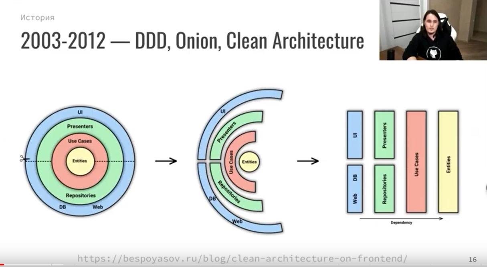

# Архитектура фронтенда

**Что такое архитектура фронтенда&**

* совокупность решений об организации программной системы.
* набор решений о том, как модули приложения будут общаться друг с другом и с внешним миром.
* приёмы и методы для решения «проблем сложной системы» в отношении программного обеспечения\

\

**Зачем нужна архитектура**

* Причины
  * Организация большого объема кода
  * Дублирование функциональности, переиспользуемость
  * Поддержка
  * Изменение состава команды - порог/время вхождения, bus-фактор
  * Расширение функциональности (!)
  * Ошибки
  * Все причины вместе — **проблемы сложной системы**
* Цель
  * Поддержка жизненного цикла системы. Хорошая архитектура делает систему легкой в освоении, простой в разработке, сопровождении и развертывании.
  * Минимизировать затраты на протяжении срока службы системы и максимизировать продуктивность программиста (команды разработчиков).
* Цитаты
  * «Всё развитие нашей индустрии можно охарактеризовать как борьбу со сложностью»
  * «Усложнять просто, упрощать сложно.»\
    \

**Что входит в понятие архитектура?**

* файловая структура
* стэк\
  \

**Термины**

* `Паттерн` в архитектуре — шаблонное решение частой архитектурной проблемы.
* `Методология` — свод правил и соглашений по организации кода\

\

<strong>История вопроса</strong>

* 1968 — Эдсгер Дейкстра. Статья «Operator GOTO considered harmful» («Оператор GOTO — оператор безусловного перехода — зло»)
* 1970-е — Дейкстра и Дэвид Парнас — развивали идею, в соавторстве и по отдельности
* 1996 — первая подробная книга об архитектуре. Мэри Шоу и Дэвид Гэрлан. «Архитектура программного обеспечения: перспективы новой дисциплины» («Software Architecture: Perspectives on an Emerging Discipline»)
* После этого подробных книг об архитектуре ПО практически не писалось — именно из-за области применения. В каждой сфере знаний есть свои архитектурные подходы, часто не применимые в других областях. Архитектура — процесс творческий => конкретные книги про как писать архитектуру, вы не найдете.
* 2007 — вышел первый стандарт программной архитектуры: «ISO ISO / IEC 42010:2007». «IEEE 1471: ANSI / IEEE 1471 — 2000: Рекомендации по описанию преимущественно программных систем».

\

<strong>Некоторые архитектурные подходы</strong>

* MVC, MVP, MVVM, MV\* — 19XX
* Компонент-контейнерный подход — 2000-2010
* Domain Driven Design (DDD) — 2003
* Onion Architecture — 2003-2012
* Clean architecture (Чистая архитектура) — 2012
* Атомарная архитектура, atomic design — 2013
* Микросервисная архитектура — 2011
* Feature Based / Feature first — 2010-2016
* Vertical slices — 2010-2016
* Flux, Redux — 2015
* Redux Duсks — 2015
* Business Logic Component (BLoC)
* Feature Driven Architecture (FDA) — 2018
* Feature Sliced Design (FSD) — 2018
* Функциональная архитектура

\

<strong>Связность и зацепленность</strong>

Хорошая архитектура должна обладать низкой связностью, высокой зацепленностью.\
`Low coupling, high cohesion`

`Связность` (coupling) — взаимная зависимость модулей между собой.\
Сколько изменений надо внести в модули при изменении другого модуля.\
Чем ниже этот показатель — тем лучше.\
Плохо кода модули зависят друг от друга — изменили что-то в компоненте User и надо вносить кучу правок в других модулях.

`Зацепленность` (cohesion) — степень общности обязанностей модуля.\
Насколько модуль сфокусирована на решении одной задачи.\
Чем выше этот показатель — тем лучше.\
Плохо кода модуль решает несколько разных задач (например авторизация и шифрование).

Ссылки:

* [ООП: некоторые принципы разработки программ на C++](https://statmod.ru/3-5/programming/oop\_potapov/index.htm)
* [Как написать аккуратный код? Часть вторая: связность](https://bureau.ru/soviet/20200227/?ysclid=l95u4bmvwd168275487)
* [Medium - Low Coupling и High Cohesion](https://medium.com/german-gorelkin/low-coupling-high-cohesion-d36369fb1be9)
*

\

<strong>MV* для web *</strong>

***

`Model-View-Controller` (Модель-Вид-Контроллер)\
Конструкционный шаблон, архитектурный паттерн, концепция. 1979 г\
Описывает способ построения структуры приложения, сферы ответственности и взаимодействие каждой из частей в этой структуре.

Основная идея: нужно чётко разделять ответственность за различное функционирование в наших приложениях.\
Делим приложение на 3 основных компонента, каждый отвечает за свои задачи. Модификация каждого компонента может осуществляться независимо.

* `Model` - обработка данных и логика приложения
* `View` - представление данных пользователю (в любом формате). Пользовательский интерфейс
* `Controller` - обработка действий пользователя, вызов соответствующих ресурсов. Логика управления

Концепция стала популярна благодаря включению в две среды разработки: Struts и Ruby on Rails.

**Модификации**\
Есть много модификаций шаблона MV\*

* MVP — Model-View-Presenter
* MVVM — Model-View-View Model
* HMVC — Hierarchical MVC
* и другие\

\

**Ссылки**

* [Концепция MVC для чайников](https://ruseller.com/lessons.php?id=666)
* [MVC для веб: проще некуда](https://habr.com/ru/post/181772/)
* [Habr - Честный MVC на React + Redux (2016)](https://habr.com/ru/company/developersoft/blog/305812/)
* [Doka - Архитектурный паттерн MVC](https://doka.guide/js/architecture-mvc/)
* [Medium - Прощай, Redux (2018)](https://medium.com/devschacht/jack-scott-goodbye-redux-4f11cc3c6af5)
* [MVVM: проектирование приложений для Windows](https://skillbox.ru/media/code/mvvm\_proektirovanie\_prilozheniy\_dlya\_windows/)
* [Habr - Паттерны для новичков: MVC vs MVP vs MVVM (2014)](https://habr.com/ru/post/215605/)
* [Habr - MVVM: полное понимание (+WPF) Часть 1](https://habr.com/ru/post/338518/)

***

\

<strong>Domain Driven Design, DDD</strong>

`Domain Driven Design` (предметно-ориентированное проектирование) - подход построения моделей программных продуктов.

DDD не связан с технологиями. Это про архитектуру.\
Вместо этого речь идет о развитии знаний о бизнесе и использовании технологий для обеспечения ценности.

Книга Эрика Эванса «Предметно-ориентированное проектирование (DDD): структуризация сложных программных систем»\
Рекоменация Кузебюрдина (It-Kamasutra)

Программное обеспечение это не только код. Код редко является конечной целью вашей работы. Код это только средства решения бизнес-задач. Так почему код должен быть на языке отличном от языка бизнеса? DDD подчеркивает что код и бизнес должны говорить на одном языке. Когда барьер преодолён, нет необходимости в переводе или утомительной синхронизации, информация не потеряется. Каждый участник влияет на Бизнес-Домен, не только разработчики. Получающееся программное обеспечение - единственная правда для общего языка.

Три основных понятия:

* Единый Язык (Ubiquitous Language)
* Стратегическое моделирование (Strategic Design)
* Тактическое моделирование (Tactical Design)

**Картинки**

\
\

**Ссылки**

* [Habr - Domain Driven Design на практике](https://habr.com/ru/post/334126/)
* [Domain Driven Design (DDD) - что это такое? И как начать использовать DDD в разработке](https://blog-programmista.ru/post/132-ddd-what-is-it.html)
* [Что можно узнать о Domain Driven Design за 10 минут?](https://itnan.ru/post.php?c=1\&p=489352)
*

\

<strong>Feature Sliced Design, FSD</strong>

`Feature Sliced Design` - методология проектирования архитектуры frontend-приложений.\
Свод правил и соглашений по организации кода

Полезна для средних и больших проектов, которые будут в вашем распоряжении несколько лет.\
Учитывает регулярные изменения требований бизнеса.

Не привязана к конкретному языку программирования, UI-фреймворку или менеджеру состояния.

Одним из минусов является высокий порог входа.\
Разработчик должен понимать как работает этот подход и при разработке очередного модуля вам придется подумать о правильности его расположения.

Выделяются следующие архитектурные абстракции:

* `слои` - по области влияния
  * app - инициализация приложения (init, styles, providers, ...);
  * processes - бизнес-процессы приложения управляющие страницами (payment, auth, ...);
  * pages - страницы приложения (user-page, ...);
  * features - части функциональности приложения (auth-by-oauth, ...);
  * entities - бизнес-сущности (viewer, order, ...);
  * shared - переиспользуемый инфраструктурный код (UIKit, libs, API, ...).
* `слайсы` - по бизнес-домену
  * разделение кода на слайсы зависит от проекта, не определяется методологией
  * Например:
    * user
    * post
    * comment
* `сегменты` - по назначению в реализации
  * ui - UI-представление модуля (components, widgets, canvas, ...);
  * model - бизнес-логика модуля (store, effects/actions, hooks/contracts, ...);
  * lib - вспомогательные библиотеки;
  * api - логика взаимодействия с API;
  * config - модуль конфигурации приложения и его окружения.

\*\*\*

* Методология состоит из разделения на
  * страницы
  * виджеты
  * фичи
  * сущности
  * shared-компоненты
* В папке каждой сущности, виджета, страницы происходит разделение на
  * /ui,
  * /lib,
  * /model.

Основная сложность при использовании методологии заключается в том, чтобы грамотно разбить код.\
Всегда проще просто взять, вынести компоненты фичи в папку `/components`, но со временем - с ростом проекта - приходит понимание того, что не всё так просто, и длинная папка `/components` может не радовать, как и размазывание логики фичи по множеству папок, будь то `/redux` или какая-нибудь `/core` папка, куда складываются бизнес-сущности и их логика.

**Ссылки**

* [Оф. сайт](https://feature-sliced.design/)
* [Habr - Архитектура фронтенда и какой она должна быть (2022)](https://habr.com/ru/post/667214/)
* [Илья Азин (Яндекс) — Доклад Feature-Sliced Design (2021, YouTube)](https://www.youtube.com/watch?v=af-PD2yIUiU)
* [Методология "feature-sliced" - идеальный способ структурировать растущий проект?](https://okusov.ru/metodologiya-feature-sliced-idealnyj-sposob-strukturirovat-rastushij-proekt)
* [Структура frontend-приложений. Миф или реальность? (2022)](https://vc.ru/s/fly-code/512625-struktura-frontend-prilozheniy-mif-ili-realnost)
*

\

<strong>Clean architecture (Чистая архитектура)</strong>

***

2012 г.

`Чистая архитектура` — способ разделения ответственностей и частей функциональности по степени их близости к предметной области приложения.\

`Предметная область` (домен) — часть реального мира, которую моделируем программой.\
Такие преобразования данных, которые отражают преобразования в реальном мире.\
Например, если мы обновили название товара, то замена старого имени на новое и есть преобразование предметной области (доменное преобразование).

Также называют `трёхслойной арзитектурой` — приложение делится на слои

* `домен` в центре
* `прикладной слой` вокруг него
* `слой адаптеров` снаружи

Чем дальше мы от центра — тем функциональность кода более «сервисная», тем дальше она от предметной области нашего приложения.\
Это важно когда мы принимаем решение, к какому слою отнести какой-либо модуль.

**Ссылки**

* [Robert C. Martin - The Clean Architecture](https://blog.cleancoder.com/uncle-bob/2012/08/13/the-clean-architecture.html)
* [Беспоясов А - Чистая архитектура во фронтенде](https://bespoyasov.ru/blog/clean-architecture-on-frontend/)
* [Беспоясов А - Чистая архитектура во фронтенде. Доклад (YouTube)](https://youtu.be/h4WQRqNjmX0)
* [Беспоясов А - Чистая архитектура во фронтенде. Слайды к докладу](https://bespoyasov.ru/slides/clean-architecture-on-frontend/)

\

<strong>Атомарный дизайн</strong>

Модульная методология для создания библиотек паттернов, простых в поддержке, масштабировании и развитии.\
Создание крупных и сложных UI-компонентов из более мелких и простых.

Брэд Фрост, 2016.\

5 категорий компонентов:

* `атомы` - неделимы элементы. Кнопка, ссылка, цвет
* `молекулы` - несколько атомов. Строка поиска - текстовое поле + кнопка + пиктограмма + подсказки
* `организмы` - несколько молекул и атомов. Шапка сайта
* `шаблон` - законченные веб-страницы или экраны приложений (но с тестовым контентом)
* `страницы` - шаблон, заполненный реальным контентом (картинками, текстами и т.д.)

Примеры реализации

* [Storybook](https://storybook.js.org/) - инструмент для разработки и управления библиотекой UI компонентов. Open Source
* [Pattern Lab](https://patternlab.io/) - генератор статических сайтов, использующий методологию атомарного дизайна.

Ссылки:

* [Habr - Атомарный веб-дизайн (2015)](https://habr.com/ru/post/249223/)
* [Брэд Фрост — Атомарный дизайн (перевод)](https://medium.com/%D0%B0%D1%82%D0%BE%D0%BC%D0%B0%D1%80%D0%BD%D1%8B%D0%B9-%D0%B4%D0%B8%D0%B7%D0%B0%D0%B9%D0%BD/atomic-design-foreword-4960ad17bc1a)
* [Всё, что вам нужно знать об атомарном дизайне](https://deadsign.ru/ui/everything-you-need-to-know-about-atomic-design/)

\

<strong>Feature first</strong>

Большое приложение должно быть набором небольших приложений, которые функционируют изолированно.

`Feature` — единица проекта, на основе разнообразия которых строится продукт. `Feature-first` — предполагает, что все компоненты, объединенные общей логикой и интерфейсом, являются фичей и располагаются в одном месте.

Иногда под `features` понимают пользовательские сценарии.\
Например — добавление товара в корзину, пополнение кошелька.\
Есть сущности (пользователь, товар, корзина), есть действия которые мы с ними можем соврешить - подписатьсся на пользователя, зарегистрировать его, авторизовать... Эти действия — features.

Открывая папку feature/Profile, мы находим весь код, относящийся к функционалу профиля пользователя и сразу получаем представление, как это работает.

Похоже на микросервисную архитектуру.

Общий подход:

* Вне папки компонента нет файлов, которые связывают его с приложением.
* Когда вы используете компонент в приложении — вы импортируете его, как если бы это был любой другой модуль или библиотека. Вплоть до включения файла Readme.md в папку каждого компонента.

Преимущества:

* вы поощряете изоляцию и инкапсуляцию ваших компонентов пользовательского интерфейса. Вы буквально гарантируете, что компоненты вашего приложения будут повторно использоваться в будущих проектах.

\*\*\*

**Ссылки**

* [Организация кода в масштабных React проектах.(2018)](https://blogru.4xxi.com/%D0%BE%D1%80%D0%B3%D0%B0%D0%BD%D0%B8%D0%B7%D0%B0%D1%86%D0%B8%D1%8F-%D0%BA%D0%BE%D0%B4%D0%B0-%D0%B2-%D0%BC%D0%B0%D1%81%D1%88%D1%82%D0%B0%D0%B1%D0%BD%D1%8B%D1%85-react-%D0%BF%D1%80%D0%BE%D0%B5%D0%BA%D1%82%D0%B0%D1%85-bc00ce1621e3) -[Medium - Feature First Organization (2016)](https://medium.com/front-end-weekly/the-secret-to-organization-in-functional-programming-913484e85fc9)

\

<strong>Redux Duсks</strong>

См [Legmo Notes - React. Ducks](../js/react.md#ducks)

\

<strong>Функциональная архитектура</strong>

Примерно так:

* до начала работы с кодом анализируем будущий продукт
* решаем какие потребуются функции
* выделяем функции общие для разных частей
* расставляем их по рейтингу и т.д.
* [Шерер П - Функциональная архитектура цифровых продуктов. Часть 1](https://sherer-pro.turbopages.org/sherer.pro/s/blog/funkcionalnaja-arhitektura-cifrovyh-produktov-chast-1/)
* [Шерер П - Функциональная архитектура цифровых продуктов. Часть 2](https://sherer-pro.turbopages.org/sherer.pro/s/blog/funkcionalnaja-arhitektura-cifrovyh-produktov-chast-2/)
* [Шерер П - Функциональная архитектура цифровых продуктов. Часть 3](https://sherer-pro.turbopages.org/sherer.pro/s/blog/funkcionalnaya-arxitektura-cifrovyx-produktov-chast-3/?last\_related=1\&turbo\_feed\_type=full)

\

<strong>Микросервисная архитектура</strong>

См [Legmo Notes - Микросервисная архитектура](../webdeveloping/microservices.md)

\

**Ссылки**

* [Карпелевич А - Верхнеуровневая архитектура фронтенда. Лекция Яндекса. Видео + расшифровка (2018)](https://itnan.ru/post.php?c=1\&p=425611)
* [Habr - «Откуда ноги растут» или что предшествует программированию?](https://habr.com/ru/company/otus/blog/493898/)
* [Habr - Архитектура фронтенда и какой она должна быть](https://habr.com/ru/post/667214/)
* [Doka - Архитектура и паттерны проектирования](https://doka.guide/js/architecture-and-design-patterns/)
* [Doka - Трёхслойная архитектура (Чистая архитектура, Clear architecture)](https://doka.guide/js/clean-architecture/)
* [Doka - Организация потоков данных (Flux)](https://doka.guide/js/architecture-data-flow/)
* [Беспоясов А - Чистая архитектура во фронтенде](https://bespoyasov.ru/blog/clean-architecture-on-frontend/)
* [Яндекс - Разработка фичи: как эффективно пройти путь от идеи до реализации](https://academy.yandex.ru/journal/razrabotka-fichi-kak-effektivno-projti-put-ot-idei-do-realizacii)
* [Medium - Проволочки при проектировании структуры React приложения](https://medium.com/@vladimirmorulus/%D0%BF%D1%80%D0%BE%D0%B2%D0%BE%D0%BB%D0%BE%D1%87%D0%BA%D0%B8-%D0%BF%D1%80%D0%B8-%D0%BF%D1%80%D0%BE%D0%B5%D0%BA%D1%82%D0%B8%D1%80%D0%BE%D0%B2%D0%B0%D0%BD%D0%B8%D0%B8-%D1%81%D1%82%D1%80%D1%83%D0%BA%D1%82%D1%83%D1%80%D1%8B-react-%D0%BF%D1%80%D0%B8%D0%BB%D0%BE%D0%B6%D0%B5%D0%BD%D0%B8%D1%8F-609f80105e2c)
* [Hexlet - Курс «JS: Архитектура фронтенда»](https://ru.hexlet.io/courses/js-frontend-architecture)
* [Legmo Notes - Паттерны проектирования](pattern.md)
* [Legmo Notes - Микросервисная архитектура](../webdeveloping/microservices.md)
*
* [Habr - Масштабирование Redux-приложения с помощью ducks (2020)](https://habr.com/ru/company/otus/blog/492638/?ysclid=l6sz05stk7523793176)
* [Habr - Как организовать большое React-приложение и сделать его масштабируемым (2017)](https://habr.com/ru/company/nix/blog/329060/)
*
* [Habr - Как два программиста хлеб пекли (2012)](https://habr.com/ru/post/153225/)
* [Doka - Что такое код-ревью](https://doka.guide/tools/code-review/)
* [Doka - Что такое технический долг](https://doka.guide/js/technical-debt/)
* [Habr - Архитектура для пользователей (VK-video)](https://habr.com/ru/company/vk/blog/687752/)

\
\

[_Legmo, 2019-2022_](https://github.com/Legmo/notes/)
